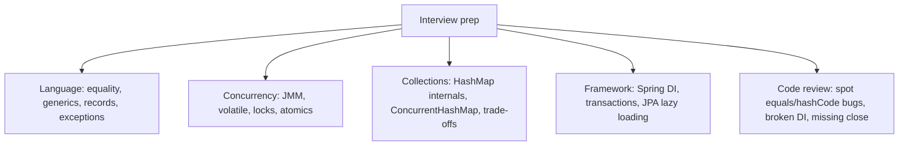


## What you'll learn
- The classic interview topics: equality, generics, collections, concurrency.
- Modern-Java conventions interviewers expect (records, sealed types, switch expressions).
- Common gotcha questions and how to reason about them.
- What "good Java" looks like in a code-review interview.

## Concepts

Most Java interviews have a recurring set of topics. None of these will be new if you've worked through this course - but knowing the *interview framing* of each helps you answer concisely.

### Equality and hashCode

The single most common interview question, in two flavours:

1. "What's the contract between `equals` and `hashCode`?"
2. "If you override `equals` but not `hashCode`, what breaks?"

A complete answer covers:
- The contract: if `a.equals(b)`, then `a.hashCode() == b.hashCode()`. Reverse not required.
- The failure mode: `HashMap`/`HashSet` route by hash code first; mismatched hashes put equal objects in different buckets, so `contains`/`get` returns the wrong result.
- The fix: always override both together; consider whether a record applies.

Module 3 Chapter 3 has the depth.

### Generics and erasure

"Why can't I do `instanceof T` / `new T()` / `new T[]`?"

The short answer: type erasure removes the type parameter at runtime. The JVM sees raw types. To recover the type information, you pass a `Class<T>` token or a `TypeReference`.

A good follow-up answer: "PECS - Producer Extends, Consumer Super" - when asked about wildcards. Demonstrate the rule applied to a copy method or stream operation.

Module 2 Chapter 3.

### Collections

"When would you use `LinkedList` over `ArrayList`?" - The honest answer in 2026: almost never. `ArrayList` wins on cache locality and allocation cost. The textbook benefit of O(1) middle insertion only matters if you already have the node, which you almost never do.

"What's the difference between `HashMap` and `Hashtable`?" - `Hashtable` is legacy (synchronized, no nulls, slow). Use `ConcurrentHashMap` for thread-safe maps and `HashMap` otherwise.

"How does `HashMap` resolve collisions?" - Linked-list buckets up to 8 entries; promoted to a balanced tree above that threshold (Java 8+). Hash codes are remixed via `hash() ^ (hash >>> 16)` to reduce collisions on poor-quality hashes.

### Concurrency

"What's the happens-before relationship?"

A complete answer:
- The JMM (Java Memory Model) defines a partial order over reads and writes.
- A write is visible to a read on another thread only if there's a happens-before edge between them.
- `synchronized`, `volatile`, `Thread.start()`, `Thread.join()`, and `final`-field initialization all establish happens-before.
- Without one, you have a data race and the program's behaviour is undefined.

"What does `volatile` do?" - Makes writes visible to other threads (a happens-before edge on each write/read) but does not provide atomicity for compound operations. `volatile int counter; counter++;` is still a data race.

"Difference between `synchronized` and `ReentrantLock`?" - Both are reentrant. `synchronized` is the intrinsic monitor; simpler, slightly more JIT-friendly. `ReentrantLock` adds `tryLock`, fairness, and `Condition` variables. Use `synchronized` when it fits.

### Modern Java conventions

Interviewers in 2026 expect you to know Java 17 features by name. Be ready to:

- Use a `record` for an immutable data carrier. Don't write boilerplate POJOs.
- Use `sealed interface` + `record` subtypes + `switch` for discriminated unions.
- Use pattern matching for `instanceof`: `if (obj instanceof Order o)` - no cast needed.
- Use text blocks for multi-line strings:

  ```java
  String json = """
      { "id": 1, "status": "PAID" }
      """;
  ```

- Use `var` for local variable inference (Java 10+):

  ```java
  var orders = new ArrayList<Order>();
  ```

  But not for fields, parameters, or return types - those still need explicit types.

### Exception handling

"Checked vs. unchecked?" - Java 17 idiom: most new code throws unchecked exceptions; wrap checked ones at the boundary (Module 2 Chapter 4).

"What's the use of try-with-resources?" - Auto-closes any `AutoCloseable`. Reverse close order. Suppressed exceptions on dual failures.

### Common gotchas

A list interviewers love:

1. **`Integer` cache.** `Integer.valueOf(127) == Integer.valueOf(127)` is `true`; `Integer.valueOf(128) == Integer.valueOf(128)` is `false`. Always `.equals()` for wrappers.
2. **`==` on Strings.** Compares references unless both come from the string pool. `.equals()` always.
3. **`String.intern()`.** Adds the string to the JVM string pool. Rarely needed; mentioned to test if you know how the pool works.
4. **Autoboxing NPE.** `Map<String, Integer> m = ...; int v = m.get("missing");` - silent autobox, then NPE on unbox.
5. **Concurrent modification.** Iterating a `HashMap` and modifying it throws `ConcurrentModificationException`. Use `Iterator.remove()` or `removeIf`.
6. **`Stream` reuse.** A consumed stream can't be re-terminated.
7. **`Optional.get()` without `isPresent`.** Treat as null.
8. **JPA lazy loading outside a transaction.** `LazyInitializationException`.
9. **`@Transactional` self-invocation.** Bypasses the proxy.
10. **Floating-point money.** Use `BigDecimal` for currency; `double` is wrong.

### Code-review interviews

Some companies run review-style interviews: they show you Java code and ask what's wrong. Patterns to spot:

- `equals` overridden, `hashCode` not.
- `Optional` field or `Optional` parameter.
- `if (obj.equals(otherObj))` where `obj` could be null - should be `Objects.equals(obj, otherObj)`.
- Mutable `static` collection without thread safety.
- Catching `Exception` and ignoring.
- Resource not closed in a `try/finally` - should be try-with-resources.
- `String` concatenation in a tight loop where `StringBuilder` would do.
- `@Autowired` on a field instead of a constructor parameter.

### Anti-patterns interviewers test for

1. **Premature optimisation.** Don't reach for parallel streams in interview code unless the question is explicitly about concurrency.
2. **Over-use of `Optional`.** Knowing where it doesn't belong (fields, parameters) is more impressive than using it everywhere.
3. **Reaching for reflection** when polymorphism would do.
4. **Manually parsing dates with `SimpleDateFormat`** instead of `java.time.LocalDateTime` + `DateTimeFormatter`.
5. **Returning null from a method that returns `Optional`.** Always `Optional.empty()`.

## Walkthrough

A common live-coding question: "Implement an LRU cache with O(1) get/put."

```java
import java.util.*;

public class LruCache<K, V> extends LinkedHashMap<K, V> {
    private final int capacity;

    public LruCache(int capacity) {
        super(capacity, 0.75f, true);   // accessOrder=true makes it LRU
        this.capacity = capacity;
    }

    @Override
    protected boolean removeEldestEntry(Map.Entry<K, V> eldest) {
        return size() > capacity;
    }
}

// Usage:
var cache = new LruCache<String, Integer>(3);
cache.put("a", 1); cache.put("b", 2); cache.put("c", 3);
cache.get("a");                          // refreshes 'a' as most recently used
cache.put("d", 4);                       // 'b' evicted
System.out.println(cache.keySet());      // [c, a, d]
```

The interesting points to highlight to an interviewer:
- `LinkedHashMap` with `accessOrder=true` maintains insertion order with access-time bump.
- `removeEldestEntry` is the hook that fires after every `put`.
- Total ~15 lines, O(1) on both operations.
- For thread safety, wrap in a `Collections.synchronizedMap` or use a `ConcurrentMap` + custom LRU logic (more code, often unnecessary).

A code-review question: "What's wrong with this snippet?"

```java
public class Counter {
    public int count;

    public void increment() {
        count++;
    }
}
```

Answers (in order of severity):

1. **`count` is public.** Encapsulation broken.
2. **`count++` is not thread-safe.** Compound operation; data race under concurrent access.
3. **No `equals`/`hashCode` if used as a key.**
4. **No documentation of thread-safety contract.**

A safer rewrite:

```java
public class Counter {
    private final AtomicInteger count = new AtomicInteger(0);

    public int increment() { return count.incrementAndGet(); }
    public int get() { return count.get(); }
}
```

## How it fits together



## Common pitfalls

| Pitfall | Why it happens | Fix |
|---|---|---|
| Reaching for Java 8-era idioms | Stale tutorials. | Use records, switch expressions, pattern matching, text blocks. |
| Defending checked exceptions | Old habit. | Acknowledge the pragmatic shift; explain the wrap-and-rethrow pattern. |
| Memorising `equals`/`hashCode` template | Misses the reasoning. | Be able to explain *why* the contract matters. |
| Saying "always use `LinkedList` for inserts" | Misleading textbook trope. | Explain cache locality and why `ArrayList` usually wins. |
| Confusing concurrency primitives | `volatile` vs. atomic vs. synchronized. | Be precise: `volatile` is visibility, atomics are visibility+atomicity, locks are mutual exclusion. |

## Exercises

1. Explain in two minutes (out loud) why overriding `equals` without `hashCode` corrupts `HashMap`/`HashSet`. Then write the broken example.
2. Reproduce the `Integer` cache asymmetry in code, with a unit test that demonstrates the boundary.
3. Take a snippet of "bad" Java (use one above or invent one) and write a code-review comment listing 3-5 issues in order of severity.

## Recap & next

- Equality, generics+erasure, concurrency primitives, and collection internals are the most-tested fundamentals.
- Modern Java conventions (records, sealed types, pattern matching, `var`, text blocks) are expected in 2026.
- Common gotchas: `Integer` cache, autoboxing NPE, stream reuse, JPA lazy loading, `@Transactional` self-invocation.
- Code-review questions test pragmatism: spot `equals`/`hashCode` bugs, missing close, broken DI, mutability issues.
- Be ready to articulate *why*, not just *what*.

Next, **Where to go next: Java 21, Kotlin, Quarkus, and beyond** - pointers for continuing the journey after the course.

