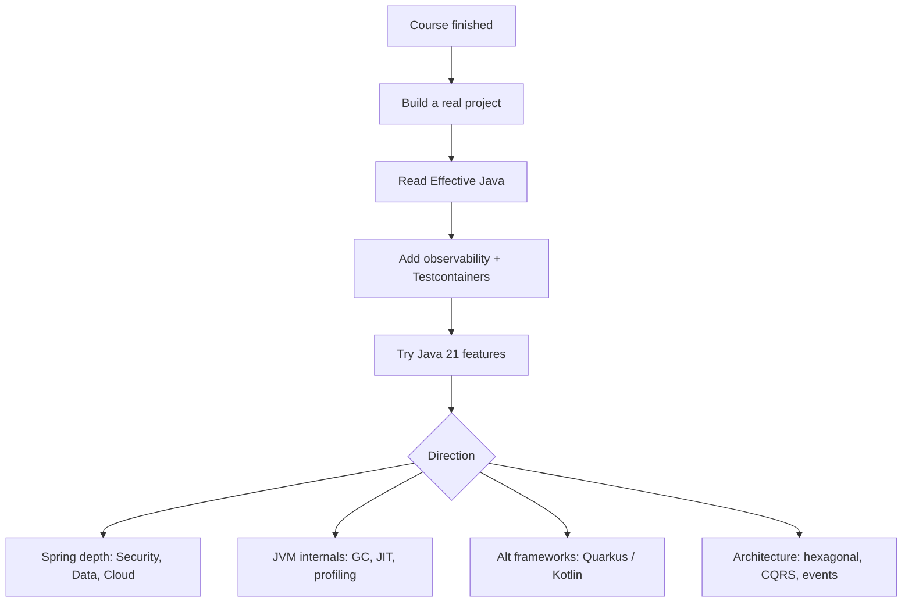


## What you'll learn
- The Java 21 features worth learning next: virtual threads, pattern matching, sequenced collections.
- When to look at Kotlin from a .NET background.
- Alternative JVM frameworks: Quarkus and Micronaut.
- GraalVM Native Image - beyond a quick mention.
- Books, communities, and conferences worth your time.

## Concepts

You're now equipped to be productive on Java 17 + Spring Boot 3 backends. This chapter sketches the directions to grow next, with honest trade-offs.

### Java 21 LTS - what changes

Java 21 (Sept 2023) is the next LTS after 17. The features that meaningfully shift how you write code:

**Virtual threads** ([JEP 444](https://openjdk.org/jeps/444)). Lightweight, JVM-scheduled threads. Creating a million virtual threads is trivial; blocking on I/O frees the underlying carrier thread.

```java
// Java 21:
try (var exec = Executors.newVirtualThreadPerTaskExecutor()) {
    for (int i = 0; i < 10_000; i++) {
        exec.submit(() -> { httpClient.get("..."); /* blocks cheaply */ });
    }
}
```

Implications:
- The "must I write reactive code?" question mostly goes away. Blocking JDBC + Spring MVC scales like reactive WebFlux did, with simpler code.
- `CompletableFuture` composition is still useful but less essential.
- Don't pin virtual threads with `synchronized` blocks for long I/O operations; prefer `ReentrantLock`, which doesn't pin (since Java 21).

For Spring Boot 3.2+, opt in:

```yaml
spring:
  threads:
    virtual:
      enabled: true   # Tomcat uses virtual threads for request handling
```

**Pattern matching for switch** ([JEP 441](https://openjdk.org/jeps/441)) - finalized:

```java
String describe(Object x) {
    return switch (x) {
        case Integer i when i < 0 -> "negative int";
        case Integer i           -> "non-negative int";
        case String s            -> "string: " + s;
        case null                -> "null";
        default                  -> "other";
    };
}
```

The `null` case and `when` guards are new. Combined with sealed types, this is the closest Java gets to ML-style pattern matching.

**Record patterns** ([JEP 440](https://openjdk.org/jeps/440)) - destructuring:

```java
record Point(int x, int y) {}
record Line(Point a, Point b) {}

if (line instanceof Line(Point(int x1, int y1), Point(int x2, int y2))) {
    // x1, y1, x2, y2 all bound
}
```

**Sequenced collections** ([JEP 431](https://openjdk.org/jeps/431)) - `SequencedCollection`, `SequencedMap`, `SequencedSet` interfaces with `getFirst()`, `getLast()`, `addFirst()`, `addLast()`, `reversed()`. Closes a long-standing API gap.

Java 25 LTS (Sept 2025) builds on these with structured concurrency ([JEP 480](https://openjdk.org/jeps/480)), scoped values, and stable virtual threads. By the time you read this, Java 25 LTS is a reasonable migration target.

### Kotlin

[Kotlin](https://kotlinlang.org/) is JetBrains' JVM language. For a .NET developer:

- Syntax is closer to C# than Java is - `data class`, properties, `?`/`!` nullable handling.
- 100% Java interop: a Kotlin Spring Boot project consumes Java libraries seamlessly.
- Less ceremony: shorter classes, expressive collections, coroutines for async.

```kotlin
data class Order(val id: Long, val sku: String, val quantity: Int)

@RestController
class OrderController(private val service: OrderService) {
    @GetMapping("/orders/{id}")
    fun get(@PathVariable id: Long): Order = service.findById(id) ?: throw NotFoundException(id)
}
```

When to consider Kotlin:
- Greenfield projects where the team is willing to learn it.
- Android development (it's the default).
- Backend code that benefits from null safety and concise syntax.

When to stay on Java:
- Existing Java codebases without strategic pressure to switch.
- Teams new to the JVM - fewer concepts at once.

For a .NET developer learning the JVM, **stay on Java first**. Pick up Kotlin later if a project warrants it.

### Quarkus and Micronaut

Two alternative frameworks compete with Spring Boot for greenfield work:

**[Quarkus](https://quarkus.io/)** (Red Hat) - "Supersonic, Subatomic Java." Aggressive use of build-time processing: code generation at compile time, no runtime reflection or proxies. Result: very fast startup (especially with GraalVM Native Image), low memory footprint. Familiar APIs (CDI - Contexts and Dependency Injection - and Jakarta REST) plus Quarkus-specific extensions.

**[Micronaut](https://micronaut.io/)** (Object Computing) - similar philosophy: AOT-friendly, low memory, fast startup. Uses Java annotations at compile time to avoid runtime reflection.

Compared with Spring Boot:

| Aspect              | Spring Boot          | Quarkus / Micronaut    |
|---------------------|----------------------|------------------------|
| Startup time (JVM)  | 1-3s                 | 0.5-1s                 |
| Native image build  | Works, with caveats  | First-class            |
| Ecosystem           | Vast                 | Solid, growing         |
| Hiring market       | Huge                 | Smaller                |
| Hot reload          | DevTools             | Dev mode (similar)     |

When to consider them: serverless/lambda workloads, scale-to-zero containers, memory-constrained environments. For a typical enterprise backend, **Spring Boot's ecosystem advantage wins**.

### GraalVM and native image - more depth

If you do venture into native image:
- Adopt early - late migration is painful.
- Use Spring Boot's [AOT support](https://docs.spring.io/spring-boot/reference/packaging/native-image/index.html); it handles most metadata generation.
- Test in native mode in CI. Behaviour can diverge from JVM mode.
- Watch for reflection-heavy libraries (Hibernate, Jackson) and have their reflection metadata pre-registered.

Compared with .NET NativeAOT:
- More mature on .NET. Java is catching up.
- Bigger ecosystem of "doesn't work yet" libraries on Java.
- Spring AOT closes much of the gap for Spring-shaped apps.

### Tools you'll meet next

- **[IntelliJ IDEA](https://www.jetbrains.com/idea/)** - the JetBrains IDE. Community edition is free; Ultimate has Spring support. Coming from Visual Studio / Rider, it's the natural transition.
- **[Lombok](https://projectlombok.org/)** - annotation processor for boilerplate reduction. Common but contentious; many teams skip it.
- **[MapStruct](https://mapstruct.org/)** - DTO mapping at compile time. Useful for record/entity boundaries.
- **[ArchUnit](https://www.archunit.org/)** - architectural rule enforcement as unit tests.
- **[OpenRewrite](https://docs.openrewrite.org/)** - large-scale code transformations. Useful for framework upgrades.
- **[jBang](https://www.jbang.dev/)** - scripts as single Java files; the closest analogue to `dotnet-script`.

### Books and resources

- **[Effective Java, 3rd edition](https://www.oreilly.com/library/view/effective-java-3rd/9780134686097/)** - the canonical book. Still relevant; ignore the few items obviated by records.
- **[Java Concurrency in Practice](https://jcip.net/)** - older but still definitive on the JMM.
- **[Spring in Action, 7th edition](https://www.manning.com/books/spring-in-action-seventh-edition)** - current and broad.
- **[Modern Java in Action](https://www.manning.com/books/modern-java-in-action)** - streams, lambdas, Optional.
- **[Java, A Beginner's Guide / Java: The Complete Reference](https://www.oracle.com/java/technologies/learn-java.html)** - reference-shape rather than learning material; use for spec questions.

For staying current, the [Inside Java](https://inside.java/) blog and [Devoxx](https://devoxx.com/) talks are the highest signal-to-noise.

### Communities

- **[Reddit r/java](https://www.reddit.com/r/java/)** - broader than Spring; good for ecosystem news.
- **[Spring Boot blog](https://spring.io/blog)** - release notes and major feature posts.
- **Local JUGs (Java User Groups)** - most cities have one; meetups are useful for hiring market signals.
- **[Stack Overflow](https://stackoverflow.com/questions/tagged/java)** - still the highest-traffic Q&A site for Java.

### Conferences

- **[Devoxx](https://devoxx.com/)** (multiple cities) - community-driven, deep technical content.
- **[Spring One](https://springone.io/)** - VMware's annual conference. All Spring, all the time.
- **[Java One](https://www.oracle.com/javaone/)** - Oracle's revived annual conference.
- **[JCON](https://jcon.one/)** - European, broad Java.

## Walkthrough

A migration plan from "I finished this course" to "I'm a Java backend engineer":

**Week 1-2:** Build a substantial project. A clone of something you already understand (a URL shortener, a kanban board API). Java 17 + Spring Boot 3 + PostgreSQL + JWT auth. Push to GitHub.

**Week 3:** Read [Effective Java](https://www.oreilly.com/library/view/effective-java-3rd/9780134686097/), items 1-30. Apply each lesson to the project you just wrote. PR each change separately to track the deltas.

**Week 4:** Add observability - Actuator, Micrometer, OpenTelemetry, structured JSON logs. Run a local OTel collector and inspect spans.

**Week 5:** Add Testcontainers-backed integration tests. Migrate one or two `@SpringBootTest` to slices.

**Week 6:** Try Java 21. Enable virtual threads in Spring Boot 3.2+. Re-run any benchmarks you ran earlier.

**Week 7+:** Pick a depth area: deep JVM internals, Spring Security, JPA optimisation, Kafka with Spring Cloud Stream, or contribute to an open-source project.

## How it fits together



## Common pitfalls

| Pitfall | Why it happens | Fix |
|---|---|---|
| Adopting too much at once | "Let's add Kafka and Quarkus and GraalVM today." | Pick one new thing per project. |
| Migrating to Kotlin without team buy-in | Becomes one person's project. | Treat language choice as team decision. |
| Skipping fundamentals to chase frameworks | Spring works but you don't know why. | Spend time on plain JVM + Java first. |
| Reading too much, building too little | Library of unfinished tutorials. | Ship a project end-to-end, even a small one. |
| Ignoring Effective Java | "It's old." | Items 1-30 are still definitional; skim the rest. |

## Exercises

1. Pick a small backend service idea (URL shortener, RSS aggregator, expense tracker). Build it end-to-end in Spring Boot 3 + Java 17, deploy it somewhere (fly.io / Cloud Run / a tiny VPS), and post the repo link.
2. Read three random items from Effective Java; for each, find a real example in your project that the item improves. PR the fix.
3. Spin up a tiny Quarkus or Micronaut variant of the same service. Compare startup time and memory in both JVM and native modes. Write up the comparison.

## Recap & next

- Java 21 LTS brings virtual threads (the big one), record patterns, sequenced collections - worth migrating to once your stack supports it.
- Kotlin is the natural "next language" but only after Java fluency.
- Quarkus and Micronaut are credible alternatives for low-startup / serverless workloads; Spring Boot's ecosystem wins for most enterprise backends.
- Effective Java + Java Concurrency in Practice + the Spring docs remain the highest-leverage reading.
- Ship a real project; everything else compounds from there.

This is the final chapter. You now have the working knowledge of a Java backend engineer at the intermediate level - language idioms, Spring Boot 3, integration patterns, production concerns, and the wider ecosystem. The next step is your real codebase.

