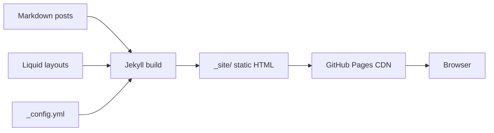


# What a Static Site Generator Is, and Why Jekyll for an Engineering Blog

> Module 1 · Chapter 1 - Foundations: From web pages to a Jekyll site

## What you'll learn
- The three common ways a web page reaches a browser, and where static site generation fits.
- What a static site generator (SSG) actually does - Markdown and templates in, plain HTML out.
- Why Jekyll and GitHub Pages are paired, and what that pairing gives you for free.
- When a static site is the wrong tool, so you stop reading this course before wasting a weekend.

## Concepts

A web page can reach a browser through one of three broadly different paths. A **server-rendered** site (Rails, Django, Express with templates) holds your content in a database and assembles HTML on every request. A **single-page app** (React, Vue, Svelte without server rendering) ships a mostly-empty HTML shell plus a JavaScript bundle that fetches data and paints the page in the user's browser. A **static site** is the third path: the HTML is built ahead of time - once, on your machine or in CI - and then served as-is. No application server. No database query. Just files on a CDN.

A static site generator (SSG) is the tool that does the building. You write content in Markdown, you keep design in HTML templates, and the SSG combines them into a directory of `.html` files ready to upload anywhere that can serve static files. Jekyll, written in Ruby, was one of the earliest SSGs and the one GitHub built into [GitHub Pages](https://docs.github.com/en/pages). It reads `_posts/*.md`, applies a `_layouts/*.html` template, runs the result through the [Liquid](https://shopify.github.io/liquid/) template language, and writes the output to a `_site/` directory. That directory is your whole website.

The reason this model fits engineering blogs so well is alignment with how engineers already work. Posts are plain text files. They live in a Git repo. Diffs review cleanly. You can write in your editor of choice, with the same Markdown you use for READMEs and PR descriptions. Deploys are a `git push` away - GitHub Pages will build the site for you on every push to your blog repo, which is exactly the integration Jekyll was designed for. See the [Jekyll docs](https://jekyllrb.com/docs/) and [GitHub Pages with Jekyll](https://docs.github.com/en/pages/setting-up-a-github-pages-site-with-jekyll) for the contract between the two.

The trade-off is rendering time. "Build-time vs request-time" is the phrase worth memorising. Server-rendered and SPA sites render at request time - every visit can see fresh content, personalised data, the result of a database query made one second ago. Static sites render at build time - every visit sees what was true when you last ran `jekyll build`. That is a feature for a blog (posts don't change between requests) and a non-starter for, say, a dashboard. If your "page" needs to change per logged-in user or update in real time, you want a different architecture. If it's an article you wrote on Tuesday and want the world to read, build-time rendering is the cheaper, faster, more durable answer.

A few corollaries fall out of this model. Static sites are fast - the work is done before the request arrives, so the server only has to fling bytes. They are cheap or free to host because there's no runtime. They are resilient - there's no application server to crash, no database to corrupt. And they are portable - `_site/` is just files; you can move it from GitHub Pages to Netlify to S3 in an afternoon. The cost is that anything dynamic - comments, search, analytics - has to come from elsewhere (a third-party service, a serverless function, JavaScript in the browser). For a blog, that trade is almost always worth it.

## Walkthrough

Here is the minimal source-to-output flow, with no tooling installed yet. Imagine a single post:

```markdown
---
layout: post
title: "On rate limiting"
date: 2026-01-15
---

A token bucket is the simplest algorithm that still
captures the *burst, then steady* behaviour you want.
```

A layout template stamps every post into a full HTML page:

```liquid
<!-- _layouts/post.html -->
<!doctype html>
<html>
  <head><title>{{ page.title }}</title></head>
  <body>
    <h1>{{ page.title }}</h1>
    <article>{{ content }}</article>
  </body>
</html>
```

After `jekyll build`, the SSG converts the Markdown to HTML, substitutes `{{ page.title }}` and `{{ content }}`, and writes:

```html
<!-- _site/2026/01/15/on-rate-limiting.html -->
<!doctype html>
<html>
  <head><title>On rate limiting</title></head>
  <body>
    <h1>On rate limiting</h1>
    <article>
      <p>A token bucket is the simplest algorithm that still
      captures the <em>burst, then steady</em> behaviour you want.</p>
    </article>
  </body>
</html>
```

That file is all the browser ever sees. There is no Ruby process running at request time, no database lookup, no template engine on the server. The work happened on your machine - or, on GitHub's servers - before the URL was hit.

## How it fits together



The arrows on the left happen once per build. The arrows on the right happen on every visit. The split is what makes static sites cheap, fast, and durable.

## Common pitfalls

| Pitfall | Why it happens | Fix |
|---|---|---|
| Expecting content edits to appear without a rebuild. | The HTML was rendered at the last build; new posts don't materialise on their own. | Run `jekyll build` (locally) or push to GitHub (Pages auto-rebuilds). |
| Trying to build a logged-in app on a static site. | Static means *per-build*, not per-user. | Use a server-rendered framework, or layer a JS/serverless API on top - but not for a blog. |
| Treating `_site/` as source. | It is the *output*; Jekyll rewrites it on every build. | Keep it gitignored; commit Markdown, templates, and `_config.yml` only. |
| Assuming "static" means "no JavaScript". | Static is about rendering, not interactivity. | Ship JS for client-side enhancements; the page is still static. |
| Picking an SSG for a high-write app (forum, real-time feed). | Build-time rendering can't keep up with content that changes per request. | Pick a server-rendered stack; come back to Jekyll when you need a blog. |

## Exercises

1. Open three websites you read regularly. For each, view source and guess whether it's server-rendered, an SPA, or static. What clues did you use? (Hint: look for `<script src=".../main.[hash].js">`, server headers, and how much of the article text is in the initial HTML.)
2. Sketch the directory you'd want for a blog with 20 posts, an About page, and an RSS feed. You don't need to be right - you'll see the canonical layout in Chapter 1.3. Compare your guess afterwards.
3. List two features of your dream blog that a static site can't do on its own. For each, write one sentence on how you'd add it later (third-party service, JS widget, serverless function).

## Recap & next

- Static sites are built once and served as plain files - the opposite of server-rendered and SPA models.
- An SSG turns Markdown plus templates into a directory of HTML; Jekyll is the SSG GitHub Pages was built around.
- The model fits engineering blogs because posts are plain text in Git, deploys are pushes, and reviews are diffs.
- Build-time rendering is the right trade for blogs and the wrong trade for per-user or real-time apps.
- Anything truly dynamic (comments, search, analytics) comes from outside the static site - we'll wire those up later in the course.

Next, **Installing Ruby and Jekyll locally (just enough Ruby)** - get a working Jekyll on your machine without inheriting a Ruby maintenance habit.



