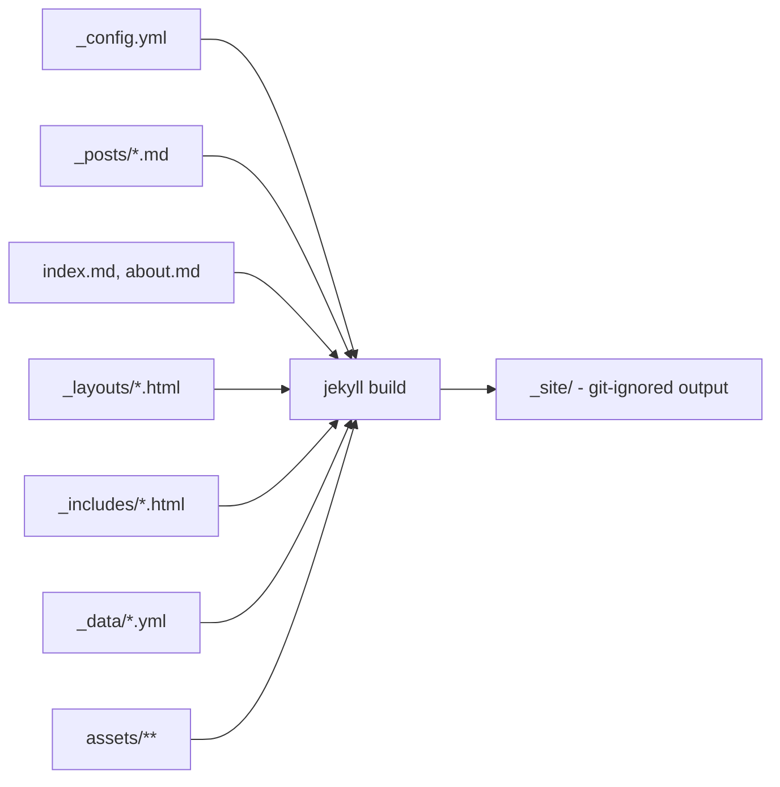


## What you'll learn
- What each top-level directory in a Jekyll project is for, and which Jekyll treats specially.
- The handful of `_config.yml` keys that matter on day one.
- What ends up in `_site/`, why it's disposable, and what to gitignore.
- How directories starting with `_` differ from everything else.

## Concepts

Jekyll's design rests on a small set of conventions. Directories whose names start with an underscore (`_posts`, `_layouts`, `_includes`, `_data`, `_drafts`, `_site`) are **special** - Jekyll knows them by name and treats their contents according to specific rules. Everything else in the project root is **regular** content: files and folders Jekyll copies into the build output, applying Markdown conversion and Liquid rendering to anything that has front matter. That single distinction explains most of the directory layout.

`_posts/` holds your blog posts. Filenames must follow the `YYYY-MM-DD-slug.md` convention so Jekyll can extract the date - files that don't match are silently ignored, which is the kind of footgun worth remembering. `_layouts/` holds HTML templates that wrap content; a post says `layout: post` in its front matter and gets stamped into `_layouts/post.html`. `_includes/` holds reusable fragments (a header, a footer, an icon) that layouts pull in with ``. `_drafts/` holds posts without a date in the filename - they're hidden from normal builds but appear with `jekyll serve --drafts`. `_data/` holds structured YAML, JSON, or CSV files exposed as `site.data.<filename>` inside templates. We'll use this in Chapter 2.5. `_site/` is the build output - Jekyll wipes and rewrites it on every build, so never edit it by hand and never commit it.

`assets/` is the canonical home for CSS, images, JavaScript, and fonts. It's a regular directory - Jekyll copies its contents to `_site/assets/` verbatim, except for files with front matter (a `.scss` file with front matter, for example, will be processed by Jekyll's Sass converter). `index.md` and `index.html` at the root become the homepage. Any other `.md` or `.html` file with front matter at the root becomes a page at the same path: `about.md` becomes `/about/`.

`_config.yml` is the site's central control file. Jekyll reads it once at build start; changing it requires restarting `jekyll serve` (live reload won't pick it up, which is the most common "why isn't my change showing?" moment in Jekyll). The keys you'll care about early are short. `title` and `description` set site-wide metadata used by themes and SEO plugins. `url` is the production origin (`https://yourname.dev`) and `baseurl` is the subpath if you're hosted at one (often `""` for a custom domain, `/repo-name` for a GitHub project site - we'll cover the difference in Module 5). `markdown: kramdown` selects the Markdown engine. `permalink` controls the URL pattern for posts; the default `/:categories/:year/:month/:day/:title:output_ext` is verbose, and most blogs override it. `plugins:` is the list of Jekyll plugins to load, which only works on GitHub Pages for [a small safelist](https://pages.github.com/versions/) - we'll handle that in Module 5. Full reference: [Jekyll configuration docs](https://jekyllrb.com/docs/configuration/).

## Walkthrough

Here is the layout `jekyll new mysite` produces, annotated:

```text
mysite/
├── _config.yml              # Site configuration - read once at build start
├── _posts/                  # Blog posts; filename = YYYY-MM-DD-slug.md
│   └── 2026-01-15-welcome-to-jekyll.markdown
├── _site/                   # Build output; gitignored, regenerated on every build
├── .jekyll-cache/           # Internal build cache; gitignored
├── 404.html                 # Served on missing-page errors
├── about.markdown           # Regular page → /about/
├── index.markdown           # Homepage → /
├── Gemfile                  # Ruby dependencies (covered last chapter)
├── Gemfile.lock             # Locked dependency versions
└── .gitignore               # Already lists _site, .jekyll-cache, .sass-cache
```

A more mature blog grows directories the scaffold doesn't include:

```text
mysite/
├── _config.yml
├── _data/                   # Structured data - site.data.<filename>
│   └── authors.yml
├── _drafts/                 # Unpublished posts - visible with --drafts
│   └── on-incident-reviews.md
├── _includes/               # Reusable HTML fragments
│   ├── header.html
│   └── footer.html
├── _layouts/                # Page templates
│   ├── default.html
│   └── post.html
├── _posts/
│   └── 2026-01-15-welcome-to-jekyll.md
├── _sass/                   # Sass partials, imported by main.scss
│   └── _typography.scss
├── assets/
│   ├── css/main.scss        # Has front matter so Jekyll compiles it
│   └── img/avatar.png
├── about.md
└── index.md
```

The starter `_config.yml`, annotated:

```yaml
# Site metadata - read by themes and SEO plugins.
title: Jane Doe - Engineering Blog
description: >-
  Notes on distributed systems, performance work, and the
  small details of writing software that lasts.
author: Jane Doe

# Production origin and path. Leave baseurl empty for a custom domain.
url: "https://janedoe.dev"
baseurl: ""

# Markdown engine. kramdown is Jekyll's default and the only one
# GitHub Pages supports; don't change it without a reason.
markdown: kramdown
kramdown:
  syntax_highlighter: rouge

# Permalink pattern. /:year/:month/:day/:title/ is cleaner than the default
# and matches what most engineering blogs end up with. (Deep dive in 2.3.)
permalink: /:year/:month/:day/:title/

# Theme installed via Gemfile.
theme: minima

# Plugins. The :jekyll_plugins group in Gemfile must also list these.
plugins:
  - jekyll-feed       # RSS - Module 4
  - jekyll-seo-tag    # Title/description/OG tags - Module 4
  - jekyll-sitemap    # sitemap.xml - Module 4

# Files Jekyll should not copy to _site.
exclude:
  - Gemfile
  - Gemfile.lock
  - node_modules
  - vendor
  - README.md
```

And the `.gitignore` you want - `jekyll new` writes most of this for you:

```text
_site/
.jekyll-cache/
.jekyll-metadata
.sass-cache/
vendor/
```

`_site/` is the most important entry. Treat it like `dist/` or `target/` - pure output, regenerated on every build.

## How it fits together



The left side is what you write and commit. The right side is what Jekyll produces - and what gets uploaded to wherever you host the site.

## Common pitfalls

| Pitfall | Why it happens | Fix |
|---|---|---|
| New `_config.yml` value isn't applied. | `jekyll serve` reads the config once at startup; the file watcher doesn't reload it. | Stop the server (`Ctrl+C`) and restart it. |
| A new post in `_posts/` doesn't show up. | Filename doesn't match `YYYY-MM-DD-slug.ext`, or the date is in the future. | Rename to the correct pattern; pass `--future` to include future-dated posts. |
| `_site/` gets committed by accident. | Wasn't in `.gitignore` before the first push. | Add `_site/` to `.gitignore`; run `git rm -r --cached _site` to untrack. |
| Edits to a file under `_site/` disappear. | Jekyll wipes `_site/` on every build. | Edit source files (`_layouts/`, `_posts/`, etc.); `_site/` is generated. |
| A drafts file never appears. | Files in `_drafts/` are excluded from the default build. | Run `jekyll serve --drafts`, or move the file into `_posts/` with a dated filename. |

## Exercises

1. In the `mysite` from Chapter 1.2, run `tree -L 1 -a` (or `ls -la`) and identify which directories are special (start with `_`) and which are regular. Predict for each whether its contents are copied as-is or processed by Jekyll.
2. Edit `_config.yml` to change `title` and `description`. Reload the browser - does it update? Now stop and restart `bundle exec jekyll serve` and check again. Note the difference.
3. Create `_drafts/scratch.md` with a single line of Markdown (no date in the filename). Run `bundle exec jekyll serve` and confirm it's not visible. Then run `bundle exec jekyll serve --drafts` and confirm it appears.

## Recap & next

- Directories starting with `_` are special; Jekyll knows them by name and treats them according to specific rules.
- `_site/` is build output - never edited by hand, never committed.
- `_config.yml` is read once per build; changes require restarting `jekyll serve`.
- A handful of config keys (`title`, `description`, `url`, `baseurl`, `markdown`, `permalink`, `plugins`) cover almost all early needs.
- The conventions are strict (filename formats, special directories), but they're the same strictness that lets Jekyll be configuration-light.

Next, **Front matter, Markdown, and writing your first post** - open `_posts/`, learn the kramdown dialect Jekyll uses, and ship a real post.



