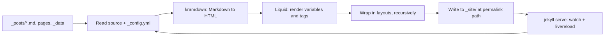


## What you'll learn
- What `jekyll build` actually does, step by step, from source files to `_site/` output.
- How `jekyll serve` extends `build` with a watcher and a local HTTP server.
- The trade-offs of `--incremental` and where it goes wrong.
- How to read Jekyll's build errors - Liquid syntax errors, YAML front-matter errors, and missing-layout errors - and act on them.

## Concepts

`jekyll build` is the entire pipeline in one command. It reads `_config.yml`, scans every file Jekyll considers content (posts, pages, collections, data, layouts, includes, assets), converts Markdown to HTML via kramdown, renders Liquid templates, applies layouts, and writes the result to `_site/`. Each invocation starts by **wiping** `_site/` and rebuilding from scratch - the only durable thing in that directory between runs is whatever was just written. The whole build for a small blog runs in well under a second; even a hundred-post blog typically builds in two or three.

`jekyll serve` wraps `build` with two additions: a file watcher that rebuilds when source files change, and a local web server (WEBrick by default, on `http://127.0.0.1:4000`) that serves the contents of `_site/`. Pass `--livereload` and a small JavaScript snippet gets injected into pages so the browser refreshes automatically after each rebuild. Pass `--drafts` to include `_drafts/`. Pass `--future` to include future-dated posts. You will run `bundle exec jekyll serve --livereload` more often than any other command in this course; aliasing it in your shell is a reasonable habit.

`--incremental` is the optimization that sounds great and behaves badly. With incremental builds enabled, Jekyll tracks which output files depend on which source files in `.jekyll-metadata` and rebuilds only the affected files. For a single-post edit this can be ten times faster. The catch: the dependency graph is imperfect. Changes to `_config.yml`, `_data/`, `_includes/`, or `_layouts/` often don't trigger the rebuilds they should, leaving stale output. The standing advice in the [Jekyll docs](https://jekyllrb.com/docs/configuration/incremental-regeneration/) is to use `--incremental` only while iterating on a single post, and to do a full rebuild before publishing or deploying. If something's not updating and the source clearly changed, suspect incremental first.

Tracing one source file through the pipeline helps cement the model. A file at `_posts/2026-01-15-profiling-go.md` with `layout: post` in its front matter does this: kramdown converts the body's Markdown to an HTML fragment; Liquid renders any `{{ ... }}` and `` tags inside that fragment using `page`, `site`, and `layout` variables; the fragment is injected into `_layouts/post.html` as `{{ content }}`; that layout may itself declare a `layout:` in its front matter (often `default.html`), and the chain continues until a layout has no parent. The final HTML is written to a path determined by the post's date and the `permalink` setting - for `permalink: /:year/:month/:day/:title/` that's `_site/2026/01/15/profiling-go/index.html`. Serving `index.html` from that directory is what gives you the clean trailing-slash URL.

Build errors come in three flavors, each with a recognizable shape. **YAML front-matter errors** print `did not find expected key` or `mapping values are not allowed in this context` and name the file - almost always an unquoted colon or unbalanced quote in front matter. **Liquid syntax errors** print `Liquid Exception: ... in /path/to/file.md` and quote the offending tag - usually a typo like `{{ page.titel }}` (renders blank, no crash) or `{% endif }` (missing `%`, hard crash). **Missing-layout errors** print `Could not find layout 'foo'` - the post's front matter references a layout that doesn't exist in `_layouts/`. Read the file path, fix in source, re-run. Line numbers are usually accurate for YAML errors and approximately right for Liquid errors.

## Walkthrough

A one-shot production build:

```bash
# Build into _site/. Use JEKYLL_ENV=production so the site behaves
# as it will on GitHub Pages - some plugins (jekyll-seo-tag, jekyll-feed)
# emit different output in production.
JEKYLL_ENV=production bundle exec jekyll build

# Inspect what was written.
ls _site/
```

A dev loop:

```bash
# Watcher + local server + browser auto-reload + drafts visible.
bundle exec jekyll serve --livereload --drafts

# Quick iteration on a single post - incremental, with eyes open.
bundle exec jekyll serve --livereload --incremental
```

Tracing a single post end to end. Source:

```markdown
---
layout: post
title: "Profiling Go services with pprof"
date: 2026-01-15
---

The dashboard had been flat for weeks.
```

The layout it points at:

```liquid
<!-- _layouts/post.html -->
---
layout: default
---
<article>
  <h1>{{ page.title }}</h1>
  <time datetime="{{ page.date | date_to_xmlschema }}">
    {{ page.date | date: "%B %-d, %Y" }}
  </time>
  {{ content }}
</article>
```

The default layout it points at in turn:

```liquid
<!-- _layouts/default.html -->
<!doctype html>
<html lang="en">
  <head>
    <meta charset="utf-8">
    <title>{{ page.title }} · {{ site.title }}</title>
  </head>
  <body>
    
    {{ content }}
    
  </body>
</html>
```

After `jekyll build`, the rendered output ends up at `_site/2026/01/15/profiling-go-services-with-pprof/index.html` (assuming `permalink: /:year/:month/:day/:title/`):

```html
<!doctype html>
<html lang="en">
  <head>
    <meta charset="utf-8">
    <title>Profiling Go services with pprof · Jane Doe - Engineering Blog</title>
  </head>
  <body>
    <header>...</header>
    <article>
      <h1>Profiling Go services with pprof</h1>
      <time datetime="2026-01-15T00:00:00+00:00">January 15, 2026</time>
      <p>The dashboard had been flat for weeks.</p>
    </article>
    <footer>...</footer>
  </body>
</html>
```

Two nests, three template files, one HTML file out. That same logic runs on every post, every page, every build.

Reading an error you'll meet often:

```text
Liquid Exception: Liquid syntax error (line 8): Unknown tag 'endi' in /posts/2026-01-15-example.md
  Error: Liquid syntax error (line 8): Unknown tag 'endi' in /posts/2026-01-15-example.md
```

Open the file, jump to line 8, find the typo (`` instead of ``), fix, re-run. The pattern repeats for every Liquid error: the file is named, the line is named, the offending tag is named.

## How it fits together



`jekyll build` runs the top row once. `jekyll serve` adds the bottom loop - file changes go back into the read step and the cycle repeats.

## Common pitfalls

| Pitfall | Why it happens | Fix |
|---|---|---|
| Edits to `_config.yml` don't show up under `jekyll serve`. | The config is read once at server start; the watcher does not reload it. | Stop and restart the server. |
| `--incremental` builds show stale content after editing a layout or include. | Incremental's dependency graph misses layout and include changes. | Drop `--incremental`, or do a full rebuild before deploying. |
| Build fails with `did not find expected key` and no useful context. | Front-matter YAML has an unquoted colon or stray tab. | Quote the value; ensure indentation uses spaces. The file path is in the error. |
| Plugin works locally but not on GitHub Pages. | GitHub Pages only allows a fixed plugin safelist; arbitrary plugins are rejected. | Either pick a safelisted plugin or build with GitHub Actions (Module 5). |
| `jekyll serve` says "Address already in use". | A previous server is still running, or another process holds port 4000. | Kill the old process (`lsof -i :4000`) or run with `--port 4001`. |

## Exercises

1. Run `bundle exec jekyll build` with no flags, then run it again with `--verbose`. Read through the verbose output and identify the steps for reading config, processing posts, and writing files. Look for the line that names the kramdown converter.
2. Deliberately introduce a Liquid error in a layout: change `` to ``. Run a build, read the error, fix it. Then introduce a YAML error in a post (unquoted colon in `title`). Read that error, fix it. You'll see both shapes many times - get used to them now.
3. Enable `--incremental`, edit `_layouts/post.html`, and rebuild. Open a post in `_site/` - does it reflect the layout change? Repeat without `--incremental`. Note when incremental gives wrong answers.

## Recap & next

- `jekyll build` wipes `_site/` and re-renders the whole site from source; it's idempotent and fast for small blogs.
- `jekyll serve` is `build` plus a watcher plus a local server, the inner loop you'll live in.
- `--incremental` is a footgun: useful while editing one post, unreliable when layouts, includes, or config change.
- Posts pass through kramdown, then Liquid, then nested layouts, before landing at a permalink-derived path in `_site/`.
- Build errors come in three predictable shapes (YAML, Liquid, missing layout); read the file and line, fix in source, re-run.

Next module - **The Jekyll model: Layouts, Liquid, and content**. Chapter 2.1, **Layouts and includes - composing pages from reusable parts**, picks up exactly where this chapter leaves off: building the layout system you just watched a post pass through.



