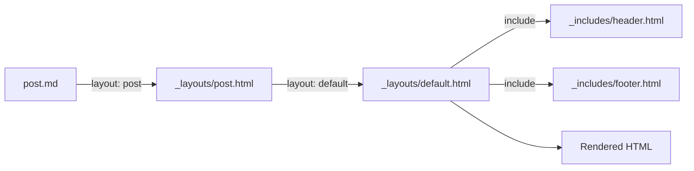

## What you'll learn
- How Jekyll wraps a page's content in a `layout`, and how layouts chain to compose a full HTML document.
- The role of `_includes/` - small fragments you compose into layouts and pages.
- How to pass parameters into an include and why that scoping matters.
- When a piece of markup belongs in a layout versus an include versus a plain partial post.
- The pitfalls that bite first-time Jekyll authors (path resolution, variable scoping, double-wrapping).

## Concepts

A Jekyll source file rarely contains a full HTML document. Instead, the post or page contains the *interesting* bit - the article body, a project description, a list - and a `layout` front-matter key names a template in `_layouts/` that wraps it. The layout receives the rendered body in the magic variable `content` and decides where to drop it. Layouts can themselves declare a `layout`, which is how you get the chain `post.html → default.html → (raw HTML document)`. See the [Layouts docs](https://jekyllrb.com/docs/layouts/) for the formal contract.

`_includes/` is the second composition primitive. An include is a snippet of markup - a site header, a post footer, a `<figure>` macro - that you splice into a layout or page with ``. Unlike a layout, an include doesn't wrap content; it *is* content, dropped in at the point of the include tag. The split is intentional: layouts express the *outside* of a page (the chrome), includes express *repeatable inside parts* (the header inside that chrome, the share buttons under a post).

The trade-off between the two is about direction of flow. A layout receives its child's rendered output and decides where to put it. An include receives parameters from its parent and renders inline. If the same chrome wraps many pages, that's a layout. If the same widget appears at a known spot inside many layouts or pages, that's an include. Mixing them up - for example, trying to "wrap" a page with an include - leads to brittle markup where you forget to render `content` or repeat the doctype five times.

Variables in an include are *scoped* but not isolated. An include can read every site-level and page-level variable (`site.title`, `page.title`, etc.) just like its caller can. Parameters you pass via `` are available inside the include as `include.label`. That `include.` prefix is the only sandbox; it stops your include's local names from leaking back to the caller and vice versa. This is a small but important detail when you start parameterising includes.

The pragmatic rule of thumb: layouts handle the page skeleton (doctype, `<head>`, header, footer, the slot for `content`), and includes handle reusable fragments. Resist the urge to make everything an include - three layers of indirection for a five-line snippet hurts more than it helps.

## Walkthrough

Start with a `default.html` layout that owns the document skeleton. It has no `layout:` of its own, so it is the top of the chain.

```liquid
<!-- _layouts/default.html -->
<!doctype html>
<html lang="en">
  <head>
    <meta charset="utf-8">
    <title>{{ page.title | default: site.title }}</title>
    <link rel="stylesheet" href="{{ '/assets/css/main.css' | relative_url }}">
  </head>
  <body>
    
    <main>{{ content }}</main>
    
  </body>
</html>
```

A `post.html` layout wraps post bodies with title, date, and reading metadata, then delegates to `default.html` for the document skeleton.

```liquid
---
layout: default
---
<article class="post">
  <header>
    <h1>{{ page.title }}</h1>
    <time datetime="{{ page.date | date_to_xmlschema }}">
      {{ page.date | date: "%-d %b %Y" }}
    </time>
  </header>

  {{ content }}

  
</article>
```

A post then opts into the chain with one line of front matter:

```markdown
---
layout: post
title: "On rate limiting"
date: 2026-01-15
---

Body in Markdown here.
```

The header is a small, parameter-free include:

```liquid
<!-- _includes/header.html -->
<header class="site-header">
  <a class="brand" href="{{ '/' | relative_url }}">{{ site.title }}</a>
  <nav>
    <a href="{{ '/posts/' | relative_url }}">Writing</a>
    <a href="{{ '/about/' | relative_url }}">About</a>
  </nav>
</header>
```

A parameterised include is more interesting - say a callout box you can drop into any page:

```liquid
<!-- _includes/callout.html -->
<aside class="callout callout--{{ include.kind | default: 'note' }}">
  <strong>{{ include.title }}</strong>
  <p>{{ include.body }}</p>
</aside>
```

You call it like this, anywhere a page or layout renders:

```liquid

```

The interesting line is `kind | default: 'note'` - the include has a safe default when callers omit the parameter, so it never renders `callout--`. This is the [Includes documentation](https://jekyllrb.com/docs/includes/) pattern worth copying.

## How it fits together



The post climbs up the layout chain, gathering chrome at each level. Includes are pulled in laterally at each layer.

## Common pitfalls

| Pitfall | Why it happens | Fix |
|---|---|---|
| Layout chain never renders body. | A layout forgot `{{ content }}`. | Every non-leaf layout must emit `content` exactly once. |
| Include "doesn't see" my variable. | You set a local variable in the parent and expected it inside the include. | Pass it explicitly: ``, then read `include.foo`. |
| `Liquid Exception: Could not locate the included file`. | Path is relative to `_includes/`, not the calling file. | Use `` from `_includes/subdir/file.html`. |
| Doctype appears twice in output. | A layout extends `default.html` but also includes the full doctype itself. | Only the topmost layout should emit `<!doctype html>` and `<html>`. |
| Page renders unstyled with broken links. | Hard-coded `/assets/...` paths break under a project-page baseurl. | Always pass URLs through `{{ '/x' | relative_url }}`. |

## Exercises

1. Build a `default.html`, a `post.html` that extends it, and a `page.html` that also extends it. Verify the chain by viewing source on a built post and a built page; the `<head>` should be byte-identical between them.
2. Convert a hard-coded post footer (author byline + share links) into `_includes/post-footer.html`. Accept `author` and `permalink` as include parameters and read them with `include.`.
3. Add an `_includes/callout.html` like the one above and use it three times in a post - once each with `kind="note"`, `"warning"`, and `"tip"`. Confirm the default kicks in if you omit `kind`.

## Recap & next
- A `layout` wraps a page's content; layouts can chain via their own `layout:` front matter.
- Includes splice fragments inline and accept parameters under the `include.` namespace.
- Layouts are for chrome, includes are for repeated inner parts - don't blur the line.
- Path resolution for includes is from `_includes/`, not the caller; URLs need `relative_url`.

Next, **Liquid templating - variables, filters, tags, and the data flow** - the template language those layouts and includes are written in, end to end.

