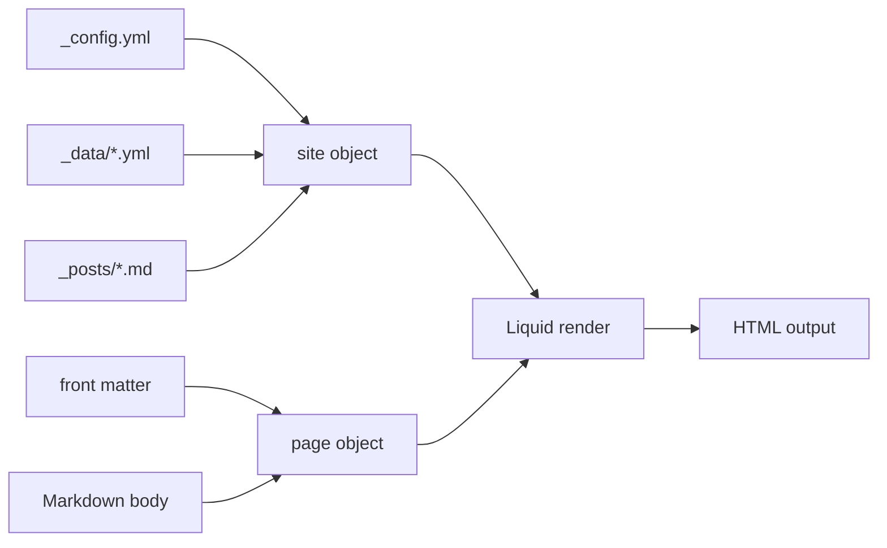

# Liquid Templating - Variables, Filters, Tags, and the Data Flow

> Module 2 · Chapter 2 - The Jekyll model: Layouts, Liquid, and content

## What you'll learn
- The two syntactic forms in Liquid - output `{{ }}` and logic `` - and when to reach for each.
- The global objects Jekyll exposes (`site`, `page`, `layout`, `content`) and the shape of each.
- The filters you'll reach for daily: `date`, `slugify`, `where`, `where_exp`, `group_by`, `sort`, `default`, `escape`, `relative_url`.
- Control flow you'll actually use - `for` with `limit`/`offset`/`reversed`, plus `if`/`unless`/`case`.
- How to debug Liquid in a static-build world without a runtime debugger.

## Concepts

Liquid is a [Shopify-designed template language](https://shopify.github.io/liquid/) that Jekyll uses for every template, layout, include, and even some plugin-rendered files. It has exactly two pieces of syntax. Output tags - `{{ expression }}` - evaluate an expression and write it into the rendered HTML. Logic tags - ``, ``, `` - control the render without producing output themselves. Everything else in your template is literal text that passes through unchanged.

Jekyll injects a handful of globals into every render. `site` is the merged view of `_config.yml`, every collection, and `_data/`. `page` is the front matter of whatever file is currently rendering, plus a few derived fields like `page.url`, `page.path`, and `page.excerpt`. Inside a layout, `content` is the rendered child. The [Jekyll variables docs](https://jekyllrb.com/docs/variables/) enumerate the full shape. The mental model: `site` is global, `page` is local, and Liquid never mutates either - `assign` only creates new variables in the current scope.

Filters are how you transform values inline. The syntax is pipe-style: `{{ post.date | date: "%-d %b %Y" }}`. Most filters take the value on their left and return a new one - they don't mutate. The handful you'll touch every week: `date` (format a date), `slugify` (kebab-case an arbitrary string), `default` (fall back when a value is nil or empty), `escape` (HTML-escape), and the URL pair `relative_url`/`absolute_url`. Jekyll also adds collection-flavoured filters on top of stock Liquid: `where` (filter an array by a key/value), `where_exp` (filter with a Liquid expression), `group_by` (turn an array into named buckets), and `sort` (by key, ascending). The [Jekyll Liquid reference](https://jekyllrb.com/docs/liquid/) lists the full set.

Control flow is small but exact. `for` is your workhorse - it iterates an array and exposes `forloop.index`, `forloop.first`, and `forloop.last` so you can decorate first and last items. `for` also accepts `limit:`, `offset:`, and `reversed`, which compose cleanly: ``. `if`/`unless` are conditional blocks; `case`/`when` is a switch. There is no `else if` - Liquid spells it `elsif`.

Debugging Liquid in a static-build world means you don't have a REPL. You have three reliable tools. First, dump the variable: `<pre>{{ some_var | jsonify }}</pre>` will serialise most structures readably. Second, when you need to render Liquid syntax literally (when teaching or troubleshooting), wrap it in a `raw` block - the block tells Liquid "leave my content alone". The raw tag itself is hard to print on a page rendered by Liquid; the reliable trick is to emit the literal text through an output tag, e.g. `{{ "the-text-you-want-printed" }}`. Third, watch the build output - `jekyll serve --trace` will print the stack on Liquid exceptions, which is much more useful than the default one-liner. The popular suggestion of an `inspect` filter is not standard Liquid; `jsonify` is the dependable Jekyll-flavoured equivalent.

## Walkthrough

A homepage that lists the five most recent posts, with the first one highlighted:

```liquid
---
layout: default
---
<section class="recent">
  
    <article class="card card--featured">
      <h2><a href="{{ post.url | relative_url }}">{{ post.title }}</a></h2>
      <time datetime="{{ post.date | date_to_xmlschema }}">
        {{ post.date | date: "%-d %b %Y" }}
      </time>
      <p>{{ post.excerpt | strip_html | truncate: 160 }}</p>
    </article>
  
</section>
```

The interesting moves: `site.posts` is pre-sorted newest first; `limit:5` slices in template-space without needing an `assign`; `forloop.first` lets the first card take a different class; `date_to_xmlschema` produces a machine-readable timestamp for the `datetime` attribute while a human-readable date shows in the body.

A tag index page that groups every post by its first tag and renders an anchored section per tag:

```liquid
---
layout: default
title: "Tags"
permalink: /tags/
---


  <section id="tag-{{ group.name | slugify }}">
    <h2>{{ group.name | default: "Untagged" }}</h2>
    <ul>
      
        <li>
          <a href="{{ post.url | relative_url }}">{{ post.title }}</a>
          <small>{{ post.date | date: "%Y-%m-%d" }}</small>
        </li>
      
    </ul>
  </section>

```

`group_by_exp` lets the grouping key be an expression - here, the first tag of each post - rather than a simple key. `default: "Untagged"` rescues posts with no tags. `slugify` turns the tag name into a safe `id` anchor.

A debugging trick - render any value as JSON when something's off:

```liquid
<pre style="white-space: pre-wrap">{{ page | jsonify }}</pre>
```

Drop that into a layout during development and you'll see the full `page` object the template is working with. Remove it before deploying.

## How it fits together



`site` and `page` are the two inputs Liquid has; everything else is just expressions over them.

## Common pitfalls

| Pitfall | Why it happens | Fix |
|---|---|---|
| `` always renders. | Liquid uses `==`, not `=`. `=` is for `assign`. | Use ``. |
| `date` filter produces gibberish. | You're piping a string the parser can't read. | Ensure it's a Date (`page.date` is, `"2026-01-15"` is not unless you `| date: "%s"` it first). |
| `where` returns nothing. | Wrong key name or strict comparison (string vs int). | Compare types via `where_exp: "p", "p.draft != true"` for boolean checks. |
| Code samples render as Liquid tags, not literal text. | You wrote `{{ var }}` in a tutorial post. | Wrap examples in a `raw` block so Liquid leaves them alone. |
| Adding a key to `_config.yml` doesn't show up. | Jekyll only reads `_config.yml` at startup. | Restart `jekyll serve` after editing `_config.yml`. |

## Exercises

1. Write a sidebar include that lists the three most recent posts, but skips the post currently being viewed. Hint: filter with `where_exp` against `page.url`.
2. On a tag archive page, render the count of posts per tag next to the heading. Combine `group_by` with `group.items | size`.
3. Build a debug include `` that dumps any value as JSON. Drop it into a stuck template and use it to figure out why a `where` is returning empty.

## Recap & next
- Output tags emit, logic tags don't - that's the whole grammar.
- `site` and `page` are the global inputs; filters transform them inline.
- Reach for `where`, `where_exp`, `group_by`, `sort`, and `default` constantly; the date and URL filters daily.
- Debug by dumping with `jsonify` and reading `--trace` output - there is no Liquid REPL.

Next, **The `_posts` collection and designing your permalink structure** - applying the Liquid model to the most important built-in collection on your site.

