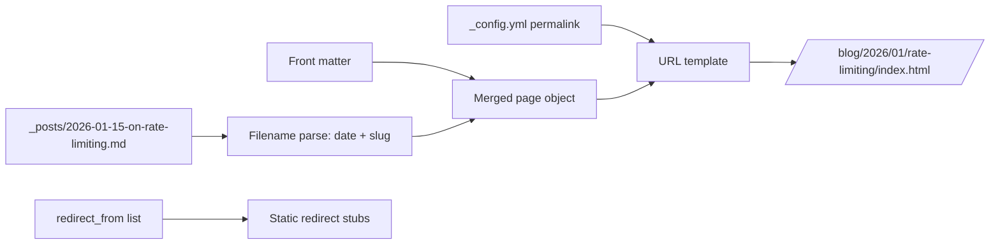

# The `_posts` Collection and Designing Your Permalink Structure

> Module 2 · Chapter 3 - The Jekyll model: Layouts, Liquid, and content

## What you'll learn
- Why `_posts/` is a built-in collection, and what that buys you compared to a plain folder.
- The filename contract Jekyll enforces on posts and how to break it (you don't want to).
- The permalink placeholders available and how to compose them into a URL pattern you can live with for years.
- Why trailing slashes matter, and how `permalink` defaults differ between pages and collections.
- How to change your URL scheme later without breaking the web - `jekyll-redirect-from` and `redirect_from:`.

## Concepts

`_posts/` is the only collection Jekyll ships with enabled by default. Mechanically it behaves like any other collection (covered in chapter 2.4), but it gets two perks no custom collection has: an enforced filename format that injects `date`, `slug`, `categories`, and `title` into front matter for free, and a place at `site.posts` that is *automatically sorted newest first*. That second perk is why list pages and feed templates can write `` and get the right thing.

The filename contract is `YYYY-MM-DD-some-slug.md`. Jekyll parses the date and slug out of the filename and merges them into the post's front matter. You can override `slug` (and other parsed fields) by setting them explicitly in front matter, but the date in the filename is treated as authoritative for sorting and for the `:year`/`:month`/`:day` placeholders below. Files outside that pattern are silently ignored - a common gotcha when you copy a draft from elsewhere and forget the date prefix.

Permalinks are the single most consequential design decision in this chapter. The default for `_posts` is `/:categories/:year/:month/:day/:title:output_ext`, which encodes the publish date *and* the categories *and* the title into the URL, and dumps the file extension into the slug. That URL is brittle: it forces a category structure you may regret, the file extension shows up in browser history, and it puts day-of-month into the URL of an article that is conceptually about an idea, not a date. A more defensible default is `/blog/:year/:month/:slug/` - namespace your writing under `/blog/`, keep year/month for a sense of ordering, ditch day-of-month, and end with a trailing slash so the URL resolves to an `index.html` inside a folder. The [permalinks docs](https://jekyllrb.com/docs/permalinks/) list every placeholder.

Trailing slashes matter for two reasons. First, ergonomics: `/blog/2026/01/on-rate-limiting/` is read by browsers and proxies as a "directory" - copy-paste from the address bar always works. Second, SEO: search engines treat `/foo` and `/foo/` as two URLs unless you tell them otherwise via canonical tags or a redirect. Pick one and commit. With `:slug/` (trailing slash) Jekyll writes `_site/blog/2026/01/on-rate-limiting/index.html`, which is what GitHub Pages serves at the trailing-slash URL.

Changing URLs later is unavoidable - at some point you'll rethink the scheme, or realise a post slug was wrong. The [`jekyll-redirect-from`](https://github.com/jekyll/jekyll-redirect-from) plugin solves the migration problem. Add it to `_config.yml` and you can list old URLs in a post's front matter under `redirect_from:`. Jekyll generates a tiny HTML stub at each old URL that redirects to the new one. The stubs are static - no server logic - so they work fine on GitHub Pages, which whitelists `jekyll-redirect-from` for builds.

Pagination is the one feature this chapter only flags. The default `jekyll-paginate` is barely usable; the community plugin [`jekyll-paginate-v2`](https://github.com/sverrirs/jekyll-paginate-v2) is what you reach for if you outgrow the simple `limit:` pattern Module 3 uses on the homepage. It is not on the GitHub Pages safelist, so it requires the Actions-based build from Module 5. Plan your permalinks knowing pagination layers cleanly on top of any URL scheme.

## Walkthrough

Set the site-wide post permalink in `_config.yml`. This is the single line you'll touch most often when revisiting URL design:

```yaml
# _config.yml
permalink: /blog/:year/:month/:slug/

# Tell Jekyll which plugins to load. jekyll-redirect-from is allowed by
# GitHub Pages, so you can use it without giving up the GH-built build.
plugins:
  - jekyll-redirect-from
```

A post file under the date-stamped naming convention:

```markdown
---
layout: post
title: "On rate limiting"
date: 2026-01-15
tags: [systems, throttling]
# Optional: override the auto-generated slug.
slug: rate-limiting
# Optional: old URLs that should now redirect here.
redirect_from:
  - /2024/05/12/rate-limits/
  - /notes/rate-limits/
---

Body.
```

Filename: `_posts/2026-01-15-on-rate-limiting.md`. With the config above, this builds to `_site/blog/2026/01/rate-limiting/index.html` and serves at `https://yoursite.com/blog/2026/01/rate-limiting/`. The two URLs in `redirect_from:` produce stub pages at their old paths that meta-refresh to the new URL.

Per-collection permalink defaults via the `defaults:` block - useful when you want the *same* layout and URL pattern applied to every post without repeating yourself in each file:

```yaml
# _config.yml - apply layout: post and the canonical permalink to all _posts
defaults:
  - scope:
      path: ""
      type: posts
    values:
      layout: post
      permalink: /blog/:year/:month/:slug/
```

A `defaults` entry has two parts: a `scope` (which files it applies to - by path and/or collection type) and `values` (front-matter fields to inject). Front matter in individual files still wins; this only fills in the unset fields.

## How it fits together



The post's URL is a deterministic function of its filename, its front matter, and the site-wide `permalink` template.

## Common pitfalls

| Pitfall | Why it happens | Fix |
|---|---|---|
| New post doesn't appear in `site.posts`. | Filename missing the `YYYY-MM-DD-` prefix or sitting outside `_posts/`. | Rename to the canonical pattern and rebuild. |
| URLs end in `.html` and look ugly. | Default permalink ends in `:title:output_ext`. | Use a pattern with a trailing slash, e.g. `/:year/:month/:slug/`. |
| Slug differs from what you typed in `title`. | Title has punctuation Jekyll strips during slugify. | Override with `slug:` in front matter. |
| Old URLs 404 after a permalink change. | You only updated the template; nothing maps the old paths. | Install `jekyll-redirect-from` and list old URLs in `redirect_from:`. |
| `defaults:` block doesn't apply. | `scope.path` mismatched or `type` wrong (`pages` vs `posts`). | `path: ""` plus the right `type` covers an entire collection. |

## Exercises

1. Switch your permalink from the default to `/:year/:month/:slug/`. Build the site, open `_site/`, and confirm each post lives in a folder named after its slug with an `index.html` inside.
2. Pick one post and "rename" its slug. Add the old URL to `redirect_from:`, rebuild, and visit the old URL - confirm you land on the new one.
3. Add a `defaults:` block that applies `layout: post` to everything in `_posts/`, then remove `layout:` from one post's front matter. Confirm the layout still kicks in.

## Recap & next
- `_posts/` is a built-in collection; the filename pattern is a contract that gives you date, slug, and ordering for free.
- The site-wide `permalink` template controls every post's URL - pick something stable, slash-terminated, and not date-precise.
- `jekyll-redirect-from` makes URL changes safe; install it before you need it.
- Per-collection `defaults:` blocks keep layouts and permalinks DRY without per-file front matter.

Next, **Custom collections (notes, projects, talks) - when and how** - when one built-in collection isn't enough and you need to model new content types.

