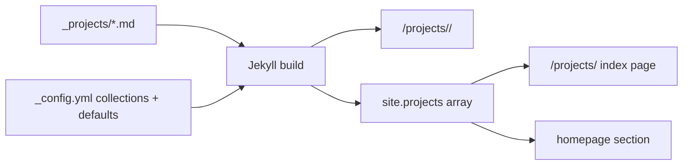

# Custom Collections (Notes, Projects, Talks) - When and How

> Module 2 · Chapter 4 - The Jekyll model: Layouts, Liquid, and content

## What you'll learn
- How to declare a custom collection in `_config.yml` and what `output: true` actually does.
- The `defaults:` block as the right place to set per-collection layout and permalink.
- The decision framework for "collection vs tag vs data file" - three options that overlap but aren't interchangeable.
- How to iterate collections, build an index page, and cross-link between them.
- The gotchas: directory naming, draft files, plugin permissions on GitHub Pages.

## Concepts

A *collection* in Jekyll is a folder of content files (Markdown, HTML) that share a schema, a layout, and a URL space. `_posts/` is the only built-in collection; everything else you declare yourself. Custom collections are how you model content types that don't fit the "dated article" mould - projects with screenshots, talks with slides links, short notes with no date, glossary entries indexed by term. The [collections docs](https://jekyllrb.com/docs/collections/) are the authoritative reference; this chapter walks the practical setup and the decision of when to reach for one.

Declaring a collection takes two pieces. The directory `_<collection_name>/` holds the source files. An entry under `collections:` in `_config.yml` tells Jekyll the collection exists and, crucially, whether to render each item as a standalone page. `output: true` turns a collection into a set of URLs - one HTML page per source file. `output: false` (the default) treats the collection as data - you can iterate `site.<name>` in templates, but no individual pages are written. The latter is useful for things like a "members" list where each member doesn't need their own page; for projects, talks, and notes you almost always want `output: true`.

The trickier choice is *collection vs tag vs data file*. A tag is the cheapest move: zero schema, no new layout, post-shaped URLs. Use tags when "Rust posts" and "Python posts" should look identical apart from a label, and when you don't want a dedicated landing page or a different metadata shape. Reach for a collection when the items have *different fields* from posts (a `screenshot:` on a project, a `slides_url:` on a talk), or *different URLs* (`/projects/foo/` instead of `/blog/2026/01/foo/`), or *different list pages* (a grid of project cards, not a chronological list). Reach for a data file (next chapter) when the items have no body - they're just structured records that templates render inline, like a list of links or speaking dates with no narrative attached.

Defaults are how you keep collection items DRY. The `defaults:` block in `_config.yml` accepts a `scope` (a `type:` matching your collection name) and `values` (front-matter fields injected into every matching file). This is where you set `layout:` and `permalink:` once instead of repeating them in every project file. The same mechanism applies to `_posts/` (chapter 2.3) - it's not collection-specific.

Cross-linking between collections is straightforward but worth flagging. `site.posts` works because it's built in; for a custom collection named `projects`, you iterate `site.projects` and read each project's front matter and `content` exactly like a post. A common pattern is a homepage section that shows recent posts *and* featured projects from one template - the data flow is identical, just with two different collection objects.

## Walkthrough

Declare a `projects` collection with its own layout and a `/projects/<slug>/` URL space:

```yaml
# _config.yml
collections:
  projects:
    output: true             # render one HTML page per project file
    permalink: /projects/:path/

defaults:
  - scope:
      path: ""
      type: projects
    values:
      layout: project        # default layout for every project
```

A project source file under `_projects/sapling.md`:

```markdown
---
title: "Sapling"
url: "https://github.com/example/sapling"
screenshot: "/assets/img/sapling.png"
status: "active"
tags: [tooling, llms]
order: 1
---

Sapling generates roadmap-style courses with Claude. Built because every
"course generator" I tried produced flat lists of bullet points.
```

This file becomes `https://yoursite.com/projects/sapling/` and renders through `_layouts/project.html`, which can read every front-matter field as `page.url`, `page.screenshot`, etc.

A project layout that emits a structured page:

```liquid
---
layout: default
---
<article class="project">
  <header>
    <h1>{{ page.title }}</h1>
    <p class="status status--{{ page.status }}">{{ page.status }}</p>
  </header>

  
    
  

  {{ content }}

  
    <p><a href="{{ page.url }}">Project on GitHub →</a></p>
  
</article>
```

An index page for `/projects/` that lists every project, sorted by an `order` field with a fallback for items that don't set one:

```liquid
---
layout: default
title: "Projects"
permalink: /projects/
---
<ul class="project-grid">
  
  
    <li>
      <a href="{{ project.url | relative_url }}">
        
        <h2>{{ project.title }}</h2>
        <p>{{ project.excerpt | strip_html | truncate: 120 }}</p>
      </a>
    </li>
  
</ul>
```

`project.url` here is the *generated URL of that project page* (`/projects/sapling/`), distinct from the front-matter `page.url` (an external link) used in the project layout. Two different `url`s - Jekyll resolves the one in template context, the front matter wins when keyed on `page`.

A second collection, declared the same way, for talks:

```yaml
# _config.yml - adding to the collections block
collections:
  projects:
    output: true
    permalink: /projects/:path/
  talks:
    output: true
    permalink: /talks/:year/:slug/
```

Each collection has its own folder (`_projects/`, `_talks/`), its own schema (front-matter fields), and its own URL pattern. A homepage can render both side by side with `site.projects` and `site.talks`.

## How it fits together



A collection produces both standalone pages and a `site.<name>` array that any other template can iterate.

## Common pitfalls

| Pitfall | Why it happens | Fix |
|---|---|---|
| Collection items don't get URLs. | `output: true` is missing from the collection's config. | Add it. Without it the items are data-only. |
| Layout doesn't apply to new items. | No `defaults:` block; layout only set on some files. | Add a `defaults:` entry matching `type: <collection>`. |
| Folder named `projects/` (no leading underscore). | Jekyll only treats `_projects/` as the collection source. | Rename to `_projects/`. |
| `site.projects` is empty in templates. | `_config.yml` change was made but server wasn't restarted. | Restart `jekyll serve` - `_config.yml` is read once at startup. |
| Plugin that generates collection pages breaks on GitHub Pages. | GH Pages only whitelists a small set of plugins. | Either keep within whitelisted plugins or build elsewhere and deploy `_site/`. |

## Exercises

1. Add a `notes` collection with `output: true`, permalink `/notes/:slug/`, and a default `layout: note`. Write two notes and verify both render at the expected URLs.
2. On the homepage, render a section "Recent notes" that lists the three most recently added notes. (Notes don't have dates; use a `date:` front-matter field or `order:` and `sort` by it.)
3. Decide for each of these whether you'd model it as a collection, tag, or data file: a list of conference talks; the "Rust" topic on your blog; a footer with five social-media links. Justify each.

## Recap & next
- A collection is a folder of content files with a shared schema, layout, and URL space.
- Declare collections in `_config.yml`; set `output: true` to get one page per item.
- Use `defaults:` to set layout and permalink once per collection.
- Reach for a collection when items have a distinct schema, distinct URLs, or a distinct list page; reach for a tag or data file otherwise.

Next, **Data files (`_data/*.yml`) and driving the site from structured data** - the third option in the collection/tag/data triangle, and the cleanest way to drive lists and tables from outside templates.

