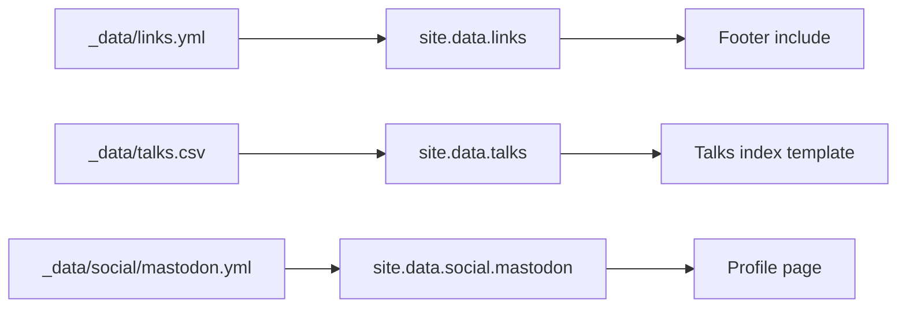

## What you'll learn
- What `_data/` is for and how it differs from collections and front matter.
- The three supported formats (YAML, JSON, CSV) and when each is the right choice.
- The decision rule for "data file vs front matter vs collection".
- One practical pattern for generating pages from data when you need to.
- The pitfalls - caching, casing, types - that bite once your data files grow.

## Concepts

`_data/` is Jekyll's slot for *structured, body-less content*. Anything you put under `_data/filename.yml` becomes available in templates as `site.data.filename`. The shape on the Liquid side is whatever your file deserialises to: a list becomes a Liquid array; an object becomes a Liquid hash; nested structures nest. See the [data files documentation](https://jekyllrb.com/docs/datafiles/) for the full contract.

The point of `_data/` is to keep tabular and list-shaped content out of templates and out of front matter. A footer with five social links *could* be five hardcoded `<a>` tags in `_includes/footer.html`. It could also be five entries in the front matter of the page that uses them. Neither scales well. `_data/links.yml` lets the footer iterate over a list that lives in a clean, diff-friendly YAML file - easy to edit, easy to review, and decoupled from any specific page.

The three supported formats compose nicely: YAML for the common case (human-edited, nested, comments allowed), JSON when the file is generated by a script or imported from an API dump, CSV for genuinely tabular data (talks-and-dates, books-and-ratings) that's easier to maintain in a spreadsheet than as nested YAML. All three end up as the same Liquid shape on the other side, so the choice is about authoring convenience.

The decision rule is the third side of the triangle from chapter 2.4. Use a collection when items need their own URL or layout. Use front matter when the data belongs to *one specific page* (a post's `tags`, a project's `screenshot`). Use a data file when the data is shared across templates, has no body, and doesn't need per-item pages. A glossary entry rendered inline on a `/glossary/` page is a data file; a glossary entry that deserves its own URL is a collection.

Pages from data is the one advanced move worth knowing about. Out of the box, Jekyll doesn't loop a data file and emit a file per entry - the build is template-driven, not data-driven, by default. Two paths exist. The community plugin [`jekyll-datapage-generator`](https://github.com/avillafiorita/jekyll-datapage_gen) (not whitelisted on GitHub Pages - needs a separate build step) does this in one declarative block. Alternatively, you can write a single index template that iterates the data and emits anchored sections on one page, which is enough for glossaries, link lists, and most "list of records" cases. Reach for the plugin only when you genuinely need each record at its own URL - in which case you should reconsider whether it should be a collection instead.

## Walkthrough

A small `_data/links.yml` driving the footer:

```yaml
# _data/links.yml - edited like a list, not like template code
- label: "GitHub"
  url: "https://github.com/example"
  rel: "me"
- label: "Mastodon"
  url: "https://hachyderm.io/@example"
  rel: "me"
- label: "RSS"
  url: "/feed.xml"
  rel: "alternate"
```

The footer include reads `site.data.links` and renders each entry. Adding a link tomorrow is a one-line YAML edit:

```liquid
<!-- _includes/footer.html -->
<footer class="site-footer">
  <ul class="links">
    
      <li>
        <a href="{{ link.url }}" rel="{{ link.rel | default: 'noopener' }}">
          {{ link.label }}
        </a>
      </li>
    
  </ul>
</footer>
```

Subdirectories work too. `_data/social/mastodon.yml` becomes `site.data.social.mastodon`. The path under `_data/` maps directly to nested keys, so you can group related files without flattening into one giant document.

A CSV variant - talks indexed by date, easier to maintain in a spreadsheet:

```csv
title,date,venue,slides
Token bucket internals,2025-09-12,Berlin Backend Meetup,https://example.com/talks/token-bucket.pdf
Schema migrations without downtime,2025-11-04,RustConf,https://example.com/talks/migrations.pdf
```

Saved as `_data/talks.csv`, this is iterable as `site.data.talks` exactly like the YAML file. CSV rows always come through as strings - note that `date` is a string here, so format it via the `date` filter only after coercing:

```liquid

  <article>
    <h3>{{ talk.title }}</h3>
    <p>
      {{ talk.venue }} - {{ talk.date }}
    </p>
    <a href="{{ talk.slides }}">Slides</a>
  </article>

```

A "pages from data" pattern using only the built-in primitives: one template, many anchored sections. Suitable for a glossary, a tech-stack page, or any list of small records:

```liquid
---
layout: default
title: "Glossary"
permalink: /glossary/
---
<dl>
  
    <dt id="{{ term.term | slugify }}">{{ term.term }}</dt>
    <dd>{{ term.definition | markdownify }}</dd>
  
</dl>
```

`markdownify` is the filter to know here - it lets your data file contain Markdown definitions (with links and `code`) while the template stays plain HTML.

## How it fits together



`_data/` is read once per build; the directory shape becomes a nested object available to every template.

## Common pitfalls

| Pitfall | Why it happens | Fix |
|---|---|---|
| Edited `_data/x.yml` and nothing changed. | Browser cache, or `jekyll serve` didn't pick up the change. | Hard refresh; data files are watched but verify the build output rebuilt. |
| `site.data.foo` is `nil`. | Filename typo, or YAML failed to parse silently. | Run `jekyll build --trace`; check for tab characters in YAML (use spaces). |
| Dates in CSV format wrong. | CSV values come through as strings. | Parse with `| date: "%Y-%m-%d"` only after the field is a date; consider YAML for date-heavy data. |
| Keys with hyphens fail in dot access. | `link.label-text` is a Liquid syntax error. | Use bracket access: `link["label-text"]`. |
| Same data drifts between several files. | Copy-pasted a list into both a data file and a layout. | Pick one home for the list; templates read from `site.data`, layouts don't duplicate. |

## Exercises

1. Replace any hard-coded list in your templates (nav menu, footer, social links) with a `_data/*.yml` file and a `for` loop. Confirm adding a new entry is a one-line YAML edit.
2. Build a `/uses/` page driven by `_data/uses.yml` grouped into sections (editor, terminal, hardware). Use nested YAML and a `for` loop within a `for` loop.
3. Write a glossary using the anchored-sections pattern above. Confirm that `markdownify` lets you put inline links and `code` formatting in the YAML definitions.

## Recap & next
- `_data/` holds structured, body-less content reachable as `site.data.<path>`.
- Pick YAML for hand-edited data, JSON for generated data, CSV for tabular data.
- Use a data file when content is shared and body-less; use front matter for one-page data; use a collection when items need URLs.
- For "pages from data", prefer one template with anchored sections; reach for plugins only when items truly need distinct URLs (and then consider whether it should be a collection).

You now have Jekyll's templating and content model in your head: layouts compose pages, Liquid drives the renders, `_posts/` plus your permalink scheme is the spine of the blog, custom collections handle distinct content types, and `_data/` handles the structured glue.

Next, in Module 3, **Choosing a starting point - `minima`, a community theme, or from scratch** - turning all this theory into a real blog by picking the right base to build on.

