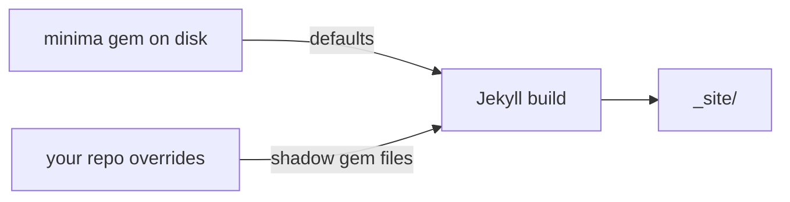


## What you'll learn
- The three real starting points for an engineering blog and where each one breaks.
- How gem-based themes work - and why most of the theme's files are invisible until you override them.
- How to read a theme's source so you know what you're inheriting before you commit to it.
- The signals that you've outgrown a theme and should fork or replace it.
- Why "start small, override selectively" beats either extreme for almost everyone.

## Concepts

You have three honest options. The first is **`minima`**, the default theme that `jekyll new` scaffolds for you. It is intentionally plain: one column, system fonts, a header with site title and a couple of nav links, posts on the home page in reverse-chronological order. It ships as a Ruby gem, so the theme's `_layouts`, `_includes`, `_sass`, and `assets/` are not in your repo - they live inside the installed gem and Jekyll reads them at build time. That invisibility is a feature when you don't want to maintain templates yet, and a footgun when you go looking for `default.html` and can't find it.

The second is a **community theme** like [`jekyll-theme-chirpy`](https://github.com/cotes2020/jekyll-theme-chirpy) or [`al-folio`](https://github.com/alshedivat/al-folio). These are richer - pre-built tag pages, search, archive layouts, dark mode, sometimes even tooling for citations or projects. They are also more opinionated: a Chirpy site looks like a Chirpy site, and getting it to look like *your* site means fighting design choices you didn't make. Many of them are also **fork-style** rather than gem-based - you clone the whole repo and your blog *is* the theme, which means future upstream updates land in your tree as merge conflicts rather than a `bundle update`.

The third is **starting from a blank `index.html`** with no theme at all. Maximum control. Also maximum work. You write every layout, every include, every line of Sass. For a small blog this isn't unreasonable - a competent web developer can produce a serviceable Jekyll theme in an afternoon - but you are now the maintainer of a theme as well as a writer of posts, and those compete for the same evenings.

For an engineering blog, the answer is almost always the same: **start with `minima` or a similarly minimal gem-based theme, and override only the files you need to change**. Jekyll's [themes documentation](https://jekyllrb.com/docs/themes/) describes the override mechanism - any file you place in your repo at the same path shadows the gem's copy. You get the theme's defaults for everything you haven't touched and full control over the parts you have. The next chapter is dedicated to that workflow. This chapter is about choosing well before you write any code.

The key skill in choosing is being able to *read* a theme before adopting it. With a gem-based theme, that means finding where it lives on disk.

## Walkthrough

Locate `minima` on your machine after `bundle install`:

```bash
# Print the install path of the minima gem
bundle info minima
```

The output ends with a path like `/Users/you/.gem/ruby/3.3.0/gems/minima-2.5.1`. Open that directory in your editor - read-only, since editing here would be invisible to git and would vanish on `bundle update`:

```bash
# Open the gem in your editor without checking it out anywhere
$EDITOR "$(bundle info --path minima)"
```

You should see a familiar Jekyll tree:

```text
minima-2.5.1/
  _includes/
    disqus_comments.html
    footer.html
    google-analytics.html
    head.html
    header.html
    social.html
  _layouts/
    default.html
    home.html
    page.html
    post.html
  _sass/
    minima.scss
    minima/
      _base.scss
      _layout.scss
      _syntax-highlighting.scss
  assets/
    main.scss
    minima-social-icons.svg
```

Three things are worth noticing. First, `_layouts/default.html` is the page skeleton - `<html>`, `<head>`, header, footer, and `{{ content }}`. Every other layout extends it. Second, the Sass is split into a top-level `minima.scss` partial plus `_base.scss`, `_layout.scss`, and `_syntax-highlighting.scss` - that structure is what makes selective overrides possible. Third, `_includes/head.html` is where you'll edit `<meta>` tags later in the course. Knowing this map before you commit to a theme means you can predict whether a customization will be a five-minute override or a fork-and-maintain situation.

For a community theme, do the equivalent on GitHub: read `_layouts/`, `_includes/`, and `_sass/` before adopting it. If you can't picture the override you'd need for the first three things you'd want to change, pick a simpler theme.

## How it fits together



The gem provides defaults; your repo overrides them path-by-path. You only ever own the files you've changed.

## Common pitfalls

| Pitfall | Why it happens | Fix |
|---|---|---|
| Searching the repo for `default.html` and finding nothing. | Gem-based theme files don't live in your repo until you override them. | Run `bundle info minima` to find the gem path; read the layouts there. |
| Adopting Chirpy/al-folio for "engineering polish", then spending weekends fighting its opinions. | Rich themes encode a lot of design decisions; deviating means undoing them. | Either commit to the theme's look or downgrade to a simpler base. |
| Forking a theme repo to "customize easily", then never pulling upstream fixes. | A fork is now a maintenance burden, and merge conflicts grow with every change. | Prefer gem-based themes; reserve forking for when the override path runs out. |
| Editing files inside the gem's install directory. | The path is read-write, and edits seem to "work" locally. | Don't. `bundle update` will silently wipe them; copy the file into your repo instead. |
| Going from-scratch on day one. | Total control is appealing before you've felt the weight of maintaining it. | Use a theme for v1; rewrite from scratch on v3 when you actually know what you want. |

## Exercises

1. Run `bundle info minima` and open the gem in your editor. Find the line in `_layouts/default.html` that renders the site footer. Note the path - you'll override exactly this file in the next chapter.
2. Open the GitHub repo for one community theme (Chirpy or al-folio). List three opinions it encodes (layout, navigation, color, typography) and ask yourself whether you want to inherit each one.
3. Write a one-paragraph "design brief" for your blog: what should the home page show, how many fonts, light or dark, sidebar or no sidebar. You'll measure your theme choice against this brief.

## Recap & next

- Three starting points: `minima`, a community theme, from scratch - each trades effort for control.
- Gem-based themes hide most files until you override them; `bundle info <theme>` shows you where they actually live.
- Read a theme's `_layouts`, `_includes`, and `_sass` *before* adopting it, so you know what overrides you'll need.
- For an engineering blog, the default recommendation is `minima` plus selective overrides - the rest of this module assumes that path.
- You've outgrown a theme when the color tokens, typography, or markup you want to change don't have hooks; that's the signal to fork or replace, not before.

Next, **Customizing layouts and styles without forking the whole theme** - the exact override workflow that keeps your diff with the theme gem small.



