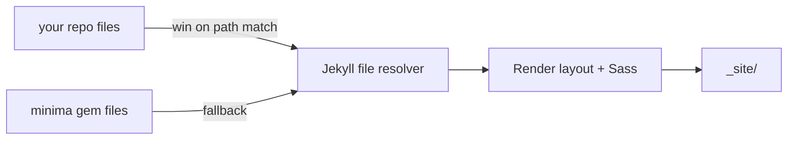

## What you'll learn
- How Jekyll's theme-file precedence lets your repo shadow individual gem files.
- The override pattern for a single layout (`_layouts/default.html`) - copy, edit, ignore the rest.
- The Sass entrypoint pattern: import the theme's partials into your own `assets/css/main.scss` and add only the overrides on top.
- How to pin the theme gem version so your overrides don't break under you.
- How to keep your diff with the upstream theme small enough to stay updatable.

## Concepts

Jekyll resolves theme files in a strict precedence order: **your repo first, the theme gem second.** For any path Jekyll looks up - `_layouts/default.html`, `_includes/head.html`, `_sass/minima/_base.scss`, `assets/main.css` - it checks your repo before the gem. If your repo has a file at that path, the gem's copy is shadowed entirely. There is no merge; there is no partial override. Either your file wins, or the gem's does. That binary is the mechanic that makes targeted customization pleasant and broad customization painful.

The practical implication is that you should copy *only* the file you want to change. If you want a different `<head>`, copy `_includes/head.html` into your repo and edit it. If you want a different page skeleton, copy `_layouts/default.html`. Leave the rest in the gem. Your diff with the theme is now exactly the files you've touched - when `minima` ships a fix, you `bundle update minima` and inherit it everywhere except the files you've taken responsibility for. Compare that to forking the whole theme, where every file is yours and every upstream fix is a merge.

The same precedence applies to Sass via a small but important convention. Themes ship a top-level Sass file (in `minima`'s case `assets/main.scss`) that imports a partial named after the theme (`_sass/minima.scss`). The recommended override is to create your own `assets/css/main.scss` with a front-matter header (Jekyll only processes Sass when there's front matter), set your variables, then `@import "minima";`. Your variables are evaluated *before* the import, so any `$brand-color` you define overrides the theme's default. This is the standard Sass-cascade pattern and the [Jekyll themes docs](https://jekyllrb.com/docs/themes/#overriding-theme-defaults) describe it explicitly.

The last piece is **version pinning**. Override files are written against a specific version of the theme's structure. If `minima` 3.0 renames `_includes/head.html` to `_includes/site-head.html`, your override silently stops applying - the build still succeeds, your `<meta>` tag just disappears. Pin the theme in your `Gemfile` with `gem "minima", "~> 2.5"` so a major version bump is a deliberate decision, not a `bundle update` surprise.

## Walkthrough

A concrete, end-to-end override: change the site title's link color and add a `<meta name="theme-color">` tag for mobile browser chrome.

First, the Sass override. Create `assets/css/main.scss` in your repo:

```scss
---
# Empty front matter is required so Jekyll processes this as Sass, not a static asset.
---

// Override theme defaults before importing the partial - the import uses these values.
$brand-color: #2c5282;        // site title link color
$link-base-color: #2c5282;    // body link color, kept in sync

@import "minima";

// Anything after the import wins over the theme - use sparingly.
.site-title {
  font-weight: 600;
}
```

Two things are doing the work. The empty front-matter block (the `---` fence with nothing inside) is what tells Jekyll to run the file through Sass at build time; without it, the file is copied verbatim. The variable assignments happen *before* `@import "minima";` so when the theme's partial reads `$brand-color`, it sees your value. Rules below the import are last-wins overrides for selectors the variables don't expose.

This filename matters: `main.scss` is what `minima` (and most starter themes) reference from their default `<head>`, so naming yours `main.scss` lets you override the theme's stylesheet by file precedence - the same mechanic that overrides `_includes/head.html`. Pick a different name and you have to update the `<link>` tag to match.

Point the site at the new stylesheet by overriding `_includes/head.html`. Copy the gem's version into your repo first:

```bash
# Copy just the one file you want to change; leave the rest in the gem.
mkdir -p _includes
cp "$(bundle info --path minima)/_includes/head.html" _includes/head.html
```

Then edit the copy:


```html
<head>
  <meta charset="utf-8">
  <meta http-equiv="X-UA-Compatible" content="IE=edge">
  <meta name="viewport" content="width=device-width, initial-scale=1">

  <!-- Mobile address-bar color - matches the body link color set in Sass. -->
  <meta name="theme-color" content="#2c5282">

  
  <link rel="stylesheet" href="{{ '/assets/css/main.css' | relative_url }}">
  
</head>
```


Note `/assets/css/main.css` - Jekyll compiles `main.scss` to `main.css`, and the URL drops the leading underscore conventions. The Liquid tags `` and `` come from gems we'll add in Module 4; leave them in even if you haven't installed those plugins yet - they'll no-op silently until you do.

Pin the theme so this all keeps working:

```ruby
# Gemfile - pin the major version; minor bumps still arrive via `bundle update`.
source "https://rubygems.org"

gem "jekyll", "~> 4.3"
gem "minima", "~> 2.5"
```

## How it fits together



The resolver is path-by-path. Files you haven't overridden continue to come from the gem on every build.

## Common pitfalls

| Pitfall | Why it happens | Fix |
|---|---|---|
| Sass overrides don't apply. | Variables were placed *after* `@import "minima";`. | Put variable assignments above the import; rules can go below. |
| Stylesheet 404s after override. | The copy of `head.html` still points at a path that doesn't match your entrypoint filename. | Update the `<link rel="stylesheet">` to `/assets/css/main.css` (or whatever you named your entrypoint). |
| Override stops working after `bundle update`. | A major theme version renamed or removed the file you'd copied. | Pin the theme major version in `Gemfile`; treat major bumps as a project. |
| Sass file ships as-is, unprocessed. | The front-matter `---` fence is missing. | Add an empty front-matter block at the top of `.scss` files you want Jekyll to compile. |
| Override drifts far from upstream and updates become painful. | The reader copied many files "just in case", then changed a few lines in each. | Only copy a file when you actually need to edit it; revert files you didn't end up changing. |

## Exercises

1. Override `_includes/footer.html` to add your social handle. Run `jekyll serve --livereload`. Confirm the change appears without copying any other file.
2. Add a `$base-font-family` override in `assets/css/main.scss` that switches the body font to a system stack. Verify the change in the rendered HTML's computed styles.
3. Run `bundle outdated`. If `minima` has a newer minor version, run `bundle update minima` and confirm your overrides still work. If a major version is available, *don't* update - explain in one sentence why.

## Recap & next
- Jekyll's theme-file precedence is binary and per-path: your repo's file wins, or the gem's does.
- Override only the files you need to change; the rest stay in the gem and keep getting upstream fixes.
- The Sass entrypoint pattern - set variables, then `@import "minima";` - is how you change tokens without forking the stylesheet.
- Pin the theme's major version so `bundle update` doesn't silently break overrides.
- Keep the override surface small enough that you could explain every file in your repo in one sentence.

Next, **Designing the homepage, post page, and archive** - apply these overrides to the three pages every blog has.

