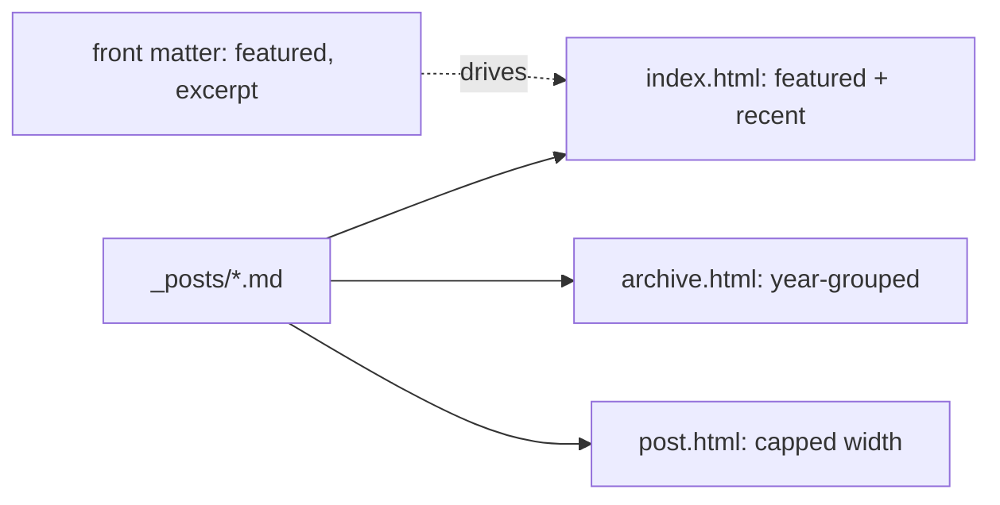

# Designing the Homepage, Post Page, and Archive

> Module 3 · Chapter 3 - Applied: Building the blog itself

## What you'll learn
- How to give the homepage a deliberate hierarchy with a "selected" list and a "recent" list.
- The two or three CSS rules that make a post page actually readable on a phone.
- How to build a year-grouped archive that scales as your post count grows.
- How to use `excerpt_separator` and the per-post `excerpt:` front matter so list pages don't all look the same.
- The judgement calls - what to leave plain, what to mark, what to hide on small screens.

## Concepts

Every blog has three pages, and most blogs get one of them wrong. The **homepage** is where you tell a first-time visitor what this place is. The **post page** is where readers spend most of their time. The **archive** is the page they reach when they want to find something specific. Each has different priorities and each rewards a different layout.

The homepage's job is not "show the 10 most recent posts" - that's the default and it gives every post equal weight, which is wrong if some of your posts are much better than others. Treat the homepage as an edit. A short "selected work" list of three to six posts you'd want a stranger to read, followed by a "recent" list of the last few. Implement the selection via a `featured: true` flag in front matter and a [Liquid `where` filter](https://jekyllrb.com/docs/liquid/filters/) - no plugin needed.

The post page rewards typographic discipline more than anything. The single biggest improvement is **reading-line length**: cap `.post-content` at roughly 65-75 characters of body type, which on a 16-18px font lands around 38-42rem. Generous line-height (1.6-1.75 for serif body, 1.5-1.6 for sans) and a sensible vertical rhythm between paragraphs do the rest. None of this requires a framework; it requires you to stop letting paragraphs span the full window width.

The archive becomes load-bearing once you have more than about 30 posts. Paginating it ("10 per page, navigate with arrows") is the wrong default - readers scanning for a half-remembered title don't want to flip through pages. **Year-grouped** is better: one section per year, each post a single line of title plus date. A reader can `Cmd-F` for a title or scan visually in a single scroll. Liquid's `group_by_exp` does the grouping in the template; no plugin needed.

Excerpts are the other under-used Jekyll feature. By default Jekyll takes the first paragraph as the excerpt, which is fine for some posts and useless for others. You have two levers: a site-wide `excerpt_separator` (set to `<!--more-->` in `_config.yml`) lets you mark the cut point in the body, and a per-post `excerpt:` front-matter key lets you write a bespoke summary that never appears in the post body itself. Use the latter on list pages where the first paragraph isn't doing summary work.

## Walkthrough

**Homepage** with a featured list and a recent list. Create `index.html` at the repo root:

```liquid
---
layout: default
title: Home
---

<section class="featured">
  <h2>Selected writing</h2>
  <ul>
    
    
      <li>
        <a href="{{ post.url | relative_url }}">{{ post.title }}</a>
        
          <p>{{ post.excerpt | strip_html | truncatewords: 30 }}</p>
        
      </li>
    
  </ul>
</section>

<section class="recent">
  <h2>Recent</h2>
  <ul>
    
      <li>
        <time datetime="{{ post.date | date_to_xmlschema }}">
          {{ post.date | date: "%b %-d, %Y" }}
        </time>
        <a href="{{ post.url | relative_url }}">{{ post.title }}</a>
      </li>
    
  </ul>
</section>

```

The `where: "featured", true` filter quietly does the editorial work: only posts whose front matter sets `featured: true` appear in the top list. Add `featured: true` to a post when you'd send a stranger that link.

**Post page** typography in `assets/css/main.scss`, appended after the `@import "minima";`:

```scss
// Cap reading-line length; em-based so it scales with the user's font size.
.post-content {
  max-width: 40rem;       // ~65-72ch at 16-18px body type
  font-size: 1.0625rem;   // 17px on the default 16px root
  line-height: 1.7;
}

.post-content p + p {
  margin-top: 1.1em;      // vertical rhythm between paragraphs
}

.post-content h2 {
  margin-top: 2.2em;      // generous space *above* headings
  margin-bottom: 0.6em;   // tight space below; binds heading to its section
}
```

The asymmetric heading margins matter more than they look. Generous space above a heading and tight space below it visually groups the heading with the text it introduces - a small thing that reads as "this is well-typeset" without the reader knowing why.

**Year-grouped archive** at `archive.html`:

```liquid
---
layout: default
title: Archive
permalink: /archive/
---

{%- assign by_year = site.posts | group_by_exp: "post", "post.date | date: '%Y'" -%}

  <section>
    <h2>{{ year.name }}</h2>
    <ul>
      
        <li>
          <time>{{ post.date | date: "%b %-d" }}</time>
          <a href="{{ post.url | relative_url }}">{{ post.title }}</a>
        </li>
      
    </ul>
  </section>


```

`group_by_exp` evaluates the second argument as a Liquid expression per item and groups by the result - here, the year. `site.posts` is already reverse-chronological, so years come out newest-first for free.

Enable explicit excerpts in `_config.yml`:

```yaml
# Mark excerpt cut points in post bodies with <!--more-->
excerpt_separator: "<!--more-->"
```

Then in any post:

```markdown
---
title: "On rate limiting"
excerpt: "Token bucket vs. leaky bucket, and the cases where neither is enough."
---

Body of the post...
```

The `excerpt:` front-matter key wins over the separator and over the default-first-paragraph behaviour. Use it whenever the first paragraph isn't a summary.

## How it fits together



The same `site.posts` collection feeds all three pages; front-matter flags shape how each renders it.

## Common pitfalls

| Pitfall | Why it happens | Fix |
|---|---|---|
| Homepage shows every post the same. | The template loops `site.posts` with no filter. | Add a `featured: true` flag and split into "selected" and "recent" sections. |
| Long lines on desktop, fine on phone. | The body has no `max-width`; the column grows with the window. | Cap `.post-content` at ~40rem; let small screens fill naturally. |
| Archive becomes unusable at 60+ posts. | Paginated 10-per-page hides everything behind clicks. | Group by year; one section per year, one line per post. |
| Every excerpt is the same first sentence. | Default-first-paragraph behaviour with no overrides. | Set `excerpt_separator` and use `excerpt:` front matter for important posts. |
| `group_by_exp` syntax error. | The second argument is a Liquid expression string, not a property name. | Use `group_by_exp: "post", "post.date \| date: '%Y'"` - both arguments quoted. |

## Exercises

1. Mark three of your posts (or scaffolds) as `featured: true`. Rebuild and confirm they appear in "Selected writing" on the homepage and *not* duplicated in "Recent" if your loop excludes them.
2. Open a post on your phone (or a 375px viewport in DevTools). Measure the reading-line length. Adjust `.post-content { max-width }` so it lands between 60 and 75 characters on a desktop window.
3. Add an `excerpt:` front-matter key to one post and `<!--more-->` to another. View the homepage and confirm each post uses the right source for its summary.

## Recap & next
- Homepage hierarchy beats reverse-chronological-by-default; "selected" + "recent" is the smallest editorial layout that works.
- Post-page typography is mostly `max-width` and `line-height`; the rest is rhythm between elements.
- Year-grouped archives scale further than pagination for a blog of any size.
- `excerpt_separator` and per-post `excerpt:` give you list pages that aren't all the same first sentence.
- `group_by_exp` is the Liquid primitive for grouping by any expression - year, category, anything you can compute.

Next, **Code blocks, syntax highlighting (Rouge), and engineering-friendly typography** - the centrepiece of an engineering blog.

