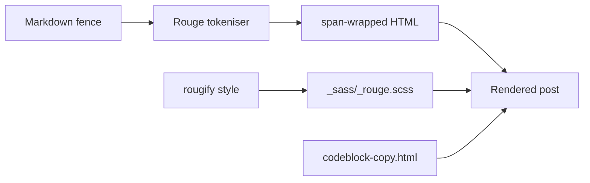

## What you'll learn
- How Rouge - Jekyll's default highlighter - tokenises fenced code, and what controls the CSS classes it emits.
- How to generate a Rouge theme stylesheet with `rougify` and swap it in.
- The two ways to render code (fenced blocks vs. the `highlight` Liquid tag) and when each one is right.
- How to add a copy-to-clipboard button via a small include and a few lines of vanilla JS.
- A working monospace + body type pairing that doesn't make code feel like an afterthought.

## Concepts

Rouge is the pure-Ruby syntax highlighter Jekyll uses by default - no Node, no external process, runs as part of the build. When Jekyll converts your Markdown to HTML, kramdown hands fenced code blocks to Rouge, which tokenises the source and wraps each token in a `<span>` with a short class (`k` for keyword, `s` for string, `c1` for comment, and so on). The colors come from a separate stylesheet you generate from Rouge itself. The [Rouge repo](https://github.com/rouge-ruby/rouge) lists every supported language; if your fence has a language tag Rouge recognizes, you get colored output for free.

There are two ways to mark code in your Markdown. **Fenced blocks** with a language tag are the everyday workhorse: triple backticks, the language, the code, triple backticks. This is what 95% of your posts should use. For the other 5% - when you need line numbers, a starting line offset, or to highlight specific lines - reach for Liquid's [`highlight` tag](https://jekyllrb.com/docs/liquid/tags/#code-snippet-highlighting), which accepts options the Markdown fence can't express. Both routes go through Rouge; the difference is what options you can pass.

The CSS is where most blogs trip up. Rouge ships with several built-in themes (`github`, `monokai`, `base16`, `gruvbox`, others), but the *stylesheet* isn't shipped - you have to generate it. The `rougify` CLI that comes with the Rouge gem prints a CSS file you can drop into your project. Once it's there, swapping themes is a one-line regeneration. Default `minima` includes a basic syntax stylesheet, but it's small and tied to the theme's color palette; generating your own gives you control and the right contrast against your background.

Typography for code is its own discipline. The body face is for reading prose; the monospace face is for reading structure. They need to sit next to each other without one shouting. JetBrains Mono, IBM Plex Mono, Berkeley Mono, and the open-source `Mono` cuts of common sans families are all reasonable choices. The key is **sizing them so the x-height looks similar to the body** - a 16px sans body usually wants a 14.5-15px monospace, not 16px, because most monospaces have a taller x-height. Inline code (`` `like this` ``) wants a small background tint and a tiny horizontal pad; block code wants more padding and a less aggressive background. Get those two right and the post looks engineered before anyone reads a word.

## Walkthrough

A fenced block in Markdown - Rouge picks up the language from the fence tag:

````markdown
```ruby
# Build the site once and exit; --trace prints the full backtrace on errors.
Jekyll::Commands::Build.process(source: ".", destination: "_site")
```
````

For line numbers or line highlighting, use the `highlight` tag:

```liquid

def token_bucket(rate, capacity)
  tokens, last = capacity, Time.now
  ->(now = Time.now) {
    tokens = [capacity, tokens + (now - last) * rate].min
    last = now
    tokens >= 1 && (tokens -= 1; true)
  }
end

```

`linenos` is the option you'll reach for most often. The full list (line offsets, hl_lines for highlighting specific lines) is in the Jekyll docs.

**Generate the Rouge theme stylesheet** to `_sass/_rouge.scss`:

```bash
# List available themes:
bundle exec rougify help style

# Generate a theme as a CSS file, prefix every selector with .highlight
# so it scopes cleanly to Rouge's wrapper element:
bundle exec rougify style github.light > _sass/_rouge.scss
```

Then import it from your `assets/css/main.scss`, after `@import "minima";`:

```scss
@import "minima";
@import "rouge";   // overrides minima's basic syntax stylesheet

// Inline code: subtle background, not block-level padding.
code {
  background: #f6f8fa;
  padding: 0.1em 0.35em;
  border-radius: 3px;
  font-size: 0.9em;
}

// Block code: rouge handles color; we handle the frame.
pre.highlight {
  padding: 1em 1.2em;
  border-radius: 6px;
  overflow-x: auto;
  font-size: 0.875rem;   // ~14px against a 16px body
  line-height: 1.55;
}
```

The `code` rule targets inline code; the `pre.highlight` rule targets the block. Rouge wraps every highlighted block in `<div class="highlight"><pre class="highlight">...`, so `pre.highlight` is the safe selector to style.

**Copy-to-clipboard** as a small include. Create `_includes/codeblock-copy.html`:

```html
<!-- Renders once per page; the JS finds every `pre.highlight` on load. -->
<script>
  // Wrap each highlighted block with a copy button. Idempotent on re-runs.
  document.querySelectorAll("pre.highlight").forEach((pre) => {
    if (pre.parentElement.classList.contains("code-wrap")) return;

    const wrap = document.createElement("div");
    wrap.className = "code-wrap";
    pre.parentNode.insertBefore(wrap, pre);
    wrap.appendChild(pre);

    const btn = document.createElement("button");
    btn.type = "button";
    btn.className = "copy-btn";
    btn.textContent = "Copy";
    btn.addEventListener("click", async () => {
      // navigator.clipboard requires HTTPS or localhost.
      await navigator.clipboard.writeText(pre.innerText);
      btn.textContent = "Copied";
      setTimeout(() => (btn.textContent = "Copy"), 1500);
    });
    wrap.appendChild(btn);
  });
</script>
```

Include it once near the end of `_layouts/default.html`:

```liquid

```

A few CSS lines complete the picture:

```scss
.code-wrap { position: relative; }
.copy-btn {
  position: absolute;
  top: 0.5em;
  right: 0.5em;
  font-size: 0.75rem;
  background: rgba(255,255,255,0.9);
  border: 1px solid #d0d7de;
  border-radius: 4px;
  padding: 0.2em 0.5em;
  cursor: pointer;
}
.code-wrap:hover .copy-btn,
.copy-btn:focus { opacity: 1; }
.copy-btn { opacity: 0; transition: opacity 0.15s; }
```

The button stays hidden until hover or keyboard focus, so it doesn't compete with the code.

## How it fits together



Rouge produces the HTML at build time; the CSS provides the colors; the include adds interactivity in the browser.

## Common pitfalls

| Pitfall | Why it happens | Fix |
|---|---|---|
| Code blocks render but have no colors. | Rouge produced the spans but no stylesheet is loaded. | Generate one with `rougify style <name> > _sass/_rouge.scss` and `@import "rouge";`. |
| Wrong language colors after a fence change. | The fence tag is misspelt or unsupported (`js` vs `javascript`, `sh` vs `bash`). | Check Rouge's [list of lexers](https://github.com/rouge-ruby/rouge/tree/master/lib/rouge/lexers); use canonical names. |
| Copy button copies HTML, not source. | `innerHTML` was used instead of `innerText`. | Use `pre.innerText` (or `textContent`) - Rouge's spans don't leak that way. |
| Inline code looks like block code. | A single `code` selector covers both, with block-level padding. | Style inline `code` separately from `pre code`/`pre.highlight`. |
| Monospace dwarfs the body text. | Default 1em monospace against a 16-17px body face. | Set block code at ~0.875rem and inline code at ~0.9em. |

## Exercises

1. Run `bundle exec rougify style monokai.sublime > _sass/_rouge.scss`, rebuild, and compare it to `github.light`. Pick the one that has the contrast you want against your background.
2. Add the copy-to-clipboard include and verify it works on `localhost`. Then deploy and confirm it still works - `navigator.clipboard` requires a secure context (HTTPS or `localhost`).
3. Use the `highlight` Liquid tag with `linenos` on one post that walks through a multi-step snippet. Note one situation where you reached for the tag instead of a fenced block.

## Recap & next
- Rouge tokenises fenced code at build time; the colors come from a separate stylesheet you generate with `rougify`.
- Fenced blocks cover 95% of cases; reach for the `highlight` tag when you need line numbers or line marking.
- Style inline `code` and block `pre.highlight` separately - they have different jobs.
- A 20-line vanilla-JS include is enough for copy-to-clipboard; no plugin required.
- Size monospace below the body face (~0.875rem block, ~0.9em inline); the page reads as engineered, not gimmicky.

Next, **Tags, categories, and post navigation that actually helps readers** - the last pieces of the reader's path through the site.

