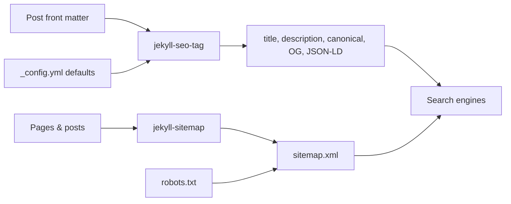

## What you'll learn
- What `jekyll-seo-tag` writes into your `<head>` and what it leaves to you.
- The three layers of title/description fallback: page front matter, site defaults, theme guesses.
- How `jekyll-sitemap` generates `sitemap.xml` and what to do with it.
- What `robots.txt` actually controls (and the very common things it does not).
- Where to set the canonical URL - and why this matters once you have any duplicate pages.

## Concepts

`jekyll-seo-tag` is a small plugin that emits the `<head>` boilerplate every blog needs: `<title>`, `<meta name="description">`, canonical link, Open Graph tags, Twitter card tags, and JSON-LD for search engines. You wire it in once and let each post override the bits it cares about through front matter. The [plugin README](https://github.com/jekyll/jekyll-seo-tag) is short and worth reading top to bottom - it documents every front-matter key it consults.

Titles and descriptions resolve through a chain. The plugin first looks at the page's front matter (`title:` and `description:`). If `description` is missing, it falls back to `excerpt`, then to the site-wide `description` from `_config.yml`. The site-wide values matter more than people think - they are what show up on your homepage, your tag pages, and any page where you forgot to write a description. Set them once, write them well, and you stop leaking placeholder text into Google.

The **canonical URL** is the URL you tell search engines to treat as the original. `jekyll-seo-tag` defaults to `page.url` joined with `site.url`, which is correct for most posts. You override it with `canonical_url:` in front matter when the same content is reachable at more than one URL - say, a post syndicated to Dev.to or a tag page that overlaps with the post list. Without an explicit canonical, two URLs with identical content can split each other's ranking signals; with one, search engines know which to index.

`jekyll-sitemap` is even smaller. It walks every page and post and writes `sitemap.xml` at the root. You then submit that URL once to [Google Search Console](https://search.google.com/search-console) and [Bing Webmaster Tools](https://www.bing.com/webmasters); they re-fetch it on a schedule. Submission is not required - sitemaps help crawlers discover new pages faster and confirm canonical URLs, but Google will find your site through links anyway. See the [plugin README](https://github.com/jekyll/jekyll-sitemap) for what it includes and how to exclude pages.

`robots.txt` is the file most often misunderstood. It is **advisory** - well-behaved crawlers honor it; badly-behaved ones do not. It tells search engines which paths to *crawl*, not which to *index*; a page can still be indexed if linked from elsewhere, even with `Disallow:` set. It is **not** a security mechanism - listing a path in `robots.txt` advertises that the path exists. For an engineering blog, you almost always want the same minimal file: allow everything and point at the sitemap.

## Walkthrough

Add both plugins to your `Gemfile`:

```ruby
# Gemfile
group :jekyll_plugins do
  gem "jekyll-seo-tag"
  gem "jekyll-sitemap"
end
```

Then declare them in `_config.yml` and set the site-wide defaults the plugin will fall back to:

```yaml
# _config.yml
url: "https://yourdomain.example"   # absolute; canonical URLs are built from this
title: "Notes on systems"
description: >-
  Long-form notes on distributed systems, observability, and the boring
  parts of software that turn out to matter.
author:
  name: "Jane Engineer"
  twitter: "janeengineer"           # used for twitter:creator meta tag

plugins:
  - jekyll-seo-tag
  - jekyll-sitemap
```

Drop the SEO tag into your `default.html` layout - once, inside `<head>`:

```liquid
<!-- _layouts/default.html -->
<!doctype html>
<html lang="en">
  <head>
    <meta charset="utf-8">
    <meta name="viewport" content="width=device-width,initial-scale=1">
                           {# emits title, meta, og, twitter, canonical, json-ld #}
    <link rel="stylesheet" href="{{ '/assets/css/main.css' | relative_url }}">
  </head>
  <body>{{ content }}</body>
</html>
```

Per-post overrides go in front matter. Write a description for every post - the auto-generated excerpt is rarely the sentence you would have chosen:

```yaml
# _posts/2026-01-15-on-rate-limiting.md
---
layout: post
title: "On rate limiting"
description: >-
  Token bucket vs. leaky bucket, why GCRA is worth knowing, and how to
  choose between them when your traffic is bursty.
date: 2026-01-15
---
```

A minimal `robots.txt` lives at the site root (`/robots.txt`, not under `_includes/`). Use Jekyll's front-matter to render it through Liquid so the sitemap URL stays correct if `site.url` changes:

```liquid
---
# /robots.txt (front matter forces Jekyll to process the file)
---
User-agent: *
Allow: /

Sitemap: {{ site.url }}/sitemap.xml
```

Build and inspect the output. In a built post, `view-source:` should show one `<title>`, one canonical link, and a `<script type="application/ld+json">` block. In `_site/sitemap.xml`, every public page should appear with a `<loc>` and a `<lastmod>`.

## How it fits together



Plugins write into `<head>` and into a single sitemap file; the `robots.txt` line points crawlers at that sitemap. Everything else is fallback behavior you do not have to think about.

## Common pitfalls

| Pitfall | Why it happens | Fix |
|---|---|---|
| Every page has the same `<title>` and `<meta description>`. | `` is missing from the layout, so the browser falls back to the static `<title>` you hardcoded. | Replace the hardcoded `<title>` with `` inside `<head>`. |
| `url:` in `_config.yml` is blank or `http://localhost`. | The starter template never had it filled in. | Set `url:` to the production origin; the plugin uses it for canonical and `og:url`. |
| `Disallow:` lines in `robots.txt` don't hide a page from Google. | `robots.txt` blocks *crawling*, not *indexing*. A blocked page linked from elsewhere can still appear in search. | Use `<meta name="robots" content="noindex">` or HTTP auth for pages you don't want indexed. |
| Sitemap lists draft or hidden pages. | The plugin includes everything not marked otherwise. | Add `sitemap: false` to that page's front matter; the plugin will skip it. |
| Two URLs for the same post split ranking. | A trailing-slash redirect, an `?utm=` link, or a syndicated copy creates duplicates. | Set `canonical_url:` explicitly on the post, or rely on the plugin's default if the site's own URL is the canonical one. |

## Exercises
1. Add `jekyll-seo-tag` and `jekyll-sitemap` to your `Gemfile` and `_config.yml`, then verify `_site/sitemap.xml` lists every post and every page. View source on the homepage and one post and confirm each has a distinct `<title>` and `<meta name="description">`.
2. Pick one existing post and write a 130–160 character `description` for it. Compare what Google's [Rich Results Test](https://search.google.com/test/rich-results) shows before and after.
3. Write a `robots.txt` that points at your sitemap. Try adding `Disallow: /drafts/` and verify with the [Google robots.txt tester](https://www.google.com/webmasters/tools/robots-testing-tool) that it parses correctly - then remove it, since you should not deploy draft posts in the first place.

## Recap & next
- `jekyll-seo-tag` and `jekyll-sitemap` are two-line wins: install, declare, drop `` into your layout.
- Site-wide `title`, `description`, and `url` in `_config.yml` are the fallback that catches every page you didn't customize.
- `canonical_url` matters once you have any duplicate URLs - set it explicitly when you syndicate.
- `robots.txt` controls crawling, not indexing, and is not a security tool.
- Submission to Search Console is optional but useful - at minimum it shows you which pages Google sees.

Next, **Open Graph and Twitter cards - making shared links look great** - the meta tags that decide whether your link is a flat URL or a card with a title, description, and hero image.

