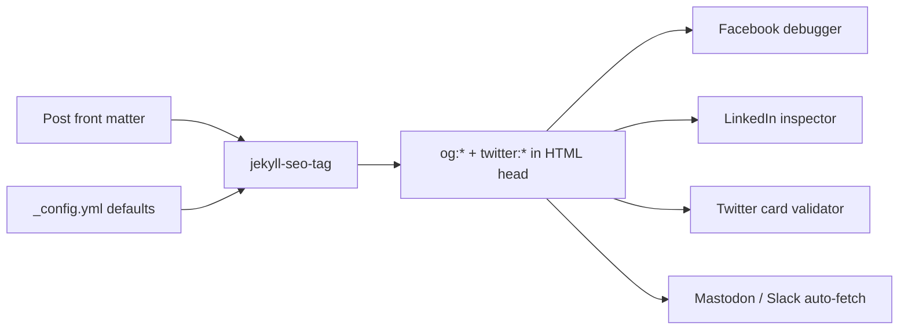

# Open Graph and Twitter Cards - Making Shared Links Look Great

> Module 4 · Chapter 2 - Production polish: SEO, social, feeds, analytics

## What you'll learn
- The required Open Graph tags that make a shared link render as a card.
- How `jekyll-seo-tag` already emits most of them, and what's left for you to add.
- The Twitter card types and when `summary_large_image` is the right pick.
- A per-post `image:` front-matter pattern with a sensible site-wide fallback.
- How to validate previews on Facebook, LinkedIn, Mastodon, and (still) Twitter/X.

## Concepts

When someone pastes your URL into Slack, Mastodon, LinkedIn, or X, the platform fetches the page and looks for **Open Graph** (`og:*`) and **Twitter card** (`twitter:*`) meta tags. With nothing set, the platform shows a bare URL or, at best, the first sentence of your page. With them set, you get a card: title, description, and a hero image at a controlled size. The cost is five meta tags and a 1200×630 image per post. The payoff is that every share is an ad for the post.

Open Graph is a [Facebook-originated standard](https://ogp.me/) that everyone else adopted. The five tags worth caring about are `og:title`, `og:description`, `og:image`, `og:url`, and `og:type`. `og:type` is `article` for posts and `website` for everything else; the difference influences how cards display on some platforms. `og:image` should be at least 1200×630 with the most important content centred - many platforms crop the edges, and small images render either tiny or pixelated.

Twitter cards live alongside OG and override it when X renders a card. Most pages should set `twitter:card` to `summary_large_image` - the variant with the big hero image - and let everything else fall through to the OG equivalents (X reads `og:title` and `og:description` when the `twitter:*` versions are absent). The smaller `summary` card uses a square thumbnail and looks unloved on engineering posts where you want the image to do work. The `twitter:site` and `twitter:creator` tags attribute the post to a handle; they still resolve correctly even though X's brand has changed and the card validator UI moved.

`jekyll-seo-tag` writes most of this for you. It emits `og:title`, `og:description`, `og:url`, `og:type`, `twitter:card`, `twitter:site`, and `twitter:creator` based on front matter and `_config.yml` defaults. What it does *not* always handle well is `og:image` - the plugin will use `page.image` if you set it, but you need to provide either a per-post image or a sensible site-wide fallback, and you need the URL to be absolute. A relative path like `/images/post.png` breaks every social debugger.

The validators are how you confirm the tags resolve. The [Facebook Sharing Debugger](https://developers.facebook.com/tools/debug/) is the most useful - it shows the parsed tags and lets you force a re-scrape, which matters because every platform caches aggressively. [LinkedIn's Post Inspector](https://www.linkedin.com/post-inspector/) is similarly useful. The [Twitter Card Validator](https://cards-dev.twitter.com/validator) was moved behind login and the UI is creaky, but cards still render in posts - the standard didn't go anywhere. Mastodon and Slack both read OG directly, so a passing Facebook debugger usually means they will render correctly too.

## Walkthrough

Set the site-wide social defaults in `_config.yml`. These are what every page that doesn't override will use:

```yaml
# _config.yml
title: "Notes on systems"
description: "Long-form notes on distributed systems and observability."
url: "https://yourdomain.example"
twitter:
  username: janeengineer            # used for twitter:site
  card: summary_large_image         # default card type site-wide
social:
  name: "Jane Engineer"
  links:
    - https://github.com/janeengineer
    - https://mastodon.social/@janeengineer

# A fallback image used when a post has no `image:` set.
# Absolute path, not URL - jekyll-seo-tag prefixes site.url for you.
image: /assets/img/social-default.png
```

For a per-post image, add `image:` to front matter. Either a string path or a hash with extra metadata works; the hash form lets you set width and height (some platforms render faster when those are present):

```yaml
# _posts/2026-01-15-on-rate-limiting.md
---
layout: post
title: "On rate limiting"
description: "Token bucket vs. leaky bucket, and how to choose."
date: 2026-01-15
image:
  path: /assets/img/posts/2026-01-15-rate-limiting.png
  width: 1200
  height: 630
---
```

If you want to see what `` actually emits, view source on a built post. You will see something like:

```html
<title>On rate limiting | Notes on systems</title>
<meta name="description" content="Token bucket vs. leaky bucket, and how to choose.">
<meta property="og:title" content="On rate limiting">
<meta property="og:description" content="Token bucket vs. leaky bucket, and how to choose.">
<meta property="og:url" content="https://yourdomain.example/2026/01/15/on-rate-limiting/">
<meta property="og:type" content="article">
<meta property="og:image" content="https://yourdomain.example/assets/img/posts/2026-01-15-rate-limiting.png">
<meta name="twitter:card" content="summary_large_image">
<meta name="twitter:site" content="@janeengineer">
```

For posts where you forgot to add an image but want a smarter fallback than the site default, write a small layout snippet that derives the image from the first inline `` in the post body. Put it in `_layouts/post.html` *above* the `` call:

```liquid
<!-- _layouts/post.html, above  -->


   Fall back to first inline image in the rendered content. 
  {%- assign first_img = content | split: '


```

The interesting line is `absolute_url`. Social platforms refuse relative paths; this filter prefixes `site.url` for you. If you skip it, your card silently breaks in production.

## How it fits together



A single set of tags is read by every platform - there is no per-platform integration to maintain. The validators are diagnostic tools, not configuration.

## Common pitfalls

| Pitfall | Why it happens | Fix |
|---|---|---|
| Card shows the old image after you've changed it. | Every platform caches its scrape for hours to days. | Force a re-scrape in the [Facebook debugger](https://developers.facebook.com/tools/debug/) or LinkedIn Post Inspector; Twitter caches by URL hash, so adding `?v=2` to the link sometimes helps. |
| `og:image` points to a relative path and no card renders. | `image: /assets/...` was used without `absolute_url`. | Use `absolute_url` in your layout, or let `jekyll-seo-tag` handle the prefix by setting `url:` in `_config.yml`. |
| Image renders as a small thumbnail instead of a hero. | `twitter:card` defaults to `summary`, not `summary_large_image`. | Set `twitter.card: summary_large_image` in `_config.yml`. |
| Card title is the site title for every post. | `<title>` was hardcoded above `` and `og:title` is being scraped from there. | Remove the hardcoded `<title>`; `` emits its own. |
| The validator shows "Hmm, something went wrong" for a 200 page. | Often a redirect chain (http → https → trailing slash) that the scraper followed too many times. | Ensure one canonical URL with one redirect at most; the chapter on HTTPS covers this. |

## Exercises
1. Pick three existing posts and create a 1200×630 social image for each. The image should be readable when cropped to a 1.91:1 aspect ratio; centre the headline. Add the `image:` front-matter key to each post.
2. Run a post URL through the [Facebook Sharing Debugger](https://developers.facebook.com/tools/debug/) and [LinkedIn Post Inspector](https://www.linkedin.com/post-inspector/). Confirm both render the expected card. Note any warnings.
3. Add a site-wide fallback image at `/assets/img/social-default.png` and verify that a post without an `image:` key falls back to it (view source on the built page).

## Recap & next
- Open Graph plus Twitter card meta is the contract every social platform reads - set it once and every share benefits.
- `jekyll-seo-tag` writes most of the tags from front matter and `_config.yml` defaults; you supply the images and the defaults.
- `summary_large_image` is the right Twitter card for an engineering blog with hero images.
- Always use absolute URLs in `og:image` - relative paths break every validator.
- Re-scrape via the debuggers when you change a post's image, because every platform caches.

Next, **RSS feeds via `jekyll-feed` and giving readers a way to subscribe** - let readers follow new posts without depending on an algorithmic feed.

