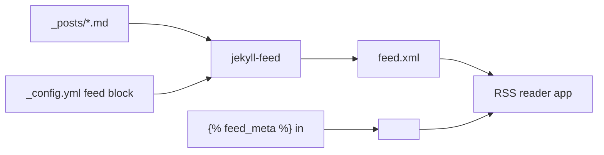

# RSS Feeds via `jekyll-feed` and Giving Readers a Way to Subscribe

> Module 4 · Chapter 3 - Production polish: SEO, social, feeds, analytics

## What you'll learn
- What `jekyll-feed` generates (it's Atom, not RSS 2.0 - and that's fine).
- How to install it, customise per-collection feeds, and choose excerpt vs. full content.
- How autodiscovery `<link>` makes RSS readers find your feed automatically.
- How to set per-post overrides like custom titles and authorship.
- Why a "Subscribe" link in your site chrome is the missing piece most blogs forget.

## Concepts

RSS is older than the modern web and still the cleanest way for someone to follow your writing without an algorithm in between. A reader subscribes to your feed URL once; their RSS client polls it; new posts appear in their inbox-shaped reader app. There is no account, no tracking, no negotiation with a platform. For an engineering blog this is the highest-leverage way to retain a regular audience. The [Jekyll docs cover it briefly](https://jekyllrb.com/docs/), but the real source is the [`jekyll-feed` plugin README](https://github.com/jekyll/jekyll-feed).

`jekyll-feed` emits **Atom**, not RSS 2.0. People say "RSS" colloquially to mean any of the syndication formats; the actual file it writes is `feed.xml` with `<feed xmlns="http://www.w3.org/2005/Atom">`. This matters only in conversation - every RSS reader supports both. Atom is the slightly nicer, slightly less ambiguous format, and what newer feed-producing tools default to.

Two decisions matter. The first is **excerpt vs. full content**. The plugin defaults to full content, and that's almost always right for an engineering blog - readers use RSS partly to read offline and partly to read in their preferred typography. Excerpt-only feeds force a click-through and feel grudging.

The second is **per-collection feeds**. If you've added a `notes/` or `talks/` collection alongside posts, give each its own feed so readers can subscribe selectively. Configure this through the plugin's `feed:` block in `_config.yml`.

**Autodiscovery** is the one-line `<link>` tag in your `<head>` that tells browsers and RSS readers where the feed is. Without it, a reader has to find the feed URL manually; with it, paste the homepage URL into NetNewsWire or Feedly and the client finds the feed for you. `jekyll-feed` emits this automatically through its Liquid tag, but only if you call it.

## Walkthrough

Install the plugin:

```ruby
# Gemfile
group :jekyll_plugins do
  gem "jekyll-feed"
end
```

Declare it and configure feed metadata in `_config.yml`. The defaults are sensible - these overrides matter only if you want to customise:

```yaml
# _config.yml
plugins:
  - jekyll-feed

# Feed metadata. Most are optional; the plugin reads site.title, site.description,
# and site.author by default.
feed:
  path: /feed.xml                   # where the feed lives. Default: /feed.xml
  # Per-collection feeds. Each entry produces /feed/<name>.xml
  collections:
    notes:
      path: /feed/notes.xml
    talks:
      path: /feed/talks.xml
  # Limit on how many entries to include in the main feed. Default: 10
  posts_limit: 20
```

Add the autodiscovery `<link>` and a visible subscribe affordance to your default layout. The plugin's Liquid helper writes the autodiscovery link for you:

```liquid
<!-- _layouts/default.html, inside <head> -->
                     {# emits <link rel="alternate" type="application/atom+xml" ...> #}
```

In the page chrome (footer, header, or a dedicated `/subscribe/` page) link the feed explicitly. Engineers know what RSS is, but a "Subscribe" link beats a bare `feed.xml` URL:

```liquid
<!-- _includes/footer.html -->
<footer class="site-footer">
  <a href="{{ '/feed.xml' | relative_url }}" rel="alternate" type="application/atom+xml">
    Subscribe via RSS
  </a>
  &middot;
  <a href="/subscribe/">How to subscribe</a>
</footer>
```

A `/subscribe/` page that points new readers at NetNewsWire, Feedly, or [Inoreader](https://www.inoreader.com) costs you ten minutes and converts more readers than you'd think. RSS feels obscure if you've never used it; a one-paragraph explainer breaks the stalemate.

Per-post overrides for the feed go in front matter. The plugin reads `excerpt:`, `image:`, and `author:` if you set them:

```yaml
# _posts/2026-01-15-on-rate-limiting.md
---
layout: post
title: "On rate limiting"
date: 2026-01-15
author: jane
description: "Token bucket vs. leaky bucket, and how to choose."
# Optional: override the feed entry's content with the excerpt only.
# Leave this off to ship the full post body - recommended.
# excerpt_only: true
---
```

Inspect `_site/feed.xml` after a build. You should see one `<entry>` per post with `<title>`, `<link>`, `<published>`, `<updated>`, `<id>`, and `<content type="html">` containing the rendered HTML. If `<content>` is empty or shows only the excerpt, something is overriding the default - check `excerpt_only` in front matter and `_config.yml`.

A small but important detail: feed `<id>` values should never change once published. `jekyll-feed` derives them from the post URL, so changing a post's permalink mid-life will show the post as new in every subscriber's reader. Pick your permalink structure deliberately (Chapter 2.3 covered this) and stick to it.

## How it fits together



Posts feed the plugin; the plugin writes one Atom file; the autodiscovery `<link>` is what bridges the homepage URL to the feed file for any reader that doesn't already know the path.

## Common pitfalls

| Pitfall | Why it happens | Fix |
|---|---|---|
| Pasting your homepage URL into an RSS reader fails to find a feed. | `` is missing from `<head>`. | Add the tag to your default layout - readers use the autodiscovery `<link>` to locate the feed. |
| Feed shows only the first sentence of each post. | Either `excerpt_only: true` is set, or you configured the plugin to emit excerpts. | Remove `excerpt_only` and leave the default - full content is what readers want. |
| Every subscriber sees old posts re-appear as new. | A permalink change altered the `<id>` on existing entries; readers treat them as new items. | Don't rename URLs after publishing; if you must, set up redirects with `jekyll-redirect-from` and keep the feed `<id>` stable by pinning it manually. |
| Per-collection feed for `notes` is missing. | The `feed.collections.notes` config block uses the wrong collection name. | The key must match the collection's `_config.yml` declaration exactly - case-sensitive. |
| Images in the feed show as broken in the reader app. | Images use relative `src` paths and the reader app doesn't resolve against the feed's `<base>`. | Use `absolute_url` for image paths in your post Liquid, or rely on `jekyll-feed`'s URL absolutising (recent versions handle this for HTML content). |

## Exercises
1. Install `jekyll-feed`, add `` to `<head>`, and confirm `/feed.xml` validates at the [W3C Feed Validator](https://validator.w3.org/feed/). Subscribe to it in your own RSS reader and verify your latest post appears.
2. If your blog has more than one collection (e.g. `posts` and `notes`), configure per-collection feeds and subscribe to one. Verify the entries are correctly partitioned between feeds.
3. Build a `/subscribe/` page that links to the feed and recommends two or three RSS readers (cross-platform: NetNewsWire on macOS/iOS, Feedly in the browser, Inoreader as another option). Link to it from your footer.

## Recap & next
- `jekyll-feed` ships an Atom feed at `/feed.xml` with one line of config and one Liquid tag.
- Default to full-content feeds for an engineering blog; readers use RSS for offline and typography reasons.
- Add `` to your `<head>` so autodiscovery works in RSS readers and browsers.
- Per-collection feeds let readers subscribe to just one kind of content if your blog has more than one.
- Don't change post URLs after publishing - every subscriber's reader will treat re-IDed entries as new.

Next, **Privacy-friendly analytics (Plausible, Umami, or GoatCounter)** - measure what matters on a blog without inheriting cookie banners or surveillance.

