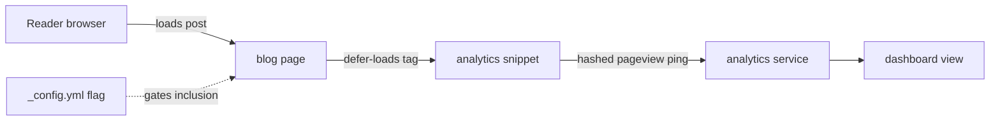

# Privacy-Friendly Analytics (Plausible, Umami, or GoatCounter)

> Module 4 · Chapter 4 - Production polish: SEO, social, feeds, analytics

## What you'll learn
- Why Google Analytics is the wrong default for a personal blog - practically, legally, and ethically.
- Three privacy-respecting options - Plausible, Umami, GoatCounter - and where each lands on hosting, cost, and complexity.
- How to install a tag in your Jekyll layout in a way you can switch later.
- What's actually worth measuring on a blog (and what's vanity).
- When a cookie consent banner is and isn't required.

## Concepts

Google Analytics built the modern web's measurement habits - and inherited every problem that comes with them. It sets persistent cookies, fingerprints visitors, and shares data with Google's broader ad infrastructure. In the EU and UK that requires a cookie consent banner under [GDPR](https://gdpr.eu) and the ePrivacy Directive; several supervisory authorities have ruled GA's default configuration unlawful entirely. Beyond the legal posture there's a simpler argument: a personal blog doesn't need ad-tech telemetry. You want to know which posts people read, where they came from, and roughly how many. None of that needs a cookie.

The privacy-friendly tools all share a model: a tiny JavaScript snippet (under 2 KB), no cookies, no cross-site identifiers, and a dashboard showing aggregate metrics. They differ in hosting model and pricing. The three worth knowing are [Plausible](https://plausible.io), [Umami](https://umami.is), and [GoatCounter](https://www.goatcounter.com).

**Plausible** is paid SaaS with a self-host option (open source under AGPL). Pricing starts at around $9/month for 10k pageviews. The dashboard is clean, the setup is one script tag, and the company's stance on privacy is the product. If your blog is part of a professional presence and you don't want to maintain a database, Plausible is the lowest-friction option.

**Umami** is open source and similar in scope, with a free hobby tier on Umami Cloud and a self-host option that's straightforward if you already run Postgres or MySQL somewhere. The dashboard is more flexible than Plausible's - custom event tracking is first-class - and self-hosting on a $5/month VPS works fine for a personal blog's traffic. If you like running things yourself, Umami is the answer.

**GoatCounter** is the most minimalist. It's free for personal use on the hosted service (`yourblog.goatcounter.com`) up to 100k pageviews/month, open source under EUPL, and the snippet is tiny. The founder, Martin Tournoij, has been opinionated about privacy and simplicity for years and the product reflects that. The dashboard is sparse on purpose. If you want analytics that don't feel like a product, GoatCounter is the answer.

All three are cookie-free, but **cookie consent law isn't just about cookies**. The EU's ePrivacy Directive technically requires consent for any non-essential information stored on or read from a user's device - which can include reading the IP address. The privacy-friendly tools hash the IP locally and discard it within a day, which the relevant regulators have generally accepted as not requiring consent. The honest answer is: probably no banner needed, but consult a lawyer if you're operating commercially in the EU. For a personal engineering blog the consensus is that these tools sit comfortably outside the consent regime.

## Walkthrough

Pick one. Sign up (or stand up the self-hosted instance). You'll receive a snippet - a `<script>` tag with a data attribute or src parameter that identifies your site. Put it in `_includes/analytics.html` so it's centralised. Plausible looks like this:

```html
<!-- _includes/analytics.html (Plausible example) -->
<script defer
        data-domain="yourdomain.example"
        src="https://plausible.io/js/script.js"></script>
```

Umami's tag is similar - a `<script>` with `data-website-id`:

```html
<!-- _includes/analytics.html (Umami example) -->
<script defer
        src="https://cloud.umami.is/script.js"
        data-website-id="abcdef12-3456-7890-abcd-ef1234567890"></script>
```

GoatCounter uses a `data-goatcounter` URL pointing at your subdomain:

```html
<!-- _includes/analytics.html (GoatCounter example) -->
<script data-goatcounter="https://yourblog.goatcounter.com/count"
        async src="//gc.zgo.at/count.js"></script>
```

Wire the include into your default layout *conditionally*. You don't want analytics running in local development or in PR previews - only in production. Use a config flag:

```yaml
# _config.yml
analytics:
  enabled: true                     # flip to false locally; true in production builds
```

```liquid
<!-- _layouts/default.html, just before </body> -->

  

```

Locally you run `bundle exec jekyll serve` with a `_config_dev.yml` override that sets `analytics.enabled: false`. In your GitHub Pages or Actions build, the default `_config.yml` (with `enabled: true`) wins. This avoids the embarrassment of seeing your own laptop in the visitor stats.

For an engineering blog, **the useful metrics are short**: top pages this month, referrers (who's linking to you), and rough visit count. That's it. Conversion funnels and bounce rate don't mean anything when your "goal" is "someone read a post." Time-on-page is unreliable because RSS readers and reading-list apps skew it. Resist the temptation to track every click - you're measuring a personal blog, not running an ad business. A weekly five-minute glance is the right interaction.

Here is the comparison summarised:

| Tool | Hosting | Cost | Best for |
|---|---|---|---|
| Plausible | SaaS or self-host (AGPL) | ~$9/mo SaaS; free self-host | Lowest-friction, professional posture |
| Umami | SaaS or self-host (MIT) | Free SaaS hobby tier; free self-host | Self-hosting on a small VPS |
| GoatCounter | SaaS (free for personal) or self-host (EUPL) | Free up to 100k pageviews/mo | Minimalist, personal blogs |

## How it fits together



The snippet sends a single pageview ping per visit. No cookies are set, no cross-site identifiers, no user profile.

## Common pitfalls

| Pitfall | Why it happens | Fix |
|---|---|---|
| Local development pageviews pollute production stats. | The analytics snippet is unconditionally in the layout. | Gate the include behind `site.analytics.enabled` and disable it via a dev-only `_config_dev.yml`. |
| Dashboard shows zero visits after deploy. | Ad blockers or the snippet is blocked by Content Security Policy. | Use the tool's [proxy option](https://plausible.io/docs/proxy/introduction) or self-host on a subdomain of your site; CSP-allowlist the analytics origin. |
| Pageview counts seem wildly inflated. | Bot traffic or your own repeat visits. | Most tools filter known bots automatically; exclude your own IP or use the per-tool "exclude me" cookie/local-storage helper. |
| Tracking every click drowns out the signal. | Habit from Google Analytics. | On a blog, track pageviews and referrers - not events. Add custom events only for specific questions you have. |
| Cookie banner inserted "just in case". | Misunderstanding which tools require consent. | Privacy-friendly cookie-free tools generally don't require consent banners; banners themselves harm UX. Verify against your jurisdiction. |

## Exercises
1. Pick one of Plausible, Umami, or GoatCounter and sign up (or self-host). Add the snippet to `_includes/analytics.html`, gate it on `site.analytics.enabled`, and verify pageviews appear after deploying.
2. Write a one-paragraph note for yourself describing the three metrics you'll actually check, and how often. Resist anything that smells like a vanity metric.
3. (Optional) Read each tool's documentation on the consent question: [Plausible](https://plausible.io/data-policy), [Umami](https://umami.is/docs), [GoatCounter](https://www.goatcounter.com/help/gdpr). Form your own view on whether your jurisdiction requires a banner.

## Recap & next
- Google Analytics is the wrong default for a personal blog; the privacy-friendly tools do the job with less friction and no banner.
- Plausible (SaaS-first), Umami (self-host-friendly), GoatCounter (minimalist and free for personal use) cover the realistic options.
- Drop the snippet into an include, gate it on a config flag, and disable it in dev.
- Measure top pages, referrers, and pageview count - ignore the metrics that don't map to "someone read a post."
- Cookie-free analytics generally don't require a banner, but the rule lives in your jurisdiction's law, not in marketing copy.

Next, **Images - responsive sizes, lazy loading, and a sensible page-weight budget** - the last polish step, and the one that decides whether your blog feels fast.

