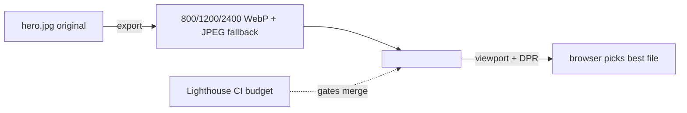

# Images - Responsive Sizes, Lazy Loading, and a Sensible Page-Weight Budget

> Module 4 · Chapter 5 - Production polish: SEO, social, feeds, analytics

## What you'll learn
- Why images are the page-weight problem on most blogs and the budget worth aiming for.
- WebP and AVIF vs. JPEG, and when each is the right choice for blog imagery.
- The `` and `sizes` syntax - what each value means and how browsers pick.
- Native `loading="lazy"` and when it actually defers a fetch.
- A pragmatic workflow: manual exports vs. the `jekyll-picture-tag` plugin.

## Concepts

Strip out images and a typical engineering blog post weighs about 60 KB. Add three full-resolution screenshots and that climbs to 4 MB. Images are the page-weight problem because everything else - markup, CSS, JS, fonts - is small and easily cached. A sane budget worth holding to: **under 500 KB total per post page, hero images under 150 KB, inline screenshots under 100 KB each**. That budget is generous; sites that genuinely care about performance aim lower. The point is to have a number; without one, you'll ship 8 MB posts and not notice.

**Format**: WebP runs 25–35% smaller than JPEG at equivalent quality and is universally supported. AVIF goes further - roughly 50% smaller - but encodes slowly and is overkill for screenshots. Pragmatic recipe: WebP as the default, AVIF only when bandwidth really matters, PNG for diagrams with sharp edges and transparency, SVG for vectors.

**Responsive images** ship the right pixel count for the device. `srcset` declares multiple sources at different intrinsic widths; `sizes` tells the browser how wide the image will display in CSS pixels at various viewports. The browser combines viewport size, `sizes`, and the device pixel ratio to pick a candidate. See the [MDN responsive images guide](https://developer.mozilla.org/en-US/docs/Learn/HTML/Multimedia_and_embedding/Responsive_images).

**Lazy loading** is now a one-attribute fix. `loading="lazy"` on an `` defers the fetch until the image approaches the viewport. Skip it on the hero - lazy-loading above-the-fold images hurts [Largest Contentful Paint](https://web.dev/lcp/). Use it on every image below the fold without thinking.

The workflow choice is **manual vs. plugin**. The plugin path is [`jekyll-picture-tag`](https://rbuchberger.github.io/jekyll_picture_tag/), which transforms a single Liquid tag into a full `<picture>` element with multiple `srcset` formats and sizes. It depends on `ImageMagick` or `libvips` and adds non-trivial build time - but writes the markup you'd otherwise hand-roll. The manual path is exporting your images at three widths (say 800/1200/2400) in your editor of choice and writing the `` by hand. For a blog with one hero image per post, manual is simpler. For a blog where every post has six screenshots, the plugin pays for itself.

## Walkthrough

Manual responsive image. Export `hero.jpg` from your image editor as three WebP files (800, 1200, 2400 wide) plus a JPEG fallback. The HTML:

```html
<!-- Manual responsive image. The browser picks based on viewport + DPR. -->

```

The interesting parts:
- `srcset` lists candidate URLs with their **intrinsic widths** (`800w` = the file is 800px wide).
- `sizes` describes the image's **rendered width** at various breakpoints: at viewport ≥880px, the image displays at 800 CSS pixels; below that, it spans the full viewport.
- `width` and `height` are critical - without them the browser can't reserve space, and the page jumps when the image loads (this is [Cumulative Layout Shift](https://web.dev/cls/), and Google measures it).
- `loading="lazy"` defers the fetch until the image is near the viewport. Drop it on the hero of a post if the hero is above the fold.
- `src` is the JPEG fallback for browsers that don't pick a `srcset` candidate. With WebP universally supported in 2026, this matters less, but costs nothing.

A reusable Jekyll include keeps post Markdown clean. Save as `_includes/figure.html`:

```liquid
<!-- _includes/figure.html - call with:  -->

<figure>
  
  <figcaption>{{ include.caption }}</figcaption>
</figure>
```

Call it from a post:

```liquid

```

The plugin path. Install `jekyll-picture-tag` and `libvips` (or `ImageMagick`), then declare presets in `_data/picture.yml`. A post then uses one tag:

```liquid

```

…and the plugin emits a full `<picture>` element with WebP and JPEG sources at every preset width, regenerating the derived files on each build. See the [jekyll-picture-tag docs](https://rbuchberger.github.io/jekyll_picture_tag/) for the presets schema.

A page-weight budget enforced in CI. Run [Lighthouse CI](https://github.com/GoogleChrome/lighthouse-ci) on a built page and fail the build if total transfer exceeds your budget:

```yaml
# .lighthouserc.yml
ci:
  assert:
    assertions:
      resource-summary:document:size: ["error", { maxNumericValue: 50000 }]
      resource-summary:image:size: ["error", { maxNumericValue: 350000 }]
      resource-summary:total:size: ["error", { maxNumericValue: 500000 }]
```

The budget bytes are post-compression transfer size. Adjust to taste; the point is having a number that CI checks.

## How it fits together



The browser, not your code, decides which file to fetch - your job is to give it good options and the metadata to choose between them.

## Common pitfalls

| Pitfall | Why it happens | Fix |
|---|---|---|
| Page jumps as images load. | `` has no `width`/`height`, so the browser can't reserve space. | Always set `width` and `height` attributes (intrinsic pixels); CSS controls displayed size. |
| Lazy-loaded hero image hurts LCP. | `loading="lazy"` on an above-the-fold image delays the largest paint. | Omit `loading="lazy"` on hero images; add it only below the fold. |
| `srcset` widths don't help - same file always fetched. | `sizes` is missing or wrong, so the browser falls back to the largest candidate. | Write `sizes` to match how the image actually renders at each breakpoint. |
| WebP saves 200 KB per image but the page is still 3 MB. | The original PNG/JPEG sources weren't compressed before conversion. | Run an optimiser (`squoosh`, `imageoptim`) on sources before exporting; compression compounds. |
| Plugin adds 30s to every build. | `jekyll-picture-tag` regenerates derivatives by default; first build is slow. | Cache the derived `_site/assets/...` between CI runs, or commit pre-generated images and skip the plugin. |

## Exercises
1. Pick your three heaviest existing post pages. Run them through [PageSpeed Insights](https://pagespeed.web.dev/) or DevTools' Network tab and record total transfer size. Set a target (e.g. halve each) and re-measure after converting images to WebP.
2. Convert a post's images to use the `_includes/figure.html` snippet from this chapter. Verify in DevTools that the browser picks different files at different viewport widths and DPRs (open responsive design mode and toggle DPR).
3. Add a Lighthouse CI step to your GitHub Actions workflow with a 500 KB total-transfer budget per post page. Confirm a deliberately oversized image fails the build.

## Recap & next
- Images dominate page weight on most blogs; set a budget and enforce it in CI.
- WebP is the right default in 2026; AVIF when bandwidth really matters; JPEG only for broad compatibility.
- `srcset` + `sizes` let the browser pick the right file for the viewport and DPR - `width`/`height` prevent layout shift.
- `loading="lazy"` on every image below the fold; never on the hero.
- Manual exports work for low-image-count blogs; `jekyll-picture-tag` pays off when images per post grow.

Module 4 is done - the blog is now findable, shareable, subscribable, measurable, and fast. Next, **How GitHub Pages builds Jekyll - the safelist, and why you'll outgrow it** - the constraints of Pages' built-in build, and the signals that it's time to switch to GitHub Actions.

