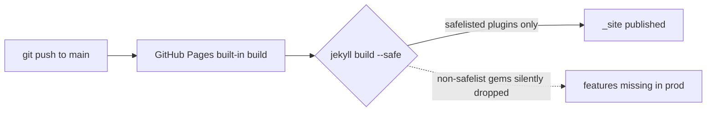

## What you'll learn
- How the legacy "GitHub Pages built-in" Jekyll build actually runs, and what it pins.
- What the plugin safelist is and which gems are on it.
- Why your Module 4 setup almost certainly already needs more than the safelist gives you.
- How to recognize that you've outgrown the built-in build before it costs you a debugging afternoon.
- The exit path: building yourself with GitHub Actions (Chapter 3) so plugin choice stops being a deploy concern.

## Concepts

The original GitHub Pages product, the one that exists if you just push a Jekyll repo and flip the switch under Settings → Pages, runs Jekyll *for* you. There is a server-side build step you never see: GitHub clones the chosen branch, runs `bundle exec jekyll build` inside a sandboxed environment, and publishes the resulting `_site/` to a CDN. This is the path the official docs describe at [docs.github.com/en/pages/setting-up-a-github-pages-site-with-jekyll](https://docs.github.com/en/pages/setting-up-a-github-pages-site-with-jekyll). It is also the path you should understand the limits of before you adopt it.

The build environment is fixed. Everything it pins - the Jekyll version, the Ruby version, the theme versions, the plugin versions - is enumerated in a single meta-gem called `github-pages`. The live, authoritative table is at [pages.github.com/versions](https://pages.github.com/versions/). At the time of writing it pins Jekyll 3.10, not Jekyll 4.x. That alone disqualifies a lot of modern plugin work. More importantly, it ships an allowlist - usually called the **safelist** - of plugins it will load. Anything outside the safelist is silently ignored at build time.

The safelist is short. It exists because GitHub has to execute arbitrary Ruby on its servers and is not willing to run anything you push. Today it includes [`jekyll-feed`](https://github.com/jekyll/jekyll-feed), [`jekyll-seo-tag`](https://github.com/jekyll/jekyll-seo-tag), [`jekyll-sitemap`](https://github.com/jekyll/jekyll-sitemap), [`jekyll-redirect-from`](https://github.com/jekyll/jekyll-redirect-from), [`jekyll-paginate`](https://github.com/jekyll/jekyll-paginate), `jekyll-gist`, `jekyll-coffeescript`, `jekyll-avatar`, `jemoji`, `jekyll-mentions`, `jekyll-relative-links`, `jekyll-optional-front-matter`, `jekyll-readme-index`, `jekyll-default-layout`, `jekyll-titles-from-headings`, and `jekyll-include-cache`. That's it. The plugin you put in for responsive images in Chapter 4.5, `jekyll-picture-tag`, is not on the list. Neither is `jekyll-archives`, `jekyll-compose`, `jekyll-toc`, or anything you'd write yourself in `_plugins/`.

The failure mode is the part that catches people. **Builds do not fail when you use an unsupported plugin.** GitHub's Jekyll build runs in `--safe` mode, which loads only safelisted gems and ignores `_plugins/`. Your `Gemfile` can list anything; the build will simply not load the unsafe ones. So your site builds green and your `<picture>` tags are missing, or your archive pages 404, or your custom Liquid tag renders as literal text. There is no warning in the Actions tab and no email. You find out because a reader tells you.

That asymmetry - local builds pass, remote builds silently drop features - is the single biggest argument for migrating to a self-managed build the moment you reach for any plugin off the safelist. Other signals that you've outgrown the built-in build: you want a Jekyll version newer than what `github-pages` pins; you have a plugin that needs network access during build (image fetching, link checking); you want to use Bundler groups to separate dev-only gems from build-time gems; you want to run anything other than `jekyll build` between checkout and deploy (a `npm run` for Tailwind, an `imagemagick` pass, a link-check).

## Walkthrough

First, see exactly what the built-in build would pin for you. Add `github-pages` to your `Gemfile` in a dedicated group so it doesn't pollute your existing setup:

```ruby
# Gemfile
source "https://rubygems.org"

group :jekyll_plugins do
  gem "jekyll-feed"
  gem "jekyll-seo-tag"
  gem "jekyll-sitemap"
  # The plugin from Module 4.5 - NOT on the GitHub Pages safelist.
  gem "jekyll-picture-tag"
end

# Pin Jekyll and the safelist to whatever GitHub Pages currently uses.
# Comment this out when you graduate to Actions (Chapter 5.3).
group :github_pages do
  gem "github-pages", group: :jekyll_plugins
end
```

Resolve the lockfile and inspect what you got:

```bash
# See the transitive pins github-pages forces on you.
bundle update github-pages
bundle list | head -30
```

You will notice three things. Jekyll is downgraded - likely from 4.x to 3.10. Several of your direct gems are now pinned to older majors than you'd otherwise pick. And `jekyll-picture-tag` is still in the lockfile, because Bundler doesn't know the GitHub Pages build will refuse to load it.

Now confirm the safelist behavior locally with the same flag GitHub uses:

```bash
# --safe is how GitHub Pages runs Jekyll on its servers.
bundle exec jekyll build --safe --trace
```

Open `_site/` and search for a `<picture>` element on a post you know used the `picture` tag. It will not be there. The plugin loaded under your normal `jekyll build` but was refused under `--safe`, which is exactly what the production build does. This is the fastest way to confirm before pushing whether a given plugin will survive the GitHub Pages build.

## How it fits together



The push is fine, the build is green, the missing features show up only when a reader views the page.

## Common pitfalls

| Pitfall | Why it happens | Fix |
|---|---|---|
| "Works locally, broken in prod" with no error | GitHub Pages runs `--safe`; unsafelisted plugins are loaded locally but ignored remotely. | Reproduce with `bundle exec jekyll build --safe`; if a feature disappears, migrate to Actions. |
| Jekyll downgraded after adding `github-pages` to the Gemfile | The meta-gem pins Jekyll 3.x and a fixed plugin matrix. | Either accept the pin, or remove `github-pages` and build with Actions (Chapter 5.3). |
| Custom Ruby in `_plugins/` "doesn't run" | `--safe` mode ignores `_plugins/` entirely; only safelisted gems load. | There is no fix inside the built-in build. Move to Actions. |
| Treating the safelist as static | The list changes; gems are added and removed across releases of `github-pages`. | Check [pages.github.com/versions](https://pages.github.com/versions/) before assuming a gem is supported. |
| Using a Jekyll feature newer than what 3.10 supports | Local Jekyll 4 supports it; the pinned 3.10 doesn't. | Pin Jekyll 3.10 locally too, or graduate to Actions and unpin everything. |

## Exercises

1. Open [pages.github.com/versions](https://pages.github.com/versions/). Note the pinned Jekyll version. Then check your `Gemfile.lock` - if your local Jekyll is newer, your local previews are not representative of the production build.
2. Run `bundle exec jekyll build --safe` and diff `_site/` against a normal `bundle exec jekyll build`. Every difference is a feature you'll lose on the built-in GitHub Pages build.
3. Make a list of every gem in your `Gemfile`'s `:jekyll_plugins` group and tick the ones present on the safelist. If even one is missing, write down whether you're willing to lose that feature or whether Chapter 5.3 is in your future.

## Recap & next

- GitHub Pages built-in runs `jekyll build --safe` on its servers, pinned by the `github-pages` meta-gem.
- The plugin safelist is short and deliberately exclusionary; anything off it is silently dropped, not errored.
- The authoritative pin table is [pages.github.com/versions](https://pages.github.com/versions/) - bookmark it.
- Signals you've outgrown the built-in build: an off-safelist plugin, a newer Jekyll, a custom `_plugins/` script, or any pre-build step.
- Reproduce the production build locally with `--safe` to catch silent-drop problems before pushing.

Next, **Repo setup: user-site vs project-site, branches, and the deploy source** - choose the right repo shape and tell Pages where to deploy from.

