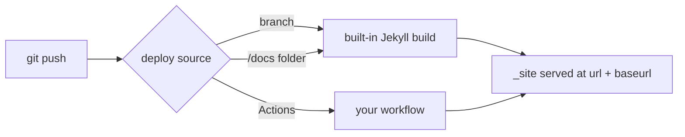

# Repo Setup: User-Site vs Project-Site, Branches, and the Deploy Source

> Module 5 · Chapter 2 - GitHub Pages and a custom domain

## What you'll learn
- The difference between a user (or organisation) site and a project site, and which one a personal blog wants.
- How `url:` and `baseurl:` in `_config.yml` interact with the served URL, and when each matters.
- The three deploy sources Pages supports: a branch, a `/docs` folder, or GitHub Actions.
- Why `gh-pages` is a leftover convention rather than a requirement.
- Where to find your build logs after the first push.

## Concepts

GitHub Pages has two repo shapes, and the rules differ between them. A **user site** lives in a repository named exactly `<username>.github.io` (the same applies for organisations: `<orgname>.github.io`). You get exactly one per account. It serves from the apex of that hostname - `https://<username>.github.io/` - and is the right shape for a personal engineering blog. A **project site** lives in any other repo and serves at `https://<username>.github.io/<repo>/`. Project sites are useful for project documentation but introduce a path prefix that complicates URL handling. The full rules are at [docs.github.com/en/pages/getting-started-with-github-pages/about-github-pages](https://docs.github.com/en/pages/getting-started-with-github-pages/about-github-pages).

That path prefix is what `baseurl:` exists for. In Jekyll's `_config.yml`, `url:` is your scheme-and-host (`https://example.com`), and `baseurl:` is the path your site lives under (`""` for a user site, `"/my-project"` for a project site). Jekyll uses both to build internal links via the `relative_url` and `absolute_url` filters. Get `baseurl` wrong on a project site and every link 404s; get it wrong on a user site and you'll prepend a path that shouldn't be there. Once you point a custom domain at the repo (Chapter 5.4), `url:` becomes your domain and `baseurl:` returns to empty - the apex serves the site directly regardless of repo name.

The **deploy source** is the second decision. Under Settings → Pages → "Build and deployment", you tell GitHub where to find what to publish. The three options are: deploy from a branch (and pick which one), deploy from a `/docs` subfolder on a branch, or deploy from GitHub Actions. The branch option triggers GitHub's built-in Jekyll build whenever that branch updates. The `/docs` option does the same but only looks at `docs/` - handy if your repo is primarily code with documentation alongside it. The Actions option turns off the built-in build entirely and lets a workflow you control upload the site (Chapter 5.3 walks through writing one).

You will see `gh-pages` mentioned a lot in older tutorials. It used to be the conventional branch name for a project site's deploy source - your `main` held source, `gh-pages` held the built `_site/`, and a script copied between them. GitHub kept the convention, so a branch literally called `gh-pages` is still picked up as a Pages source. But it is no longer required, and it predates both the built-in Jekyll build and Actions. For new repos, deploy from `main` if you're using the built-in build (no separate output branch needed - GitHub builds for you), or deploy from Actions if you're building yourself. Reach for `gh-pages` only if a tool you're using assumes it.

The first deploy after enabling Pages is the moment to know where logs live. For the **built-in build**, GitHub still publishes the build under the Actions tab as a workflow run called "pages build and deployment" - it's a managed workflow you didn't write, but its logs are visible. For the **Actions deploy source**, your own workflow's run is what you read. In both cases, a failed build will not publish - the previous successful `_site/` keeps serving until a green build replaces it.

## Walkthrough

For a user-site blog, create the repo with the exact name `<username>.github.io`. Inside it, set up `_config.yml` to match what GitHub will serve before you have a custom domain:

```yaml
# _config.yml - user site, no custom domain yet.
title: "Your Name - Engineering Notes"
description: "Notes on systems, performance, and things that broke."

# Scheme + host of where the site is served from.
# For a user site without a custom domain, this is the github.io hostname.
url: "https://your-username.github.io"

# baseurl is the path prefix. User sites serve at the apex, so leave empty.
baseurl: ""

# Jekyll permalink and posts settings unchanged from Module 3.
permalink: /:year/:month/:slug/
```

Push to `main` and enable Pages from the GitHub UI:

```text
Settings → Pages → Build and deployment
  Source: Deploy from a branch
  Branch: main  /  (root)
  Save
```

GitHub kicks off the "pages build and deployment" workflow. Watch it in the Actions tab. When it goes green, your site is at `https://your-username.github.io/`. If you don't want the built-in build (because of Chapter 1's safelist limits), switch the Source to **GitHub Actions** and skip ahead to Chapter 5.3 - that change disables the legacy build and waits for your own workflow to publish.

Compare the project-site shape, in case you're publishing documentation rather than a personal blog:

```yaml
# _config.yml - project site at https://your-username.github.io/my-project
url: "https://your-username.github.io"
baseurl: "/my-project"   # MUST match the repo name; leading slash, no trailing slash
```

Then, in your templates, *always* generate links with `relative_url`:

```liquid
<a href="{{ '/about/' | relative_url }}">About</a>
<link rel="stylesheet" href="{{ '/assets/main.css' | relative_url }}">
```

The filter prepends `baseurl` for you. Hardcoded paths like `<a href="/about/">` will appear correct on a user site and break on a project site - a one-line refactor that is much easier to do once than to fix per-page later.

## How it fits together



The push is the same; the deploy source decides whether GitHub builds or you do.

## Common pitfalls

| Pitfall | Why it happens | Fix |
|---|---|---|
| All links 404 on a project site, but home loads | `baseurl` is unset or wrong, so `/assets/main.css` resolves at the apex, not under the repo path. | Set `baseurl: "/repo-name"` and pipe paths through `relative_url`. |
| Repo named `my-blog`, expected to serve at the apex | Only `<username>.github.io` repos serve at the apex; everything else is a project site. | Either rename the repo to `<username>.github.io` or accept the path prefix. |
| Pushed to `main`, but Pages still shows the old site | The deploy source is still pointing at a different branch (e.g. `gh-pages`). | Settings → Pages → set Branch to `main`. |
| Build failed and you can't find the logs | The "pages build and deployment" workflow run sits in the Actions tab - easy to miss because you didn't write it. | Open Actions, filter by workflow `pages build and deployment`, click the failing run. |
| Switched Source to "GitHub Actions" but the site still serves the old version | You disabled the built-in build but haven't pushed an Actions workflow yet; nothing new has published. | Either revert to a branch source or add the workflow from Chapter 5.3. |

## Exercises

1. Create a repo named `<your-username>.github.io`. Push a minimal Jekyll site and enable Pages from `main`. Confirm the site is live at `https://<your-username>.github.io/` and find its build log in the Actions tab.
2. Create a second, throwaway project repo (any name). Enable Pages, then deliberately leave `baseurl` empty and observe how stylesheets and links break. Fix it by setting `baseurl` and updating one link to use `relative_url`.
3. In your user-site repo, switch the deploy source to "GitHub Actions" temporarily. Observe that no new build runs and the previously served `_site/` continues to serve. Switch back to the branch source - you'll come back to Actions in the next chapter.

## Recap & next
- User site (`<username>.github.io`) serves at the apex with `baseurl: ""`; project sites serve under a path and need `baseurl: "/repo"`.
- `url:` is the host, `baseurl:` is the path prefix; `relative_url` and `absolute_url` filters use both.
- Deploy source is set under Settings → Pages and is one of: a branch, a `/docs` folder, or GitHub Actions.
- `gh-pages` is a legacy convention; new repos rarely need it.
- Build logs for the built-in build live in the Actions tab as the managed "pages build and deployment" workflow.

Next, **Building with GitHub Actions for full plugin support** - write the workflow that frees you from the safelist.

