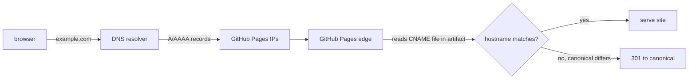

## What you'll learn
- Which registrars are sane choices for a personal domain, and what to ignore at sign-up.
- The DNS records GitHub Pages requires for apex (`example.com`) vs subdomain (`www.example.com`).
- Why apex domains need `A`/`AAAA` records and what GitHub publishes as the canonical IP set.
- The `CNAME` file in the repo - what it does, and how it relates to the Settings → Pages UI.
- How to verify propagation with `dig`, and a reasonable TTL strategy.

## Concepts

A domain comes from a **registrar**. Three reasonable picks for a personal engineering blog: [Cloudflare Registrar](https://www.cloudflare.com/products/registrar/) (at-cost), [Porkbun](https://porkbun.com/), and [Namecheap](https://www.namecheap.com/). They differ in UI but for serving a static site are equivalent. Ignore the upsells - you don't need their email forwarding, CDN, SSL certificate (GitHub provides one), or site builder. You need the domain, DNS hosting, and ideally WHOIS privacy.

The official Pages documentation for custom domains is at [docs.github.com/en/pages/configuring-a-custom-domain-for-your-github-pages-site](https://docs.github.com/en/pages/configuring-a-custom-domain-for-your-github-pages-site). There are two scenarios depending on whether you want `example.com` (an **apex** domain, sometimes called the root or naked domain) or `www.example.com` (a subdomain). The DNS records differ because DNS itself treats them differently - apex records can't be `CNAME`s by the protocol, so GitHub publishes a set of IP addresses for `A` (IPv4) and `AAAA` (IPv6) records instead.

The canonical IP list is in the [managing-a-custom-domain](https://docs.github.com/en/pages/configuring-a-custom-domain-for-your-github-pages-site/managing-a-custom-domain-for-your-github-pages-site) page - currently four IPv4 and four IPv6 addresses. **Do not copy these from a third-party blog post.** GitHub has rotated them before and the docs are the only source of truth. For a `www` subdomain, you use a single `CNAME` record pointing to `<username>.github.io` - DNS allows `CNAME` on subdomains, so the indirection saves you from tracking IPs at all.

The `CNAME` file is a separate thing despite the unfortunate name overlap. It is a text file at the root of your Pages branch (or, for Actions deploys, in the `_site/` artifact) containing exactly your custom domain on a single line. It tells the GitHub Pages server, "the canonical hostname for this artifact is X." The Settings → Pages → Custom domain UI writes this file for you when you fill it in. The two routes are equivalent - pick one and stick with it.

Choose one of `example.com` or `www.example.com` as your **canonical** hostname and put *that* string in the `CNAME` file. GitHub then 301-redirects the other one to it. Either choice is fine; apex is shorter, `www` historically simpler for DNS. Search engines need a single canonical URL, and split traffic across both hosts hurts caching and analytics.

TTLs control how long DNS resolvers cache your records. Set a short TTL (300 seconds) while you're configuring - a mistake corrects itself quickly. Once stable for a few days, raise it to 3600 or longer to reduce query load.

## Walkthrough

Suppose you've bought `example.com` and want it as your canonical hostname (apex), with `www.example.com` redirecting to it. At your registrar's DNS panel, create these records. The exact UI varies by registrar but the record types and targets do not:

```text
# Apex domain - A records (IPv4) and AAAA records (IPv6).
# Use the EXACT addresses currently published at:
# https://docs.github.com/en/pages/configuring-a-custom-domain-for-your-github-pages-site/managing-a-custom-domain-for-your-github-pages-site
# GitHub publishes 4 IPv4 and 4 IPv6 addresses. All four of each must be set.

Type   Name   Value                                  TTL
A      @      <first IPv4 from GitHub docs>          300
A      @      <second IPv4 from GitHub docs>         300
A      @      <third IPv4 from GitHub docs>          300
A      @      <fourth IPv4 from GitHub docs>         300
AAAA   @      <first IPv6 from GitHub docs>          300
AAAA   @      <second IPv6 from GitHub docs>         300
AAAA   @      <third IPv6 from GitHub docs>          300
AAAA   @      <fourth IPv6 from GitHub docs>         300

# www subdomain - CNAME pointing at your Pages user-site host.
CNAME  www    your-username.github.io.               300
```

The `@` in the Name column means "the apex itself" - most registrar UIs use this convention. Some use a blank field or the literal domain. The trailing dot on the `CNAME` value is the DNS-correct form (a "fully qualified domain name") - most UIs accept it with or without.

Then commit the `CNAME` file at the root of your repo, containing exactly your canonical domain:

```text
example.com
```

Push. The Pages build (whether built-in or Actions) will include the file in the deploy artifact, and the Pages server will start treating `example.com` as the canonical hostname. Equivalently, you can use Settings → Pages → "Custom domain", enter `example.com`, and save - that commits the same file to your default branch. Don't do both at once.

Verify propagation with `dig`. The `+short` flag strips the ceremony and prints just the answers:

```bash
# Apex A records should match GitHub's published IPv4 set.
dig +short A example.com

# Apex AAAA records should match GitHub's published IPv6 set.
dig +short AAAA example.com

# www should resolve via CNAME to your-username.github.io and then to the same IPs.
dig +short CNAME www.example.com
dig +short A www.example.com
```

If `dig` returns nothing or returns stale values, your local resolver is caching. Try `dig @1.1.1.1 ...` or `dig @8.8.8.8 ...` to query a public resolver directly - both bypass your ISP's cache and your `nsswitch.conf`. Propagation across the global DNS hierarchy is usually minutes, occasionally hours, almost never the full TTL of older parent records.

## How it fits together



DNS gets the browser to GitHub's edge; the `CNAME` file in the artifact tells the edge which hostname is canonical and which to redirect.

## Common pitfalls

| Pitfall | Why it happens | Fix |
|---|---|---|
| Setting only one or two of the four `A` records | The IP list is a round-robin set; missing entries reduce availability and may slow failover. | Add all four IPv4 records, and all four IPv6 records if you want IPv6 reachability. |
| Copying GitHub's IPs from a blog post and not the docs | The list changes occasionally; old posts go stale. | Always copy from the live [docs page](https://docs.github.com/en/pages/configuring-a-custom-domain-for-your-github-pages-site/managing-a-custom-domain-for-your-github-pages-site). |
| Using a `CNAME` record on the apex (`@`) | Most DNS providers reject this; some accept it via "CNAME flattening" extensions, but it's non-standard. | Use `A`/`AAAA` for the apex; reserve `CNAME` for `www`. |
| Editing the `CNAME` file and the Settings UI simultaneously | The UI rewrites the file on save and can revert your manual edit. | Pick one route. The UI is fine for most people; the file-in-repo route is fine for those who prefer code-as-source-of-truth. |
| Long TTLs on day one, then waiting hours to see a fix | TTLs persist in caches for their full duration regardless of when you change the record. | Set TTL 300 while configuring; raise to 3600+ only after the records are stable. |

## Exercises

1. Buy a domain (or use one you own). At your registrar, create the four apex `A` records, four `AAAA` records, and the `www` `CNAME` exactly as the GitHub docs prescribe. Set TTLs to 300 during configuration.
2. Add a `CNAME` file at the root of your repo containing your canonical hostname. Push. Confirm via Settings → Pages → Custom domain that GitHub now lists the domain.
3. Run the four `dig +short` queries from the walkthrough. Verify each answer matches what you configured. Re-run them against `@1.1.1.1` to bypass your local resolver and compare.

## Recap & next
- Cloudflare Registrar, Porkbun, and Namecheap are all reasonable; ignore the upsells.
- Apex needs `A` and `AAAA` records - four of each - pointing to GitHub's currently-published IP set. Always copy IPs from GitHub's docs, never a third-party copy.
- `www` (or any subdomain) uses a single `CNAME` to `<username>.github.io`.
- The `CNAME` file in the repo and Settings → Pages → Custom domain are the same mechanism; pick one.
- Pick apex or `www` as canonical; GitHub auto-redirects the other. Use short TTLs while configuring, raise them once stable. Verify with `dig +short`.

Next, **HTTPS, enforcing it, and verifying the live deploy** - the final lap: cert, redirect, and a polish-check across the production site.

