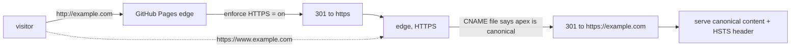

# HTTPS, Enforcing It, and Verifying the Live Deploy

> Module 5 · Chapter 5 - GitHub Pages and a custom domain

## What you'll learn
- How GitHub provisions a Let's Encrypt certificate for your custom domain, and what can delay it.
- What the "Enforce HTTPS" checkbox actually does, and when to enable it.
- How HSTS gets added to your responses once HTTPS is enforced.
- The canonical-redirect behaviour: which hostname becomes the 301 source and which the target.
- A final, runnable checklist that catches the small things that would otherwise embarrass you in week one.

## Concepts

Once DNS resolves to GitHub's edge and the `CNAME` file is in place, GitHub asks [Let's Encrypt](https://letsencrypt.org/) to issue a TLS certificate. This usually takes a few minutes; the docs reserve "up to 24 hours" to cover slow DNS propagation. The status surfaces under Settings → Pages. If it hangs for more than a few hours, the cause is almost always a DNS record GitHub can't validate against - a missing `A` record, a wrong IP from a stale blog post, or a `CAA` record at your registrar that disallows Let's Encrypt.

The "**Enforce HTTPS**" checkbox appears on the same page once the certificate exists. With it off, GitHub serves both HTTP and HTTPS. With it on, requests to `http://...` get a 301 to `https://...` before they reach your content. Enable it once the cert is live. The only reason to defer is active DNS debugging - turning on enforcement before the cert exists locks visitors out.

HTTPS enforcement also enables [HSTS](https://developer.mozilla.org/en-US/docs/Web/HTTP/Headers/Strict-Transport-Security). GitHub Pages sends a `Strict-Transport-Security` header on HTTPS responses. HSTS tells the browser to refuse HTTP for your domain for the `max-age` duration and rewrite `http://` links to `https://` client-side. The header GitHub sets is conservative; don't reach for HSTS preloading at [hstspreload.org](https://hstspreload.org/) casually because reverting it takes weeks.

Whichever hostname is in the `CNAME` file becomes canonical; the other gets a 301. With HTTPS enforced, the redirect is HTTPS-to-HTTPS. Confirm it with `curl -I` after enforcement is on - a misconfigured `CNAME` file will quietly serve both hostnames and split your traffic, analytics, and SEO signal.

## Walkthrough

After the DNS records and `CNAME` file are in place, watch the certificate status:

```text
Settings → Pages
  Your site is live at https://example.com
  TLS certificate: ✓ active
  [✓] Enforce HTTPS
```

Tick the box. Then verify from a terminal - three commands cover the load-bearing checks:

```bash
# 1. Cert valid? Look at the issuer, dates, and subject.
#    The output shows the chain; the leaf cert should be issued by "Let's Encrypt".
curl -vI https://example.com 2>&1 | grep -E "subject:|issuer:|expire date:"

# 2. HTTP → HTTPS redirect working?
#    Expect HTTP/1.1 301 Moved Permanently and a Location: https://...
curl -sI http://example.com | head -5

# 3. Non-canonical → canonical redirect working?
#    If example.com is canonical, www should 301 to it (and vice versa).
curl -sI https://www.example.com | head -5
```

Read the responses. The first should show `Let's Encrypt` as the issuer and an expiry roughly 90 days out (Let's Encrypt issues short-lived certs; GitHub auto-renews). The second should be a 301 with `Location: https://example.com/`. The third should be a 301 with `Location: https://example.com/` as well - that's the canonical redirect working.

Now run a seven-step checklist across the whole site. Treat it as a gate before you tell anyone the blog exists:

```text
1. Open https://<canonical>/ in a clean browser profile. Site loads, no mixed-content warnings.
2. Open https://<non-canonical>/some-post/. It 301s to https://<canonical>/some-post/.
3. View source, check <meta name="description"> is present and post-specific (Module 4.1).
4. Run the URL through the Twitter Card Validator and Facebook Sharing Debugger (Module 4.2).
5. Hit /feed.xml directly - RSS XML loads (Module 4.3).
6. Open /sitemap.xml - sitemap loads (Module 4.1 / jekyll-sitemap).
7. Trigger a pageview in the analytics dashboard from a new device (Module 4.4).
```

If any item fails, fix it before sharing the URL. The most common single failure at this stage is item 4 - the social preview validators cache aggressively, and Open Graph image paths that worked relatively in dev break when served from the canonical host because they need to be absolute. The fix is `absolute_url` in your `_includes/head.html` (already established in Module 4.2); the symptom is "image not appearing" in the validator.

For the cert renewal itself, you do nothing. Let's Encrypt issues 90-day certs and GitHub renews them automatically as long as DNS keeps pointing where it should. If you change registrars or migrate DNS to a different provider, the renewal will fail if the new records aren't in place before the old cert expires - keep the `A`/`AAAA` records consistent across the cutover.

## How it fits together



Two 301s funnel every visitor onto a single canonical HTTPS URL; the HSTS header tells repeat visitors to skip the HTTP hop entirely.

## Common pitfalls

| Pitfall | Why it happens | Fix |
|---|---|---|
| "Enforce HTTPS" is greyed out | Certificate hasn't provisioned yet; DNS records may be wrong. | Re-check `A`/`AAAA` records match GitHub's published IPs; wait. If still stuck after a few hours, remove and re-add the custom domain. |
| Cert provisioning hangs for 24h+ | A `CAA` record at the registrar disallows Let's Encrypt, or one of the apex IPs is wrong. | Remove the `CAA` record (or add `letsencrypt.org` to the allowlist); reverify all four `A` records. |
| Social previews show no image after going live | Open Graph image was a relative URL that worked in dev but resolves wrong when fetched from outside. | Use `absolute_url` in `<meta property="og:image">`; reset cache in the Facebook/Twitter validators. |
| `www` and apex both serve content with no redirect | The `CNAME` file is missing or contains both hostnames. | Ensure the file is one line, one hostname; re-save Settings → Pages → Custom domain. |
| HSTS preload added prematurely, can't be reverted | HSTS preload removal takes weeks because the list ships inside browser binaries. | Don't preload until the site has run on HTTPS for months without incident. |

## Exercises

1. With your custom domain live, enable "Enforce HTTPS" and run the three `curl` commands from the walkthrough. Save the outputs - they are your "first deploy verified" artifact.
2. Run the seven-step checklist top to bottom on your live site. Note any failure, fix it, re-run that step until clean.
3. Open your site in a private/incognito window and on a mobile data connection (off your home Wi-Fi). Confirm it loads from a fresh DNS resolver and that analytics records the pageview within a few minutes.

## Recap & next
- HTTPS certificates are Let's Encrypt, provisioned automatically once DNS and `CNAME` are correct. Usually minutes; up to 24h is the documented worst case.
- Enable "Enforce HTTPS" as soon as the cert is live. It also turns on HSTS on responses.
- The `CNAME` file decides which hostname is canonical; GitHub 301s the other one. Verify with `curl -I`.
- Run the seven-step checklist before announcing the site - cert, redirects, meta tags, social previews, feed, sitemap, analytics.
- Cert renewal is automatic; the only thing that breaks it is broken DNS, so leave records alone unless you mean to change them.

The blog is live. Module 5 deployed it; Module 6 is about living with it.

Next, **Writing workflow - drafts, scheduled posts, and an editor setup that doesn't fight you** - the day-to-day mechanics of actually putting words on the site you just shipped.

