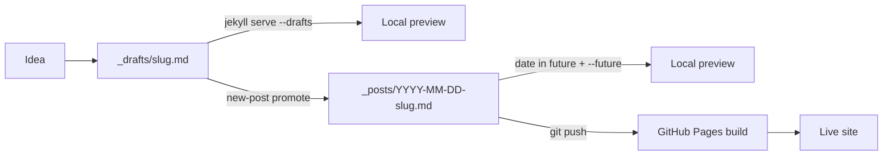

# Writing Workflow - Drafts, Scheduled Posts, and an Editor That Doesn't Fight You

> Module 6 · Chapter 1 - Capstone: Workflow, polish, and what's next

## What you'll learn
- How `_drafts/` differs from `_posts/` and why drafts don't need dates.
- Serving drafts and future-dated posts locally with `jekyll serve --drafts --future`.
- An editor setup - VS Code with the Front Matter extension, or a focused writing surface like Obsidian or iA Writer.
- A `new-post` shell function that stamps out a new post with stub front matter so you start writing in five seconds.

## Concepts

The single biggest reason a blog goes quiet is friction. If publishing a post means remembering the front-matter shape, the file-naming rule, and the date format, you will not publish. Jekyll already gives you two of the three pieces - `_drafts/` for work-in-progress and `_posts/` for the published archive - but you have to wire them together with a workflow that does not depend on memory.

Files in `_drafts/` use the same Markdown shape as posts but **drop the date from the filename**: `my-half-written-idea.md`, not `2026-05-24-my-half-written-idea.md`. Jekyll treats them as posts with the date set to the file's mtime, but it skips them during a normal build. You see them only when you pass `--drafts`. This is the right place for the messy notebook of ideas that may or may not ship. The [Jekyll drafts docs](https://jekyllrb.com/docs/posts/#drafts) cover the rules.

Future-dated posts are the other half. Set `date:` in front matter (or the filename prefix) to a date in the future, and Jekyll will exclude the post until that date arrives - unless you pass `--future`. Combined with a scheduled build (a cron-style GitHub Actions trigger, covered in Module 5), this gives you a primitive scheduled-publish workflow: commit a post dated next Tuesday, and it goes live next Tuesday.

Your editor is the surface you spend the most time on, so it should not fight you. VS Code with the [Front Matter CMS extension](https://frontmatter.codes/) gives you a sidebar to manage posts, a form view of front matter, and content-type templates - useful if you write a lot. A lighter setup is the built-in YAML language server plus the [Markdown All in One extension](https://marketplace.visualstudio.com/items?itemName=yzhang.markdown-all-in-one). If VS Code feels too coder-shaped while writing prose, open the `_drafts/` directory in [Obsidian](https://obsidian.md/), [iA Writer](https://ia.net/writer), or [Typora](https://typora.io/) - they all just edit Markdown files on disk, and they each give you a calmer surface for the actual writing.

The last piece is the new-post script. Make it one command. The function below creates a properly-named file in `_posts/` with the front matter stub already filled in and the cursor (well, the editor) opened to the body.

## Walkthrough

Set up the directory and a `.gitignore` for editor noise:

```bash
# create _drafts at the repo root, next to _posts
mkdir -p _drafts
echo ".DS_Store" >> .gitignore
echo ".obsidian/" >> .gitignore   # if you open the repo in Obsidian
```

Run the dev server so you see drafts and future-dated posts as you write:

```bash
# --drafts pulls in _drafts/; --future shows posts dated past today
bundle exec jekyll serve --drafts --future --livereload
```

A draft is just a Markdown file in `_drafts/` with front matter and no date prefix:

```markdown
---
layout: post
title: "Half-formed thought about queues"
description: ""
tags: [queues, distributed-systems]
---

I keep running into the same shape of problem...
```

When the draft is ready, move it into `_posts/` with the date prefix Jekyll expects. The shell function below does that - and also stamps out a brand-new post if you give it just a title:

```bash
# add to ~/.zshrc or ~/.bashrc
# usage: new-post "On rate limiting"
#    or: new-post promote _drafts/half-formed-thought-about-queues.md
new-post() {
  local cmd="${1:-}"
  if [[ "$cmd" == "promote" && -f "$2" ]]; then
    # promote a draft: rename with today's date, move into _posts/
    local base
    base="$(basename "$2")"
    local dated="_posts/$(date +%Y-%m-%d)-${base}"
    git mv "$2" "$dated"
    echo "Promoted to $dated"
    return
  fi
  # otherwise create a new draft-shaped post
  local title="$1"
  local slug
  slug="$(echo "$title" | tr '[:upper:]' '[:lower:]' \
    | sed -E 's/[^a-z0-9]+/-/g; s/^-+|-+$//g')"
  local file="_posts/$(date +%Y-%m-%d)-${slug}.md"
  cat > "$file" <<EOF
---
layout: post
title: "${title}"
description: ""
date: $(date +%Y-%m-%d)
tags: []
---

EOF
  echo "Created $file"
  ${EDITOR:-vi} "$file"
}
```

Two commands, one file. The function uses `git mv` so promotion is a tracked rename, not an add-and-delete that loses history.

## How it fits together



The file moves through three states - idea, draft, dated post - and the workflow gives you a one-line command to move it between each.

## Common pitfalls

| Pitfall | Why it happens | Fix |
|---|---|---|
| Draft never shows up in the local server. | `jekyll serve` without `--drafts` skips `_drafts/`. | Run `bundle exec jekyll serve --drafts --future --livereload`; alias it. |
| Post is "missing" after deploy. | Filename has tomorrow's date and the production build did not pass `--future`. | Either wait, or set `future: true` in `_config.yml` - but understand it will publish things dated ahead. |
| Editor reformats your Markdown on save. | Prettier or another formatter has opinions about line-wrapping and list markers. | Add a `.prettierignore` line for `_posts/` and `_drafts/`, or configure Prettier to leave Markdown alone. |
| Promoting a draft loses git history. | `mv` then `git add` looks like delete-plus-create to git's similarity detector if the file changed a lot. | Use `git mv` (as in the script above) and commit the rename in its own commit, separate from content edits. |
| `tags:` in front matter is a string, not a list. | YAML `tags: queues` is valid but parses as one tag named "queues". | Always use list syntax: `tags: [queues, distributed-systems]` - or the dash-list form. |

## Exercises
1. Add the `new-post` function to your shell config, restart your shell, and create a new post titled "Testing the workflow". Confirm the file lands in `_posts/` with today's date and that `bundle exec jekyll serve --drafts --future` renders it.
2. Create a file in `_drafts/`, preview it locally, then `new-post promote` it. Inspect `git log --follow` on the resulting file and confirm git tracks it as a rename.
3. Open the same repo in Obsidian (point Obsidian's vault at the repo root, then open `_drafts/`). Write a paragraph there, switch back to VS Code, and confirm both editors stay in sync on disk.

## Recap & next
- `_drafts/` holds undated work-in-progress; `_posts/` holds dated, published posts.
- `jekyll serve --drafts --future` is the local-preview incantation you want aliased.
- The Front Matter VS Code extension manages posts as forms; Obsidian, iA Writer, and Typora are good alternate writing surfaces because every file is just Markdown on disk.
- A `new-post` shell function removes the last excuse - one command stamps out a post with valid front matter, and a second promotes a draft.
- Pick a small set of tools and stop tweaking the workflow; you'll write more when the tools stop being interesting.

Next, **Editorial CI - link checking, HTML validation, and spell-check on PRs** - letting CI catch the broken links, invalid markup, and typos you'd rather not ship.

