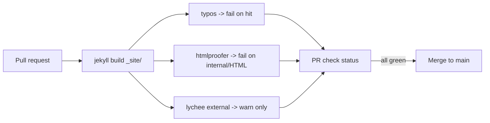

# Editorial CI - Link Checking, HTML Validation, and Spell-Check on PRs

> Module 6 · Chapter 2 - Capstone: Workflow, polish, and what's next

## What you'll learn
- The three classes of editorial bugs CI can catch: broken links, invalid HTML, and typos.
- Why `lychee` is the link checker to reach for first, and where `htmlproofer` still earns its keep.
- How to run `typos` for fast, low-false-positive spell-check.
- A practical rule for what fails the build versus what only warns: internal problems block, external flakiness warns.

## Concepts

The point of editorial CI is to delegate the boring, mechanical reading. A human reviewer should not be the one to notice that you wrote "teh" or that the link to the Postgres docs 404s - those are jobs for a tool that runs on every pull request. The cost is one workflow file and a few minutes of build time. The benefit is that the things you'd notice with embarrassment two days after publishing get caught before merge.

**Link checking.** Two tools dominate. [`htmlproofer`](https://github.com/gjtorikian/html-proofer) is a Ruby gem that integrates naturally with Jekyll - it walks the built `_site/` directory and validates every `<a>`, ``, and `<script>`. [`lychee`](https://github.com/lycheeverse/lychee) is a single-binary Rust tool that runs much faster, handles concurrency well, and has good support for caching and external-only mode. For a blog the size you have today, either works; for any repo where build time matters, prefer `lychee`. Both can check both Markdown and built HTML.

**HTML validation.** Jekyll's output is your theme's output, and themes can drift - an unclosed `<div>`, an `` without `alt`, a stray `</p>` inside an `<a>`. [`htmlproofer`](https://github.com/gjtorikian/html-proofer) does basic validation as a side effect of link checking, and the [W3C Nu HTML Checker](https://validator.w3.org/nu/) does the strict version. For most blogs, `htmlproofer`'s built-in checks are enough; reach for the Nu checker if you're hitting a rendering bug you can't explain.

**Spell-check.** [`typos`](https://github.com/crate-ci/typos) is a Rust tool with a small dictionary of *very confidently misspelled* words and good performance - it's designed to have near-zero false positives, so you can fail the build on its findings. [`codespell`](https://github.com/codespell-project/codespell) is the older Python equivalent and works similarly. Neither is a grammar checker; they catch the typos that pass spellcheck-via-eyeballs.

**Fail vs warn.** A good editorial workflow is opinionated about which problems block a merge. Internal broken links (a post linking to another post that has moved) should fail - they are entirely under your control. External broken links should warn - the link may be flaky, or the remote may be down for an hour. Typos should fail - `typos` is conservative enough that a finding is almost always a real misspelling. HTML validation findings are case-by-case; start with warn, promote to fail if you're confident in your theme.

## Walkthrough

Create a CI workflow that builds the site and runs the three checks. Save as `.github/workflows/editorial.yml`:

```yaml
# .github/workflows/editorial.yml
name: Editorial checks
on:
  pull_request:
    branches: [main]

jobs:
  editorial:
    runs-on: ubuntu-latest
    steps:
      - uses: actions/checkout@v4

      - name: Set up Ruby
        uses: ruby/setup-ruby@v1
        with:
          # match the Ruby version GitHub Pages uses; check
          # https://pages.github.com/versions/ for the current value
          ruby-version: "3.3"
          bundler-cache: true

      - name: Build site
        # JEKYLL_ENV=production so jekyll-seo-tag emits real canonical URLs
        run: bundle exec jekyll build
        env:
          JEKYLL_ENV: production

      # --- Spell check (fails the build on findings) ---
      - name: Typos
        uses: crate-ci/typos@master

      # --- Link & HTML check on the built site (internal failures only) ---
      - name: htmlproofer
        run: |
          bundle exec htmlproofer ./_site \
            --disable-external \
            --check-html \
            --no-enforce-https
        # external links handled by lychee below to keep flakiness out of htmlproofer

      # --- External link check (warns; does not fail) ---
      - name: lychee external links
        uses: lycheeverse/lychee-action@v2
        with:
          args: --no-progress --max-concurrency 8 ./_site
          fail: false   # warn-only; remote 5xx shouldn't block a merge
```

Add `htmlproofer` to your `Gemfile` so the CI step finds it:

```ruby
# Gemfile
group :test do
  gem "html-proofer", "~> 5.0"
end
```

`typos` is configured by a tiny TOML file at the repo root. The defaults are good; you mostly use the config to allow project-specific words:

```toml
# .typos.toml
[default]
extend-ignore-re = [
  # ignore code blocks fenced with ``` from spell-check entirely
  "(?s)```.*?```"
]

[default.extend-words]
# project-specific words typos doesn't know
htmlproofer = "htmlproofer"
lychee = "lychee"
giscus = "giscus"
```

Run the same checks locally before pushing - exactly what CI runs, just on your machine:

```bash
# spell check
typos

# build then check links + HTML
bundle exec jekyll build
bundle exec htmlproofer ./_site --disable-external --check-html

# external link check (slow; run when you've added new outbound links)
lychee ./_site
```

## How it fits together



Each tool runs in parallel against the same `_site/` output. Fast feedback, narrow blast radius - a flaky remote can't block your merge.

## Common pitfalls

| Pitfall | Why it happens | Fix |
|---|---|---|
| `htmlproofer` fails on every external link in CI. | Network flakiness, or rate-limited hosts blocking GitHub Actions IPs. | Run `htmlproofer` with `--disable-external` and use `lychee` (with `fail: false`) for externals. |
| `typos` flags valid project names. | Words like "giscus" or "Pagefind" aren't in its dictionary. | Add them under `[default.extend-words]` in `.typos.toml`. |
| Link checker re-validates everything on every PR run. | No cache between runs. | Use [lychee's `--cache` flag](https://github.com/lycheeverse/lychee) plus `actions/cache@v4` on `.lycheecache`. |
| HTML validator complains about Liquid markup. | You're checking source `.md`/`.html` files, not the built `_site/`. | Always run checkers against `_site/` after `jekyll build`. |
| A redirect chain trips link checks. | Some checkers flag 3xx chains as suspicious. | Configure the checker to accept 3xx as success (it's the default in `lychee`); audit the chain only if it grows long. |

## Exercises
1. Add the `editorial.yml` workflow above. Open a PR that intentionally breaks an internal link (point a post at `/posts/does-not-exist/`). Confirm the `htmlproofer` step fails and identifies the bad link in the log.
2. Add a typo to a post (e.g. `responsivness`). Open a PR. Confirm `typos` flags it. Then add the typo's correct spelling to `.typos.toml`'s `[default.extend-words]` only if it's a real project term - otherwise just fix the typo.
3. Open a PR that links to a domain you control where you can return a `503`. Confirm the `lychee` step warns but does not fail the build, and that the PR is still mergeable.

## Recap & next
- Editorial CI catches three classes of bugs: broken links, invalid HTML, and typos.
- `htmlproofer` is the Ruby-native Jekyll choice; `lychee` is the fast Rust alternative.
- `typos` (or `codespell`) gives near-zero false positives, so you can fail the build on spelling.
- Fail on things you can fix (internal links, typos, valid HTML); warn on things you can't (external 5xx).
- Run the same checks locally before pushing - CI is your second pair of eyes, not your first.

Next, **Performance audit - Lighthouse, font loading, and the things that actually matter** - running Lighthouse against the live site and fixing the few things that genuinely move Core Web Vitals.

