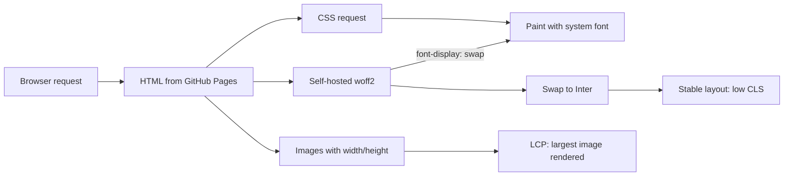

## What you'll learn
- The three Core Web Vitals - LCP, CLS, INP - and which ones matter on a static blog.
- How to run Lighthouse from Chrome DevTools and from the CLI, and how to read the report.
- Self-hosting fonts with `font-display: swap`, and why Google Fonts is a poor default.
- Why setting `width` and `height` on images is the single highest-leverage CLS fix.
- Why you can stop worrying about caching headers on GitHub Pages.

## Concepts

A static blog is already faster than most of the web. Your bottleneck is rarely your HTML - it's a hero image without dimensions, a font request that delays first paint, or a third-party script someone added a year ago. The job of a performance audit is to find which of those is currently the worst, fix it, and move on. Premature performance work is the same kind of waste as premature optimisation in code.

**Core Web Vitals** are Google's three numbers. [LCP (Largest Contentful Paint)](https://web.dev/articles/lcp) measures when the biggest visible thing - usually a hero image or a paragraph of body text - finishes rendering; the target is under 2.5 seconds at the 75th percentile. [CLS (Cumulative Layout Shift)](https://web.dev/articles/cls) measures unexpected visual jumps as the page loads; target under 0.1. [INP (Interaction to Next Paint)](https://web.dev/articles/inp) measures how quickly the page responds to clicks and keypresses; target under 200ms. INP is rarely an issue on a static blog with no JavaScript framework - if you're seeing problems there, look at a third-party script before anything else.

**Lighthouse** is the audit tool. The fastest way is Chrome DevTools → Lighthouse tab → run an audit in incognito (extensions distort scores). For repeatable measurement, run `npx lighthouse https://yourdomain.example --view` from the command line. The [Lighthouse docs](https://developer.chrome.com/docs/lighthouse) describe each metric and the underlying audit. Don't chase 100. Aim for >90 in Performance and Accessibility and an explainable score; the difference between 92 and 98 is rarely worth the work.

**Fonts** are usually the biggest LCP win on a blog. The default pattern - `<link>` to Google Fonts - costs you a DNS lookup, a TCP handshake, a TLS handshake, and an extra round trip before any text shows. Self-host the font files in your `assets/fonts/` directory and serve them from the same origin as your HTML. Set `font-display: swap` in your `@font-face` declaration so text renders in a system fallback first, then swaps to the real font when it's ready. The visual swap ("FOUT") is annoying once; an invisible block while the font loads is worse on every page load.

**Images** are the other big lever. The single biggest CLS contributor is an image without `width` and `height` attributes: the browser doesn't know how much space to reserve, lays out the page assuming zero, then jolts everything down when the image actually loads. Set the attributes (the intrinsic pixel dimensions) and the browser computes the right aspect-ratio box on first paint. Pair that with `loading="lazy"` on below-the-fold images. Caching headers, by contrast, are out of your hands on GitHub Pages - Pages sets reasonable `Cache-Control` defaults you can't override, and that's fine.

## Walkthrough

Run Lighthouse against the live site from the CLI:

```bash
# install on demand; --view opens the HTML report in your browser
npx lighthouse https://yourdomain.example \
  --only-categories=performance,accessibility,best-practices,seo \
  --preset=desktop \
  --view
```

Rerun with `--preset=mobile` (or the default, which is mobile) - mobile is the score that matters for ranking. Look at the Diagnostics section first; that's where the actionable items live.

Self-host a font. Download the `.woff2` files from the font's source (Google Fonts has a "Download family" button; [google-webfonts-helper](https://gwfh.mranftl.de/fonts) gives you just the subsets you need). Drop them in `assets/fonts/` and declare them in CSS:

```css
/* assets/css/main.css */
/* Self-hosted Inter - woff2 only; modern browsers all support it. */
@font-face {
  font-family: "Inter";
  font-style: normal;
  font-weight: 400;
  /* swap renders fallback first; eliminates invisible-text block */
  font-display: swap;
  src: url("/assets/fonts/inter-400.woff2") format("woff2");
}

@font-face {
  font-family: "Inter";
  font-style: normal;
  font-weight: 700;
  font-display: swap;
  src: url("/assets/fonts/inter-700.woff2") format("woff2");
}

body {
  /* fallback chain - what users see during the swap */
  font-family: "Inter", system-ui, -apple-system, "Segoe UI", sans-serif;
}
```

Preload the weight that the hero text uses, so it's available before paint:

```html
<!-- _includes/head.html - only preload fonts that block LCP -->
<link rel="preload"
      href="/assets/fonts/inter-400.woff2"
      as="font"
      type="font/woff2"
      crossorigin>
```

Fix CLS on images. Always set dimensions; let CSS scale them down with `max-width: 100%`:

```html
<!-- Markdown rendering produces  without dimensions; either author
     posts in HTML for hero images, or use an include that sets them. -->

```

```css
img {
  max-width: 100%;
  height: auto;     /* preserve aspect ratio; the width/height attrs reserve the box */
}
```

Module 4.5 already gave you `_includes/figure.html` with `srcset`, `width`, `height`, and `loading="lazy"` baked in. For above-the-fold hero images that block LCP, you don't want lazy-loading - the browser should fetch them immediately. Add a `loading` parameter to the include call so you can opt out per use:

```liquid
<!-- The hero on a post page: render eagerly so it counts toward LCP from the first paint. -->

```

Inside `_includes/figure.html` (from 4.5), default `include.loading` to `"lazy"` and let the caller override it. The point stays the same - always set `width` and `height`, never lazy-load the hero - but you keep a single include rather than maintaining two parallel ones.

## How it fits together



LCP is dominated by the hero image and the font that renders the largest text. CLS is dominated by elements (images, fonts, ads) whose final size differs from what the browser reserved.

## Common pitfalls

| Pitfall | Why it happens | Fix |
|---|---|---|
| Lighthouse scores swing 10+ points between runs. | Network variability, throttled CPU emulation, or extensions running. | Run in an incognito window with no extensions; average 3-5 runs; trust the trend, not the number. |
| Loading Google Fonts via `<link>` tanks LCP. | Extra DNS/TLS handshakes to `fonts.googleapis.com` and `fonts.gstatic.com` before text can paint. | Self-host `.woff2` files; serve from your origin; preload the weight used above the fold. |
| CLS is high even after setting `width`/`height`. | A late-loading web font has different metrics than the fallback; text reflows when it swaps. | Use [`size-adjust`, `ascent-override`, `descent-override`](https://developer.mozilla.org/en-US/docs/Web/CSS/@font-face/size-adjust) in `@font-face` to match metrics, or pick a fallback close to the web font. |
| Lazy-loaded hero image hurts LCP. | `loading="lazy"` on the above-the-fold image defers it. | Lazy-load only below-the-fold images; the hero should load eagerly. |
| Tried to set `Cache-Control` headers and failed. | GitHub Pages does not let you set custom response headers. | Don't try. Pages' defaults are fine. If you genuinely need custom headers, that's a "migrate off Pages" signal - covered in Chapter 6.5. |

## Exercises
1. Run Lighthouse against your live site (mobile preset, incognito). Note the LCP, CLS, and INP numbers. If LCP is over 2.5s, identify the largest element in the report and write down what's slowing it.
2. Self-host whatever font your theme currently loads. Measure LCP before and after. The change should be visible - if it isn't, the bottleneck is somewhere else, which is a useful finding too.
3. Add `width` and `height` to every image in your most-recent five posts. Rerun Lighthouse and confirm CLS dropped. If it didn't, look at fonts - a font swap with different metrics also causes CLS.

## Recap & next
- The three vitals: LCP under 2.5s, CLS under 0.1, INP under 200ms. INP rarely matters on a static blog.
- Run Lighthouse in incognito; trust the trend across multiple runs more than any single score.
- Self-host fonts as `.woff2` with `font-display: swap`; preload only what blocks LCP.
- Always set `width` and `height` on images - the highest-leverage CLS fix on a blog.
- Caching headers are not yours to set on GitHub Pages; the defaults are fine.

Next, **Accessibility pass and dark mode that respects `prefers-color-scheme`** - making the blog usable by keyboard, screen readers, and people who prefer dark UIs.

