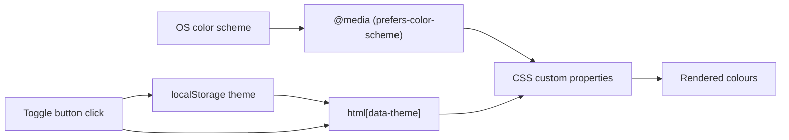


## What you'll learn
- A practical a11y audit: contrast, focus, heading hierarchy, landmarks, skip links.
- The WCAG 2.2 AA contrast bar (4.5:1 for body text, 3:1 for large text and UI).
- Semantic landmarks - `<header>`, `<nav>`, `<main>`, `<footer>`, `<article>` - and why screen readers need them.
- Dark mode that follows the system via `prefers-color-scheme`, with an optional `localStorage` override.
- Testing with axe DevTools and a keyboard-only pass.

## Concepts

Accessibility on a blog is mostly about not breaking the defaults. The browser already gives you focus rings, semantic HTML, and reasonable defaults for screen readers; your theme either preserves that or breaks it. The job of an a11y audit is to find the places where a well-meaning bit of CSS or JS has stripped something users depend on, and put it back. The reference is [WCAG 2.2](https://www.w3.org/TR/WCAG22/); for a blog, you're aiming for AA, and most of that is honest contrast and honest markup.

**Contrast.** Body text needs a 4.5:1 contrast ratio against its background. Large text (18pt+ regular or 14pt+ bold) and non-text UI elements need 3:1. The most common failure on a stylish theme is light-grey body text on white - it looks elegant in mock-ups, but `#999` on `#fff` is around 2.85:1 and fails for everyone over 40 and most people in bright light. Check your palette in the Chrome DevTools colour picker, which shows the contrast ratio live.

**Focus.** Every interactive element needs a visible focus indicator. Modern themes use `:focus-visible` to show the ring only when navigating by keyboard and not on mouse clicks, which gives the best of both worlds. A worryingly common pattern is `*:focus { outline: none; }` in someone's reset - this is the single most damaging line of CSS for keyboard users. Remove it; if the default ring clashes with your design, restyle it with `:focus-visible`, don't delete it.

**Semantic structure.** Screen readers and reader mode rely on landmarks: `<header>`, `<nav>`, `<main>`, `<footer>`, plus `<article>` for each post. Headings should form a single descending hierarchy - `<h1>` for the page title, `<h2>` for sections, `<h3>` for subsections - without skips. A skip link at the top of `<body>` lets keyboard users jump past the navigation; it's a single anchor with `href="#main"` that's visually hidden until focused. The [MDN docs on landmark roles](https://developer.mozilla.org/en-US/docs/Web/HTML/Reference/Elements#content_sectioning) cover the full set.

**Dark mode.** [`prefers-color-scheme`](https://developer.mozilla.org/en-US/docs/Web/CSS/@media/prefers-color-scheme) lets you respond to the user's system setting with a CSS media query. Default to that. Add a manual toggle only if you want to override the system - and when you do, store the choice in `localStorage` so it persists across sessions. The minimum-viable toggle is a button that flips a `data-theme` attribute on `<html>` and a tiny piece of inline JS in `<head>` that reads the saved preference before any paint, so dark-mode users never see a white flash.

**Testing.** [axe DevTools](https://www.deque.com/axe/devtools/) is the browser extension to install - it scans the current page and lists violations with severity and remediation. After the automated pass, do a manual keyboard pass: hit `Tab` from the top of the page and make sure every interactive element is reachable, has a visible focus ring, and activates with Enter or Space.

## Walkthrough

A semantic post layout - landmarks, heading hierarchy, skip link:

```html
<!-- _layouts/default.html (relevant fragment) -->
<body>
  <a class="skip-link" href="#main">Skip to content</a>

  <header>
    <nav aria-label="Primary">
      <a href="/">Home</a>
      <a href="/archive/">Archive</a>
      <a href="/about/">About</a>
    </nav>
  </header>

  <main id="main">
    {{ content }}
  </main>

  <footer>
    <p>&copy; {{ "now" | date: "%Y" }} {{ site.author.name }}</p>
  </footer>
</body>
```

```html
<!-- _layouts/post.html -->
---
layout: default
---
<article>
  <h1>{{ page.title }}</h1>
  <p class="meta">
    <time datetime="{{ page.date | date_to_xmlschema }}">
      {{ page.date | date: "%-d %B %Y" }}
    </time>
  </p>
  {{ content }}   <!-- post body uses h2/h3, not h1; layout owns the h1 -->
</article>
```

Focus and skip-link styling. The skip link is visually hidden until it receives focus:

```css
/* assets/css/a11y.css */
.skip-link {
  position: absolute;
  top: -40px; /* off-screen until focused */
  left: 0;
  background: #000;
  color: #fff;
  padding: 0.5rem 1rem;
  z-index: 100;
}
.skip-link:focus {
  top: 0;
}

/* Don't strip focus rings - restyle if needed, but keep them visible */
:focus-visible {
  outline: 3px solid var(--focus, #4c6ef5);
  outline-offset: 2px;
}
```

Dark mode via CSS custom properties. The site uses one set of variables; `prefers-color-scheme` and the `data-theme` attribute override them:

```css
/* assets/css/main.css */
:root {
  --bg: #ffffff;
  --fg: #1a1a1a;       /* 16.1:1 on white - well over 4.5:1 */
  --muted: #555555;    /* 7.4:1 on white - still passes for body text */
  --link: #0a4ec0;
  --focus: #0a4ec0;
}

@media (prefers-color-scheme: dark) {
  :root {
    --bg: #1a1a1a;
    --fg: #f0f0f0;
    --muted: #b0b0b0;
    --link: #8ab4ff;
    --focus: #8ab4ff;
  }
}

/* manual override wins over the media query */
:root[data-theme="light"] { --bg: #fff; --fg: #1a1a1a; --muted: #555; --link: #0a4ec0; }
:root[data-theme="dark"]  { --bg: #1a1a1a; --fg: #f0f0f0; --muted: #b0b0b0; --link: #8ab4ff; }

body { background: var(--bg); color: var(--fg); }
a { color: var(--link); }
```

A toggle that respects the system default and persists via `localStorage`. Inline the read-back in `<head>` so dark-mode users never see a white flash:

```html
<!-- _includes/head.html - must run before <body> paints -->
<script>
  // Read saved choice; fall back to system default.
  // No saved value means "follow the system" - don't set data-theme at all.
  (function () {
    var saved = localStorage.getItem("theme");
    if (saved === "light" || saved === "dark") {
      document.documentElement.setAttribute("data-theme", saved);
    }
  })();
</script>
```

```html
<!-- The toggle button (in your header) -->
<button id="theme-toggle" type="button" aria-label="Toggle colour scheme">
  Theme
</button>
<script>
  document.getElementById("theme-toggle").addEventListener("click", function () {
    var root = document.documentElement;
    var current = root.getAttribute("data-theme")
      || (matchMedia("(prefers-color-scheme: dark)").matches ? "dark" : "light");
    var next = current === "dark" ? "light" : "dark";
    root.setAttribute("data-theme", next);
    localStorage.setItem("theme", next);
  });
</script>
```

## How it fits together



System preference is the default; the toggle only sets `data-theme` and `localStorage` when the user wants to override. No saved value means "follow the system" - that's the polite default.

## Common pitfalls

| Pitfall | Why it happens | Fix |
|---|---|---|
| Light grey body text fails contrast. | `#999` on `#fff` looks classy but is around 2.85:1. | Darken to at least `#595959` (about 7:1 on white); verify with DevTools' colour picker. |
| Flash of white before dark mode kicks in. | The theme-detection script runs after first paint. | Inline a tiny `<script>` in `<head>` that sets `data-theme` synchronously before `<body>`. |
| Focus rings invisible on buttons. | A reset CSS includes `outline: none`. | Replace with `:focus-visible { outline: ... }`; never delete focus indicators. |
| Two `<h1>`s on a post page. | The layout has one and the post body opens with another. | Decide where the `<h1>` lives (layout, typically) and use `<h2>` onward in the body. |
| Manual toggle forgets the user's choice on next visit. | Only `data-theme` is set; nothing is written to `localStorage`. | Write the choice to `localStorage` in the click handler and read it on page load. |

## Exercises
1. Install [axe DevTools](https://www.deque.com/axe/devtools/) and run it against your homepage and a post page. Triage findings: fix all "Critical" and "Serious" issues; note "Moderate" for later.
2. Do a keyboard pass: starting from a focused address bar, hit `Tab` through every interactive element on the homepage. Confirm each has a visible focus ring and that the skip link appears when first focused.
3. Implement the dark-mode toggle above. Open the site with system dark mode on; confirm dark renders by default. Click the toggle to force light; reload; confirm it persists. Clear `localStorage` and confirm it goes back to following the system.

## Recap & next
- WCAG 2.2 AA on a blog is mostly contrast (4.5:1 body, 3:1 large/UI), focus visibility, and semantic landmarks.
- Never strip focus indicators; restyle with `:focus-visible` if you must.
- One `<h1>` per page; let post layouts own it and write the body in `<h2>`+ headings.
- Default dark mode to `prefers-color-scheme`; layer a `data-theme` + `localStorage` override only if you want a manual toggle.
- Run axe DevTools on every PR-worthy template change, plus a manual keyboard pass.

Next, **Where to grow next - search, comments, newsletter, and when to migrate off Pages** - the things readers will start asking for, and an honest take on when to move.



