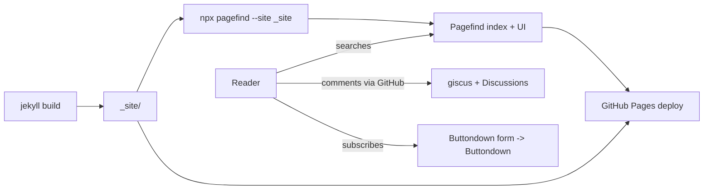

## What you'll learn
- How to add client-side search with Pagefind without a backend.
- Lightweight commenting options - giscus (GitHub Discussions) and the Mastodon thread embed pattern - and their trade-offs.
- Newsletter options: Buttondown (SaaS, indie-friendly) vs Listmonk (self-hosted, more setup).
- The signals that mean it's time to migrate off GitHub Pages - and when those signals are actually telling you to stay.

## Concepts

You have a published blog with HTTPS, SEO, an editorial workflow, performance, and accessibility. The next questions from readers tend to be the same four: "where's the search?", "can I comment?", "do you have a newsletter?", and (your own version) "is GitHub Pages still the right host?" Each has a good answer that respects the goals you started with - static, fast, low-maintenance, privacy-respecting - and each has a tempting answer that does not.

**Search.** [Pagefind](https://pagefind.app/) is the current good answer. It runs at build time, walks `_site/`, builds a search index, and ships a small JavaScript UI that does the searching client-side. No server. No third party seeing your readers' queries. Index size scales sub-linearly with content because it's compressed and chunked. The older option is [lunr.js](https://lunrjs.com/) - still works, but the index is monolithic and the API is more work to wire up. Reach for lunr only if Pagefind doesn't fit; in 2026 it almost always will.

**Comments.** The honest version of comments-on-a-static-blog is that they're hard to do well without a database. [giscus](https://giscus.app/) sidesteps this by using GitHub Discussions as the backend: comments live on a Discussion thread, the giscus widget renders them on your post, and readers comment by signing in with GitHub. The price is that readers need a GitHub account, which filters out everyone who isn't a developer. The alternative is the [Tantek Çelik / Bridgy](https://brid.gy/) approach: post a link to your post on Mastodon, then embed that thread back into the page. You get social conversation without owning any state, at the cost of needing Mastodon presence.

**Newsletter.** Two ends of the spectrum. [Buttondown](https://buttondown.com/) is paid SaaS aimed at writers - clean Markdown editor, fair pricing, no surveillance, embedded subscribe forms work everywhere. [Listmonk](https://listmonk.app/) is self-hosted, open source, and gives you full control of the data, but you now run a Postgres database and an SMTP relay. The right answer depends on whether you'd rather pay $9/month or run a service. Mailchimp is not on this list deliberately - its free tier added tracking pixels and its pricing punishes growth.

**Migrating off Pages.** GitHub Pages has real limits, [documented here](https://docs.github.com/en/pages/getting-started-with-github-pages/about-github-pages#usage-limits): 1 GB repo size, 100 GB/month soft bandwidth, 10-minute build timeout, 10 builds/hour. For an engineering blog, you'll hit none of these for a long time. The signals it's *actually* time to move are: you need server-side anything (form handling, auth, A/B tests); your build consistently exceeds 10 minutes; you need to set custom HTTP headers (CSP, custom caching); or you've outgrown the bandwidth limit and started seeing throttling. Until then, "I'm thinking about migrating" is usually a sign you're avoiding writing the next post. Stay where you are.

## Walkthrough

Add Pagefind. Build the site, then run Pagefind against `_site/`:

```bash
# install via npx; no global install needed
# this runs after `jekyll build` and writes /_site/pagefind/* assets
npx -y pagefind --site _site
```

Wire it into CI so the index is generated on every build. Update `.github/workflows/pages.yml` (the deploy workflow from Module 5):

```yaml
# excerpt: add Pagefind after jekyll build, before upload-pages-artifact
- name: Build site
  run: bundle exec jekyll build
  env:
    JEKYLL_ENV: production

- name: Build Pagefind index
  # writes _site/pagefind/* - the search index and JS bundle
  run: npx -y pagefind --site _site
```

Drop the Pagefind UI into a search page:

```html
<!-- search.html (at the repo root, with front matter to render it) -->
---
layout: default
title: Search
permalink: /search/
---
<link rel="stylesheet" href="/pagefind/pagefind-ui.css">
<div id="search"></div>
<script src="/pagefind/pagefind-ui.js"></script>
<script>
  // baseUrl matters if your site lives under a path prefix
  new PagefindUI({ element: "#search", showSubResults: true });
</script>
```

Add giscus comments. Enable GitHub Discussions on your repo, then go to [giscus.app](https://giscus.app/) and fill out the form - it generates a `<script>` snippet with your repo and category IDs. Drop the snippet into your post layout, inside the article footer:

```html
<!-- _layouts/post.html - at the bottom of <article> -->
<section class="comments" aria-label="Comments">
  <h2>Comments</h2>
  <script src="https://giscus.app/client.js"
          data-repo="your-handle/your-blog"
          data-repo-id="R_kgDO..."
          data-category="General"
          data-category-id="DIC_kwDO..."
          data-mapping="pathname"
          data-strict="1"
          data-reactions-enabled="1"
          data-emit-metadata="0"
          data-input-position="top"
          data-theme="preferred_color_scheme"
          data-lang="en"
          crossorigin="anonymous"
          async>
  </script>
</section>
```

Buttondown's subscribe form is a static `<form>` you can drop into your footer - no JavaScript needed:

```html
<!-- _includes/newsletter.html -->
<form action="https://buttondown.com/api/emails/embed-subscribe/YOUR_USERNAME"
      method="post"
      target="popupwindow"
      onsubmit="window.open('https://buttondown.com/YOUR_USERNAME', 'popupwindow')"
      class="subscribe">
  <label for="bd-email">Subscribe by email</label>
  <input id="bd-email" type="email" name="email" required placeholder="you@example.com">
  <button type="submit">Subscribe</button>
</form>
```

When (and only when) you're hitting Pages limits, the migration story is straightforward: the repo is the source of truth, so most static hosts can build from it directly. If you migrate, options exist - but make the decision because of a concrete limit, not vibes.

## How it fits together



The blog stays static. Search is client-side. Comments live in someone else's database (GitHub Discussions). Newsletter lives in someone else's database too. Pages serves only the HTML, CSS, JS, and the Pagefind index - which is what it's good at.

## Common pitfalls

| Pitfall | Why it happens | Fix |
|---|---|---|
| Pagefind index is missing on the deployed site. | The CI step ran `pagefind` before `jekyll build`, or wrote to the wrong directory. | Run `pagefind --site _site` *after* `jekyll build`; confirm `_site/pagefind/` exists in the upload artifact. |
| giscus shows "Discussion not found" on every post. | Mapping mismatch - `data-mapping="pathname"` means each post needs a unique URL path that becomes a Discussion title. | Verify the post's permalink is stable; the first comment on a post auto-creates its Discussion. |
| Newsletter signups go to spam. | Buttondown (or any sender) needs SPF/DKIM/DMARC on your sending domain. | Follow Buttondown's domain-verification flow; add the DNS records to your registrar. |
| Adding a third-party comment widget tanks Lighthouse. | giscus loads on every post and adds an iframe + scripts. | Lazy-load the comments section with `IntersectionObserver`, or only render giscus on demand behind a "Load comments" button. |
| Migrated off Pages because of "scale" with no concrete trigger. | Vibes, not data. | Stay on Pages until you hit a documented limit. The [usage limits page](https://docs.github.com/en/pages/getting-started-with-github-pages/about-github-pages#usage-limits) is your trigger list. |

## Exercises
1. Add Pagefind to your CI and a `/search/` page. Confirm a search for a term from your most recent post returns that post. Index size will be in the [Pagefind output](https://pagefind.app/) - note it as your baseline.
2. Enable GitHub Discussions, set up giscus, and add it to your post layout. Post the first comment on one of your posts and confirm the Discussion thread is auto-created.
3. Read the [GitHub Pages usage limits page](https://docs.github.com/en/pages/getting-started-with-github-pages/about-github-pages#usage-limits). Write a one-paragraph "when I will migrate" note in your repo's README - concrete signals, not vibes. Re-read it the next time you feel the urge to migrate.

## Recap & next
- Pagefind gives you client-side search with no backend; lunr is the older fallback.
- giscus turns GitHub Discussions into a comments backend; the Mastodon-embed pattern is the lighter option if your readers aren't all developers.
- Buttondown is paid SaaS for newsletters; Listmonk is the self-hosted alternative.
- Stay on GitHub Pages until you have a concrete reason to leave - usage limits, server-side needs, custom headers, or build times over 10 minutes.
- Most "I should migrate" thoughts are really "I should publish more." Publish more first.

You started this course with an empty directory and an idea. You now have a Jekyll site with SEO, social previews, an RSS feed, analytics, a custom domain on HTTPS, a writing workflow, editorial CI, a performance and accessibility pass, and an honest sense of when to grow further. The remaining step is the only one that matters - open `_drafts/` and write the first real post.

